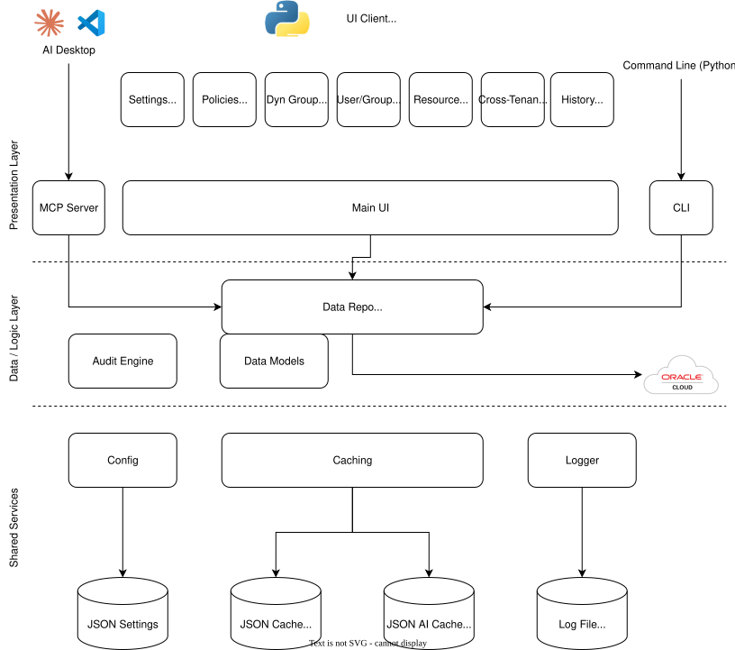

# OCI Policy Analysis

The **OCI Policy Analysis** tool is a graphical desktop application built with Python and Tkinter for Oracle Cloud Infrastructure (OCI) administrators. It allows you to analyze and visualize OCI policies, dynamic groups, and user permissions within a tenancy. 

## Overview / Features

Key features include:

- **Policy Analysis**: View and filter parsed IAM policy statements across compartments, with details like subject, verb, resource, and conditions.
- **Dynamic Group Analysis**: Display dynamic groups, their matching rules, and check for unused groups.
- **Resource Principal Analysis**: Display resource principals and search for relevant policy statements.
- **User Analysis**: Filter policy statements applicable to a user based on their group memberships.
- **Historical Comarison**: Compare policy sets from previous loads of data in order to find discrepancies over time.
- **Caching**: Save and load data to/from a local cache for faster access.
- **Export / Import**: Export filtered data to CSV or JSON for further analysis.  Good for offline usage or exchange of data from inaccessible tenancies.
- **Cross-Platform**: Runs on Windows and Linux with a user-friendly GUI.
- **GenAI Insights**: Takes advantage of AI to create insights that may help users understand a policy statement.
- **MCP Server Access**: Run the program as an MCP server, so that policy questions about your tenancy can come from desktop MCP tools such as Claude and VSCode.  Use your own data and have AI tools formulate responses

The application supports both Instance Principal authentication (for OCI compute instances) and OCI configuration file-based authentication (using named profiles).

## Architecture

Here is a simple diagram of how all of the pieces fit together:



## Getting Started

This guide is designed for users new to Python, covering setup on Windows and Linux. The application was tested with Python 3.11+ and specific dependencies.

There are 3 ways you can use the tool -
1) Via pre-built executables, which are built for Linux, MacOS, and Windows.  
2) Install the required Python version, python packages, ensure TKInter UI elements are working, and run from your system with full UI.
3) Install the required Python version, python packages, and run directly from the command line only.

All 3 options require either a configured OCI Profile or Instance Principal, see [below](#oci-configuration) for details.

## Prerequisites

All of what you need to get started.  

### Python 3.12+

This is only required if you are not running the executables, which have the appropriate Python version baked in

- **Windows**:
  - Download and install Python from [python.org](https://www.python.org/downloads/). Choose the latest version (3.12 or higher).
  - During installation, check "Add Python to PATH" to make Python accessible from the command line.
- **Linux**:
  - Most distributions include Python. Verify with `python3 --version`.
  - If not installed or outdated, install it:
    ```bash
    sudo apt update && sudo apt install python3.12 python3-pip  # Ubuntu/Debian
    sudo dnf install python3.12 python3-pip  # Fedora/RHEL
    ```

### OCI SDK and Dependencies
The application requires the `oci`, `ttkbootstrap`, and `deepdiff` Python packages. These can be installed using `pip install` or `uv pip install`.  See below for more details.  To install all requirements:

```bash
pip install -r requirements.txt
```

### OCI Configuration (Required)

This section is **REQUIRED** in order to use the tool, regardless of whether you use the executable, the script with UI, or the script without UI.

For non-Instance Principal authentication, create an OCI configuration file at `~/.oci/config` (Linux) or `%USERPROFILE%\.oci\config` (Windows) with a profile (e.g., `DEFAULT`). Example:
```ini
[DEFAULT]
user=ocid1.user.oc1..<your-user-ocid>
fingerprint=<your-api-key-fingerprint>
key_file=<path-to-private-key.pem>
tenancy=ocid1.tenancy.oc1..<your-tenancy-ocid>
region=<your-region, e.g., us-ashburn-1>
```

See [OCI SDK Configuration](https://docs.oracle.com/en-us/iaas/Content/API/Concepts/sdkconfig.htm) for details.

### Instance Principal Option

For Instance Principal authentication, simply ensure the application runs on an OCI compute instance with appropriate IAM policies.  The next section provides additional details on setting up a dynamic group for this purpose.

### Session Token Option

OCI Supports a session token, where you can create a special temporary token using the OCI CLI and a browser.  To start, use the CLI:

```
oci session authenticate
```
A browser will open and ask for authentication to OCI.  You can expedite this process by logging into OCI as the correct user prior to running the command above.  Either way, when authentication is completed, your shell will ask you the name of the **Session Token** to create.  Record this name and then present it into the UI's Settings tab before clicking "Load via Session Token".  Tenancy loading and caching will commence just like any other method.

### OCI Permissions (Required)

This section is **REQUIRED** in order to use the tool, regardless of whether you use the executable, the script with UI, or the script without UI.

This tool requires minimal permissions to OCI.  Permissions to operate can be granted in 2 ways and are the same set of overall permissions.  

The minimal policy statement looks like this:

```
allow group <your_group> to {POLICY_READ, COMPARTMENT_INSPECT, DOMAIN_INSPECT, DYNAMIC_GROUP_INSPECT, GROUP_INSPECT, USER_INSPECT} in tenancy
allow group <your_group> to use generative-ai-family in tenancy
```

**NOTE** If you already have read access to policies, compartments, and domains, you should be good to go.  

In a new tenancy or a tenancy where you are not sure about changing existing permissions, you can have a user created for yourself by the admin, and then have them create a Group and add you (and others).  Suppose this group is called `PolicyAuditorGroup`.  Then add a policy called `PolicyAnalysisPolicy` in the tenancy root, where the only statements are what is above.

If you plan to use Instance Principal via an OCI Compute Instance you run the tool from, you must have that instance part of a dynamic group.  For example, create a Dynamic Group in the Default Identity Domain called `PolicyAnalysisDynamicGroup`, defined by a matching rule `instance.id = 'your instance ocid'`.  Then, define your `PolicyAnalysisPolicy` like this:

```
allow dynamic-group 'Default'/'PolicyAnalysisDynamicGroup' to {POLICY_READ, COMPARTMENT_INSPECT, DOMAIN_INSPECT, DYNAMIC_GROUP_INSPECT, GROUP_INSPECT, USER_INSPECT} in tenancy
allow dynamic-group 'Default'/'PolicyAnalysisDynamicGroup' to use generative-ai-family in tenancy
```

Once created, download the tool or clone the repository from your OCI instance and give it a try.

### TKInter / TTKBootstrap / Deepdiff / Markdown / MCP

Only required for locally running the scripts.

   - TKInter for UI - Detailed information is maintained here: [Python TKInter](https://docs.python.org/3/library/tkinter.html#)
   - Both `deepdiff` and `ttkbootstrap` are in addition to the core TKInter installation and are installed via PIP.
   - TTKBootstrap improves the look and feel of TKInter applications.  Many of the widgets (ie dropdowns) are based on TTKBootstrap.  More on that here: [TTKBootstrap](https://ttkbootstrap.readthedocs.io/en/latest/)
   - MCP and FastMCP are required in order to run the MCP server

## Installation

Basic steps to get started.

### Executable

Download the latest release from your platform from the [Releases](https://github.com/agregory999/oci-policy-analysis/releases) page in the repository

Click on it.

If you have a valid PROFILE or Instance Principal set up already, you should be able to Load from Tenancy

### Build and Run

This requires cloning the repository, setting up your Python environment, and running the script with or without UI from the command line. 

### Clone Repo

```bash
git clone <repository-url>
cd <repository-directory>
```

All source code will be under the `src/` directory.

### Python Version and PIP

To verify python is installed on yoru system, from the command line, and within the repo directory:

```bash
prompt: repo dir> python -V
```
or 
```bash
prompt: repo dir> python3 -V
```

If you get python 3.11 or up, do the same with PIP and get a list of currently installed packages:

```bash
prompt: repo dir> python -m ensurepip
prompt: repo dir> pip -V
prompt: repo dir> pip list
```

#### Virtual Environments (recommended)
For users utilizing Virtual Environments, feel free to create a new VENV using:
```bash
prompt: repo dir> python -m venv venv
prompt: repo dir> source venv/bin/activate
prompt: repo dir> pip list
```

Once PIP is ready, proceed to the next section
### Install Dependencies

Install required packages for the tool:
```bash
pip install oci ttkbootstrap deepdiff markdown
```
If you encounter permission errors on Linux, use a user install.  Note that for virtual environments, this is unlikely to happen to you.  It can happen for the machine-based python installation, if you are not an administrator:
```bash
pip install --user oci ttkbootstrap deepdiff markdown
```

### Ensure TKInter 

As mentioned, ensure that tkinter is working.

```bash
prompt: repo dir> python -m tkinter
```

If you get the popup, close it and proceed.  If not, refer to the TKInter documentation to get it running on your platform.

## Run the Application with UI

Navigate to the repository.  You can run the program directly from the repository directory.

Run the UI using `python` or `python3`, depending on how you have your Python installation:
```bash
prompt: repo dir> python3 src/oci_policy_dg_viewer/viewer.py
```
On Windows, you may use:
```bash
prompt: repo dir> python src\oci_policy_dg_viewer\viewer.py
```

For verbose logging (useful for debugging), add the `-v` flag:
```bash
prompt: repo dir> python3 src/oci_policy_dg_viewer/viewer.py -v
```
Logging output may assist you with issue tracking, but it is better to leave verbose logging disabled (no option given) unless there are issues.   

## Using the Application UI

   - **Authentication**:
     - If running on an OCI compute instance, check "Instance Principal" to use instance-based authentication.
     - Otherwise, select a profile from the dropdown (e.g., `DEFAULT`) matching your OCI config file.
     - The **Recursive** option exists to load the EVERY compartment in the tenancy. To look for policies that exist only in ROOT, uncheck this.
   - **Load Data**:
     - Click "Load from Tenancy" to fetch policies, dynamic groups, and user data from OCI.
     - Click "Load from Cache" to use previously saved data (stored in `~/.oci-policy-analysis/cache/` or `%USERPROFILE%\.oci-policy-analysis\cache\`).
   - **Tabs**:
     - **All Policies**: Filter and view all policy statements.
     - **Dynamic Groups**: Analyze dynamic groups and their usage.
     - **User Analysis**: Select an identity domain, user, and compartment, then click "Analyze User" to view applicable policies.
     - **Advanced Analysis**: Placeholder for principal-based analysis.
   - **Export**: Use the "Export CSV" buttons to save filtered data.

### Build as an Executable
TBD

### Notes
- **Permissions**: Ensure your OCI user or instance has IAM permissions to read policies, dynamic groups, compartments, identity domains, and user group memberships.
- **Support**: This is not an official Oracle application and is not supported by Oracle Support. For issues, check the logs or contact the repository maintainer.

## Run the Application (non-UI)

To run with no UI, this section is in progress.  Essentially we can run the core, which loads the policies from cache or the tenancy, and simply outputs them to the console.  Filtering and export will be added in a later release

```bash 
prompt: repo dir> python src/oci_policy_dg_viewer/core.py --help
```
Follow the options and run again
