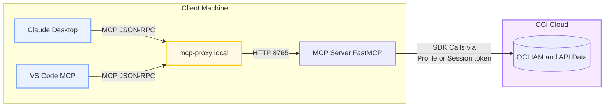
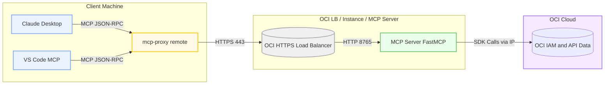

# OCI Policy Analysis MCP Server

This repository provides a **Model Context Protocol (MCP)** server exposing OCI IAM data (users, groups, dynamic groups, and policy analysis) as structured tools and resources consumable by **Claude**, **VS Code MCP**, or any MCP-compliant proxy client.

---

## ⚙️ Setup Overview

### Install
```bash
pip install -e .[mcp]
```

### Run Locally

Running locally offers a handful of options, around loading of data, or using cached data.  Similar to the CLI, you can run with a cached data set or load the tenancy.

Load the tenancy via PROFILE:
```bash
python src/mcp_server.py --use-cache andgre5678_2025-10-17-17-54-09-UTC --transport streamable-http --host 0.0.0.0
```

Load the tenancy via Instance Principal:
```bash
python src/mcp_server.py --instance-principal --transport streamable-http --host 0.0.0.0
```

Use a cached data set from a previous load:
```bash
python src/mcp_server.py --use-cache andgre5678_2025-10-17-17-54-09-UTC --transport streamable-http --host 0.0.0.0
```

### Connect via MCP Proxy
Claude or VS Code connect via a **proxy**, not directly.

For Claude, edit the `claude_desktop_config.json` file:
```JSON
{
  "mcpServers": {
    "oci-policy-remote": {
      "command": "mcp-proxy",
      "args": [ "--transport", "streamablehttp", "http://localhost:8765/mcp" ]
    }
  }
}
```
Then start Claude and look for log messages in your MCP server.

For VSCode, the proxy is configured as such for local:

```
{
	"servers": {
		"mcp-local": {
			"url": "http://127.0.0.1:8765/mcp",
			"type": "http"
		}
	},
	"inputs": []
}
```

### Via OCI Load Balancer
To run behind a Load Balancer on a server
```bash
mcp-proxy add oci-policy-analysis --url https://oci-policy-analysis-mcp.ocidemo.app/mcp
```

---

## MCP Architecture Diagrams
Locally:


For a Server-based architecture on OCI, this looks like


---

## 🔐 Secure Deployment on OCI

1. Deploy Compute Instance (OL9, Instance Principal)
2. Configure Dynamic Group and Policy:
   ```text
   Allow dynamic-group my-mcp-dg to read all-resources in tenancy
   ```
3. Launch service behind OCI Load Balancer (port 443 → 8000)
4. Add TLS (Let’s Encrypt or OCI Certificate)
5. Verify endpoint:
   ```bash
   curl -vk https://oci-policy-analysis-mcp.ocidemo.app/mcp
   ```

---

## ✅ Example Tools

| Tool | Description |
|------|--------------|
| `users://all` | List all users in tenancy |
| `groups://all` | List all IAM groups |
| `policies://filter` | Filter policy statements |
| `findings://invalid` | List invalid policy statements |

---

Mermaid diagrams render automatically on **GitHub**, **GitLab**, or in MkDocs/Furo using `pymdownx.mermaid`.

