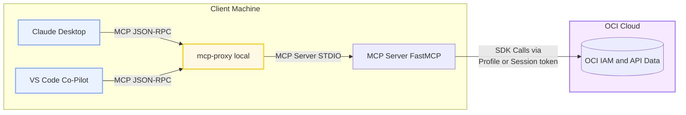
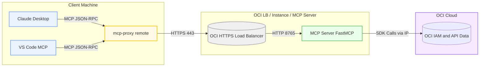

# OCI Policy Analysis MCP Server

This repository provides a **Model Context Protocol (MCP)** server exposing OCI IAM data (users, groups, dynamic groups, and policy analysis) as structured tools and resources consumable by **Claude**, **VS Code MCP**, or any MCP-compliant proxy client.

---

## ⚙️ Setup Overview

### Install
```bash
pip install -e .[mcp]
```

## MCP Architecture Diagrams

Mermaid diagrams render automatically on **GitHub**, **GitLab**, or in MkDocs/Furo using `pymdownx.mermaid`.


Locally (STDIO):


For a Server-based architecture on OCI, this looks like


---

## Running MCP

MCP Servers have 2 basic modes: STDIO and Streamable-HTTP.  STDIO mode is good for embedding in an AI Desktop client such as Claude, Oracle Code Assist, or VSCode.  More details on setups later on in the document.

Streamable HTTP is good for a server, where MCP is not local to the client, or in the OCI Policy Analysis Embedded MCP tab, the clients connect to the app over HTTP on the configured port.

In either case, the OCI Policy Analysis tool has a handful of options that can be applied.  See the usage for details:
```bash
usage: mcp_server.py [-h] (--profile PROFILE | --instance-principal | --use-cache USE_CACHE | --session-token SESSION_TOKEN) [--recursive] [--transport {stdio,streamable-http}] [--port PORT]
                     [--host HOST]

options:
  -h, --help            show this help message and exit
  --profile PROFILE
  --instance-principal
  --use-cache USE_CACHE
                        provide the combined cache date to use
  --session-token SESSION_TOKEN
                        OCI session token for instance principal auth
  --recursive           Recursively load all compartments (default: True)
  --transport {stdio,streamable-http}
  --port PORT
  --host HOST
  ```


### MCP Option 1 - Locally with STDIO and Claude

In order to use Claude with MCP, you update a file called `claude_desktop_config.json` and simply restart Claude after changes.  To add the MCP server using STDIO mode, you likely want to start with a cached copy of the tenancy data, from a previous run from the UI or CLI, where the cache file exists.  

You can use the CLI to show caches for a given tenancy:
```
agregory@agregory-mac ~ % MCP_STDIO_MODE=1 /Users/agregory/oci-policy-analysis/.venv/bin/python /Users/agregory/oci-policy-analysis/src/oci_policy_analysis/cli.py --get-caches naceoci01
2025-10-29 16:10:45,260 [INFO] [root] Root logger initialized (stdout + app.log).
2025-10-29 16:10:45,385 [INFO] [oci.circuit_breaker] Default Auth client Circuit breaker strategy enabled
2025-10-29 16:10:45,540 [INFO] [oci-policy-analysis.cli] Logging to Console
2025-10-29 16:10:45,540 [INFO] [oci-policy-analysis.data_repo] Initialized PolicyAnalysisRepo
2025-10-29 16:10:45,540 [INFO] [oci-policy-analysis.caching] Initialized Caching at /Users/agregory/.oci-policy-analysis/cache
2025-10-29 16:10:45,540 [INFO] [oci-policy-analysis.caching] Successfully loaded cache with 7 entries
2025-10-29 16:10:45,540 [INFO] [oci-policy-analysis.caching] Entries found in cache_entries.json: 4
2025-10-29 16:10:45,540 [INFO] [oci-policy-analysis.cli] Available caches:
2025-10-29 16:10:45,540 [INFO] [oci-policy-analysis.cli] naceoci01_2025-10-29-16-52-22-UTC
2025-10-29 16:10:45,540 [INFO] [oci-policy-analysis.cli] naceoci01_2025-10-29-12-14-47-UTC
2025-10-29 16:10:45,540 [INFO] [oci-policy-analysis.cli] naceoci01_2025-10-28-20-30-55-UTC
2025-10-29 16:10:45,540 [INFO] [oci-policy-analysis.cli] naceoci01_2025-10-28-19-26-08-UTC
2025-10-29 16:10:45,541 [INFO] [oci-policy-analysis.cli] Exiting after listing caches as --get-caches was provided
``` 

With the cache name and date (for example, `naceoci01_2025-10-28-19-26-08-UTC`), set up MCP within the Claude config file.

#### Flavor 1 - Cached Data
```json
{
  "mcpServers": {
    "oci-policy-local": {
      "command": "/Users/agregory/oci-policy-analysis/.venv/bin/python",
      "args": [
        "/Users/agregory/oci-policy-analysis/src/oci_policy_analysis/mcp_server.py",
        "--use-cache",
        "tenancy_2025-10-29-16-52-22-UTC"
      ],
      "env": {
        "MCP_STDIO_MODE": "1"
      },
      "type": "stdio"
    }
  }
}
```
#### Flavor 2 - Live Data

**Hint** Your `YOUR-OCI-NAMED-PROFILE` may be `DEFAULT` if that is the only profile on your machine.
```json
{
  "mcpServers": {
    "oci-policy-local": {
      "command": "/Users/agregory/oci-policy-analysis/.venv/bin/python",
      "args": [
        "/Users/agregory/oci-policy-analysis/src/oci_policy_analysis/mcp_server.py",
        "--profile",
        "YOUR-OCI-NAMED-PROFILE"
      ],
      "env": {
        "MCP_STDIO_MODE": "1"
      },
      "type": "stdio"
    }
  }
}
```

When Claude starts it will automatically run the code from your local git repo, assuming you set up a virtual environment similar to the path above.

### MCP Option 2 - Streamable HTTP and Claude

In this model, the MCP server is standalone.  It could be on your computer, using the MCP Server standalone server, or via the embedded MCP tab in the OCI Policy Analysis UI.  Or it could be on a remote server, such as an OCI compute server with instance principals, hosting the MCP Server and exposing it via an OCI Load Balancer.  Either way, configure Claude like this:

```json
{
  "mcpServers": {
    "mcp-remote": {
      "command": "mcp-proxy",
      "args": [
        "http://url-or-ip:port/mcp"
      ]
    }
  }
}
```
When you start Claude, it will conenct if your MCP is running

### MCP Option 3 - VSCode Co-Pilot and STDIO (Local)

Similar to Claude, VSCode will start your MCP standalone process and communicate directly with it.  To set this up, follow VSCode MCP Server setup and use the full command that you can test ahead of time:
```
full command
```

When done, you will have an mcp.json file with the configuration that you can try to start:

#### Flavor 1 - Cached
```json
    "mcp-local-stdio": {
        "type": "stdio",
        "command": "/Users/agregory/oci-policy-analysis/.venv/bin/python",
        "env": {
            "MCP_STDIO_MODE": "1"
        },
        "args": [
            "/Users/agregory/oci-policy-analysis/src/oci_policy_analysis/mcp_server.py",
            "--use-cache",
            "tenancy_2025-10-29-16-52-22-UTC"
        ]
    }
```
#### Flavor 2 - Live
```json
		"mcp-local-stdio-live": {
			"type": "stdio",
			"command": "/Users/agregory/oci-policy-analysis/.venv/bin/python",
			"env": {
				"MCP_STDIO_MODE": "1"
			},
			"args": [
				"/Users/agregory/oci-policy-analysis/src/oci_policy_analysis/mcp_server.py",
				"--profile",
				"POLICY-ANDGRE-5678"
			]
		}
```
If it starts, you will something like this in the VSCode Output:
```
2025-10-29 20:06:33.711 [warning] [server stderr] 2025-10-29 20:06:33,710 [INFO] [root] Root logger initialized (stdout + app.log).
2025-10-29 20:06:33.912 [warning] [server stderr] 2025-10-29 20:06:33,911 [INFO] [oci.circuit_breaker] Default Auth client Circuit breaker strategy enabled
2025-10-29 20:06:34.835 [info] Discovered 6 tools
```

From there, use the chat and ask it a question like "Show me my OCI Policies that have a verb of manage"

### MCP Option 4 - VSCode Remote HTTP

In this case, your MCP server is already running like above, on your PC, on an OCI server with Load Balancer, or in the OCI Policy Analysis tool in the embedded MCP tab.  The host and port are available and open for connections. 

Set up VSCode for a remote MCP Server:
```
    "mcp-policy-remote": {
        "url": "https://mcp-host:port/mcp",
        "type": "http"
    }
```

## Runing MCP Locally or on a Server

Running locally offers similar options, around loading of data, or using cached data.  Similar to the CLI, you can run with a cached data set or load the tenancy.  For this way of running, STDIO doesn't make sense, as you are expecting a client to access via HTTP.  

Load the tenancy via PROFILE:
```bash
python src/oci_policy_analysis/mcp_server.py --use-cache andgre5678_2025-10-17-17-54-09-UTC --transport streamable-http --host 0.0.0.0
```

Load the tenancy via Instance Principal:
```bash
python src/oci_policy_analysis/mcp_server.py --instance-principal --transport streamable-http --host 0.0.0.0
```

Use a cached data set from a previous load:
```bash
python src/oci_policy_analysis/mcp_server.py --use-cache andgre5678_2025-10-17-17-54-09-UTC --transport streamable-http --host 0.0.0.0
```

### Adding OCI Load Balancer
To run behind a Load Balancer on a server, see above.  Following that, In your VCN's public subnet, run a standard Layer 7 Load Balancer, listening on port 443 (HTTPS) with health check and backend set with your private host and port (default 8765).  Once the LB is up, point Claude or VSCode (option 2 or 4 above) to the LB's public domain and port - below there is a cert running on the LB, so the https address and cert are valid.  But it points to the MCP server on the backend.

```bash
mcp-proxy add oci-policy-analysis --url https://oci-policy-analysis-mcp.ocidemo.app/mcp
```


#### 🔐 Secure Deployment on OCI (Steps)

1. Deploy Compute Instance (OL9, Instance Principal)
2. Configure Dynamic Group and Policy:
   ```text
   Allow dynamic-group my-mcp-dg to read all-resources in tenancy
   ```
3. Launch service behind OCI Load Balancer (port 443 → 8000)
4. Add TLS (Let’s Encrypt or OCI Certificate)
5. Verify endpoint:
   ```bash
   curl -vk https://oci-policy-analysis-mcp.ocidemo.app/mcp
   ```

---

## ✅ Example Tools

| Tool | Description |
|------|--------------|
| `users://all` | List all users in tenancy |
| `groups://all` | List all IAM groups |
| `policies://filter` | Filter policy statements |
| `findings://invalid` | List invalid policy statements |

---

