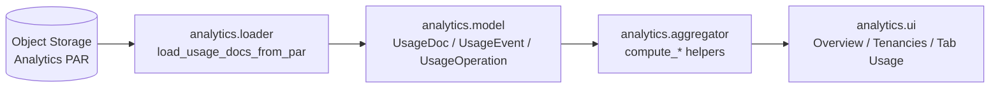

##########################################################################
# CONTEXT_analytics.md
#
# Project-Specific Context: Usage Analytics Mini-App
##########################################################################

## Purpose and Positioning

The **Usage Analytics** mini-application is a small, standalone Tkinter UI
packaged under `oci_policy_analysis.analytics`. It is designed for
maintainers of OCI Policy Analysis (and power users) to inspect **anonymous
usage tracking documents** produced by the main desktop UI and uploaded to a
write-only Object Storage PAR (see `CONTEXT_usage_tracking.md`).

Key goals:

- Provide a quick, visual overview of **how the OCI Policy Analysis tool is
  used in the wild** (run counts, OS/Python distribution, app versions).
- Show **coarse tenancy metrics** based on an anonymized tenancy suffix.
- Analyze **tab usage**, **operations**, and **data load sources** across runs
  without exposing any policy text, OCIDs, or identity details.
- Stay completely **read-only**: the analytics app never writes back to
  Object Storage and does not influence the main UI or its settings.

The analytics UI is intentionally narrow in scope. It is not shipped as a
general user feature inside the main desktop app; instead, it is a separate
tool for project owners and contributors who want to understand and tune
feature usage and performance.


## High-Level Architecture

The analytics package lives under `src/oci_policy_analysis/analytics/` and is
structured as follows:

- `__init__.py` – package entry that exposes `AnalyticsApp` for import.
- `main.py` – top-level Tkinter app and CLI entry point.
- `loader.py` – read-only loader for anonymous usage documents from the
  analytics PAR.
- `model.py` – defensive, read-side models corresponding to the JSON written
  by `common/usage_tracking.py`.
- `aggregator.py` – pure aggregation helpers that compute metrics from
  in-memory `UsageDoc` instances.
- `ui.py` – Tkinter `ttk.Notebook` tabs used by the analytics app.

Data flow is strictly **one way**:



- The **PAR** is a read/list base URL owned by the project author. The
  analytics app can only read anonymous JSON documents; it cannot write.
- `loader.load_usage_docs_from_par` lists object keys under the PAR, filters
  to `events/YYYY/MM/DD/<tenancy_suffix>/<run_id>.json`, downloads each JSON
  document, and constructs `UsageDoc` instances via `model.UsageDoc.from_dict`.
- `aggregator` functions compute overview metrics, tenancy metrics, tab usage
  counts, operation summaries, and data-load sources.
- `AnalyticsApp` in `main.py` wires these metrics into three notebook tabs
  implemented in `ui.py`.


## Usage Documents and Models

The analytics app operates on the same anonymous run documents described in
`CONTEXT_usage_tracking.md`. These are written by
`oci_policy_analysis.common.usage_tracking` as JSON objects of the form:

```json
{
  "run_id": "...",
  "app_version": "4.4.0.dev2",
  "started_at": "2025-03-20T21:15:03.123Z",
  "ended_at": "2025-03-20T21:45:10.987Z",
  "os": "Darwin-23.4.0-arm64-arm-64bit",
  "python": "3.12.13",
  "events": [ ... ],
  "operations": [ ... ]
}
```

The analytics `model.py` module provides *read-side* dataclasses that mirror
this structure but with richer typing and parsed datetimes:

- `UsageEvent` – single usage event during a run (e.g. `tab_change`).
- `UsageOperation` – higher-level operation (e.g. data load).
- `UsageDoc` – a single run document (run id, app version, OS/Python, dates,
  tenancy suffix, plus lists of events and operations).
- `AnalyticsState` – small container that holds the list of loaded
  `UsageDoc` instances.

All `from_dict` helpers are **defensive**: if data is malformed they log at
DEBUG and return `None` instead of raising, so a single bad document cannot
break the analytics app.


## Loader and PAR Configuration (`loader.py`)

`loader.py` contains all the logic for talking to the analytics PAR:

- `ANALYTICS_PAR_BASE_URL_DEFAULT` – built-in default base URL for listing
  and reading usage documents from Object Storage.
- `get_analytics_par_base_url()` – resolves the base URL to use, honoring the
  environment variable `OCI_POLICY_ANALYSIS_ANALYTICS_PAR_URL` when set,
  otherwise falling back to `ANALYTICS_PAR_BASE_URL_DEFAULT`.
- `list_usage_objects_for_dates(base_url, start_date, end_date)` – issues a
  GET to the base URL, interprets the JSON listing returned by Object
  Storage, filters for keys under `events/YYYY/MM/DD/...`, and applies an
  optional `[start_date, end_date]` window.
- `load_usage_docs_from_par(start_date, end_date)` – orchestrates full
  loading of `UsageDoc` instances for the requested date range.

**Date-based filtering**

The analytics UI requests a bounded date range based on a configurable
"days" window (see `AnalyticsApp._compute_date_range`). When `days > 0`, the
loader only returns objects with `object_date` between `today - days` and
`today` inclusive. If `days <= 0`, the loader returns all available events.

All network and decoding errors are logged but never raised. If the PAR is
unavailable or returns unexpected data, the app simply shows empty tables.


## Aggregation Helpers (`aggregator.py`)

Once `UsageDoc` instances are loaded into memory, `aggregator.py` computes
simple, UI-friendly metrics:

- `compute_overview_metrics(docs)` – total run count, distinct tenancy
  suffixes, first/last run dates, OS/Python/app-version distributions.
- `compute_tenancy_metrics(docs)` – per-tenancy aggregates, including first/
  last seen dates and app-version counts.
- `compute_tab_usage_metrics(docs)` – counts of `tab_change` events per tab
  name and their first/last seen dates.
- `compute_operation_summaries(docs)` – counts of operations by `op_type`
  across all runs.
- `compute_data_load_sources(docs)` – focused summary of `data_load`
  operations grouped by the non-personal `source` field
  (e.g. `live`, `cache`, `compliance`, `json_file`).

All helpers accept an iterable of `UsageDoc` objects and return either simple
dicts or dataclass instances that are easy to bind into Tkinter widgets.


## UI Layout and Tabs (`ui.py`)

The analytics UI uses a single `ttk.Notebook` with several tabs, implemented in
`ui.py`:

- **OverviewTab**
  - Shows top-level metrics: total runs, distinct tenancies, date range.
  - Displays a compact load-source summary alongside the date range.
  - "Recent runs" table (latest first, capped at 50) listing for each run:
    - Tenancy suffix (or `unknown`)
    - Started timestamp
    - **Duration** of the run (derived from `ended_at - started_at` when
      both timestamps are present; shown as `Xs`, `Ym ZZs`, or `Xh YYm`;
      falls back to `(unknown)` or `(invalid)` when needed)
    - App version
    - OS / Python
    - First data-load source observed during that run (or `n/a` for older
      documents).

- **TenancyTab**
  - Aggregates runs by tenancy suffix.
  - For each tenancy (including a synthetic `unknown` bucket) shows:
    - Run count
    - First and last seen dates
    - App-version distribution string (e.g. `4.4.0 (10), 4.5.0 (3)`).

- **TabUsageTab**
  - Summarizes how often each top-level UI tab is visited in the main
    desktop app.
  - For each tab name (the tab class name recorded by `App._on_tab_changed`),
    shows the number of `tab_change` events and the first/last dates on which
    that tab was seen.

- **SubtabUsageTab**
  - Provides a focused view on **subtabs / sub-views** within higher-level
    tabs, based on `tab_change` events that include a `sub_view` field in the
    payload.
  - This is primarily used to track usage of the notebook subtabs inside
    `PolicyRecommendationsTab` (e.g. "Risk Overview - Policy", "Overlap
    Analysis", "Cleanup / Fix", "Limits", "Recommendation Workbench").
  - For each `(parent_tab, sub_view)` pair, shows:
    - Parent tab name (e.g. `PolicyRecommendationsTab`)
    - Subtab / view label
    - Number of times that subtab was activated during the selected window
    - First and last dates on which that subtab was seen

All three tabs inherit from the project-wide `BaseUITab` for a consistent look
and context-help behavior.


## Main Application and Entry Point (`main.py`)

`main.py` contains the main Tkinter application class and the console entry
point used by `python -m`.

### `AnalyticsApp`

`AnalyticsApp` subclasses `tk.Tk` and wires together loader, aggregators, and
UI tabs:

- Accepts a single optional argument `days: int = 30` controlling how many
  days of analytics to load from the PAR.
- Builds a simple toolbar with:
  - **Refresh from PAR** button – reloads usage documents for the current
    date window and updates all tabs.
  - **Include 'unknown' tenancy** checkbox – toggles whether runs whose
    tenancy suffix is missing or `"unknown"` are included in aggregate
    metrics.
  - A status label reflecting the latest refresh (e.g. number of runs and
    tenancies loaded).
- Creates a notebook with the three tabs from `ui.py` and triggers an initial
  load shortly after startup via `self.after(100, self.refresh_from_par)`.

Internally, `refresh_from_par`:

1. Computes a `(start_date, end_date)` window based on `self._days`.
2. Calls `load_usage_docs_from_par` to fetch documents from Object Storage.
3. Applies the `Include 'unknown' tenancy` filter when computing metrics.
4. Invokes aggregator helpers.
5. Calls `refresh(...)` on each UI tab with the resulting metrics and
   documents.


## Operations Tracking (Design and Future UI Tab)

The anonymous usage tracker in `common/usage_tracking.py` emits a small
number of **high-level operations** via `UsageOperation` records (stored
per-run in the `operations` list). These operations are intended to capture
meaningful actions, not low-level UI noise.

As of the current design, notable operation types include:

- `data_load` – emitted by the main desktop app when policy data is loaded
  from different sources. The payload includes a non-personal `source`
  field (`live`, `cache`, `compliance`, `json_file`) as well as simple
  booleans about how the load was performed (e.g. recursive vs non-recursive,
  instance principal vs profile vs session token).
- `mcp_server` – emitted by the Embedded MCP tab when the local MCP server
  starts or stops from inside the desktop UI (payload includes
  `action="start" | "stop"`). Standalone MCP server runs do **not**
  initialize usage tracking and therefore do not emit these events.
- `mcp_tool` – emitted inside `mcp_server.py` for select MCP tools when usage
  tracking is active (i.e. when the MCP server is started from the main UI):
  - `tool_name` identifies the MCP tool (e.g. `run_simulation_batch`,
    `prepare_simulation`, `list_prospective_statements`,
    `set_prospective_statements`, etc.).
  - Optional `count` fields capture batch sizes, such as the number of
    simulation scenarios in a call to `run_simulation_batch` or the number
    of prospective statements configured in `set_prospective_statements`.
  - No policy text, OCIDs, or identity details are ever recorded.
- `consolidation_proposal` – emitted from the (optional) Consolidation
  Workbench tab when a consolidation proposal is generated. The payload
  includes simple aggregates such as:
  - `selected` – number of candidate statements in the proposal.
  - `protected` – number of protected statements excluded from the proposal.
  - Strategy information (e.g. strategy id or display name) is persisted in
    the consolidation plan state and is available to analytics via the
    consolidation history cache.
- `condition_test` – emitted from the Condition Tester tab when a where-
  clause is evaluated using simulated variables. The payload includes only
  non-sensitive metadata, such as:
  - `var_count` – number of simulated variables supplied for the test.
  - (Future extensions may add aggregate comparison counts or success
    ratios, but will never include the raw where clause text or variable
    values.)

The existing `compute_operation_summaries(docs)` helper already returns a
simple `{op_type: count}` mapping across all runs. Looking ahead, a future
**OperationsTab** in `analytics/ui.py` could expose these new signals in a
more structured way, for example:

- **Top-level operations table**
  - One row per `op_type` (e.g. `data_load`, `mcp_tool`,
    `consolidation_proposal`, `condition_test`).
  - Columns: `Operation Type`, `Total Count`, and perhaps
    `Distinct Runs` (how many runs emitted at least one such operation).

- **Detail panel / secondary table**, driven by the selected `op_type`:
  - For `data_load`:
    - A small breakdown by `source` (counts for `live`, `cache`,
      `compliance`, `json_file`), mirroring the `compute_data_load_sources`
      output.
  - For `mcp_tool`:
    - A per-tool summary (`tool_name`, `invocation_count`, optional
      aggregated `count` for batch-type tools).
  - For `consolidation_proposal`:
    - Simple aggregates such as min/avg/max of `selected` and `protected`
      statement counts per run, which can guide tuning of default
      strategies and UI affordances.
  - For `condition_test`:
    - Metrics like total tests run and average `var_count` per evaluation,
      indicating how heavily the Condition Tester is used and at what
      complexity.

At present, these operations are fully captured in the underlying usage
documents and surfaced at a coarse-grained level via `compute_operation_summaries`
and `compute_data_load_sources`. The additional **OperationsTab** described
above is intentionally scoped as a future enhancement, so it can evolve with
real-world usage patterns without overfitting the initial UI.


### CLI / Module Entrypoint

`main.py` also provides a small CLI wrapper so the analytics UI can be
launched directly from the command line.

- `_parse_args(argv)` – uses `argparse` to recognize:

  - `--days N` – integer; number of days of analytics to load from PAR
    (default: `30`). Values `<= 0` mean "no date filter" (load all
    available events).

- `main(argv=None)` – parses arguments, logs startup, instantiates
  `AnalyticsApp(days=args.days)`, and calls `app.mainloop()`.

The module-level `__all__` exposes both `AnalyticsApp` and `main` for
programmatic use.


## How to Run the Analytics UI

The analytics mini-app is installed as part of the `oci-policy-analysis`
package and can be run from any environment where the package (and its
dependencies) are available.

### Preferred invocation

From a shell in an environment where `oci_policy_analysis` is importable,
launch the UI with:

```bash
python -m oci_policy_analysis.analytics.main
```

This uses the `main()` function in `analytics/main.py` as the module
entrypoint, parses `--days` if provided, and starts the Tkinter event loop.

Examples:

- Load the last 30 days of analytics (default):

  ```bash
  python -m oci_policy_analysis.analytics.main
  ```

- Load only the last 7 days of analytics:

  ```bash
  python -m oci_policy_analysis.analytics.main --days 7
  ```

- Load **all** available analytics documents (no date filter):

  ```bash
  python -m oci_policy_analysis.analytics.main --days 0
  ```

> **Note on `--help`**
>
> Running `python -m oci_policy_analysis.analytics.main --help` will
> initialize logging and may emit a harmless `RuntimeWarning` from Python's
> `runpy` module (because the package is re-imported before executing the
> module). This warning does not affect normal operation of the analytics UI
> and can be safely ignored. For typical usage, prefer the examples above
> rather than relying on `--help` output.


### Environment assumptions

- The analytics app relies on the **anonymous usage tracking PAR** being
  reachable. If the PAR is unavailable, misconfigured, or empty, the app will
  simply show "0 runs" and empty tables.
- No OCI credentials are required: all access is via HTTP GET to the PAR,
  which is configured as read/list and does not require authentication.
- The app logs to the same logging subsystem as the main UI
  (`common/logger.py`), so log output goes to both stdout and
  `~/.oci-policy-analysis/logs/app.log`.


## When to Use This Tool

Typical scenarios for running the analytics mini-app include:

- Verifying that new or experimental UI features are being used as expected
  before investing in further enhancements.
- Monitoring adoption of new tabs or workflows (via tab usage metrics).
- Understanding which environments (OS, Python versions, app versions) are
  most common among active users.
- Confirming that anonymous usage tracking documents are still being written
  and uploaded correctly after changes to `common/usage_tracking.py` or
  deployment pipelines.

Because analytics is compiled from anonymous, non-personal data, it should
be safe to run in any development or maintainer environment that has network
access to the configured PAR.


## Related Context and References

- Anonymous usage tracking design and JSON schema:
  - [`CONTEXT_usage_tracking.md`](CONTEXT_usage_tracking.md)
- Analytics package source:
  - `src/oci_policy_analysis/analytics/__init__.py`
  - `src/oci_policy_analysis/analytics/loader.py`
  - `src/oci_policy_analysis/analytics/model.py`
  - `src/oci_policy_analysis/analytics/aggregator.py`
  - `src/oci_policy_analysis/analytics/ui.py`
  - `src/oci_policy_analysis/analytics/main.py`
- Logging subsystem shared with the main app:
  - [`CONTEXT_logging.md`](CONTEXT_logging.md)
