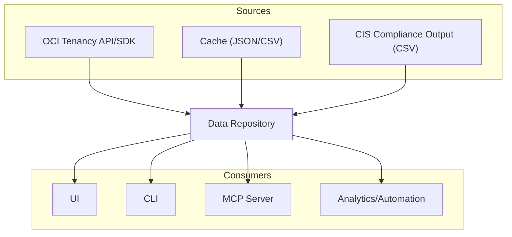
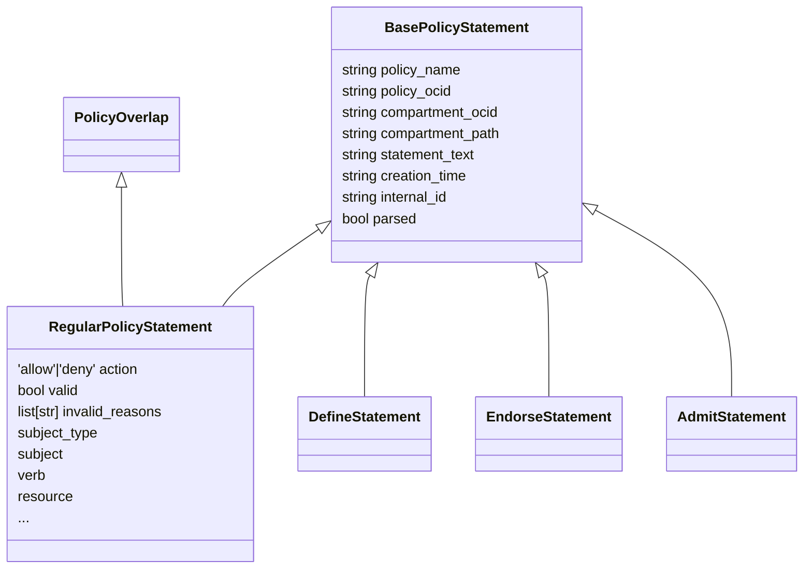
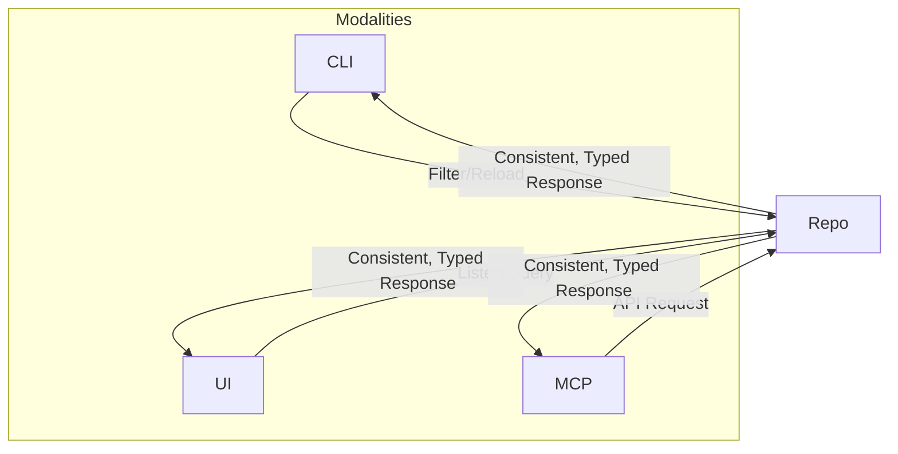

# Project-Specific Context: The Data Repository and Canonical Data Models

This resource provides an expert-level reference for the **central component** of OCI Policy Analysis: its data repository layer and underlying canonical data models. It narrates how this layer integrates every feature (CLI, UI, MCP server, analytics, caching, simulation), why its API shape ensures model validity and consistency everywhere, and illustrates the models, access patterns, key behaviors and error handling across real-world workflows.

---

## 1. **Centrality by Design: The Data Repository as the System’s Heart**

The `PolicyAnalysisRepository` (see logic/data_repo.py) is the *single source of truth* for all policy/domain/entity data:

- All **consumers—CLI, UI tabs, MCP API, automation, analytics**—operate *via the repository*'s unified, type-safe API (never via shortcuts, bespoke loaders, or external scripts).
- *No* other layer in the system accesses raw data; repo-layer guarantees all data is:
    - Consistently validated and normalized (following canonical models)
    - Atomically refreshed, cached, or partially updated across all app modes
    - Tracked with precise provenance (live/SDK, cached, compliance snapshot)
- Repo provides *stateful, but opt-in stateless* interface—full reload, partial reload, live API sync, and cache/CSV/JSON import supported identically.



_Connections:_
- A → R: Load & Normalize
- B → R: Import & Validate
- C → R: Parse & Map
- R → (F, G, H, I): Typed, filtered API

**Narrative**:  
Every action—query, simulation, diff, analysis, visualization—*starts* with a call to the repo API. Consistency is ensured across all modalities. No consumer can “skip the repo” and thus all data passing into business logic and UIs/threaded tasks is rigorously validated.

---

## 2. **Canon of Record: Data Models and Inheritance (see `common/models.py`)**

All data passes through a collection of **canonical TypedDict models** (see common/models.py), which embody type safety, extendability, and clarity required for both machine processing and human diagnostics.

- **IAM Entities** — Models for:
    - `User` (username, domain, display, email, OCID, group membership tracking, etc.)
    - `Group` (domain, name, OCID, description)
    - `DynamicGroup` (domain, name, OCID, matching rule, in-use state, description, etc.)
    - `Compartment` (id, name, path, parent, status, and *optional analysis fields*: statement counts direct/cumulative)
- **Policy Model Hierarchies** — Supports all statement types: allow/deny, cross-tenancy (admit, endorse), define, and overlays/analysis.

**Policy & Statement Model Inheritance**



- **Simulation Models** — For principal query/scenario construction and traceable, explainable result types.
- **Filtering/Search Models** — Fine-grained, AND/OR-capable filters for all entity types (full-text + type-aware queries).
- **Analysis/Overlay Models** — e.g. overlap/conflict, risk scores, and summary/diagnostic scaffolding.

**Design Rationale:**  
The TypedDict structures empower strict validation on load, human-centric error reporting, and make all repo output predictable and easy to document/test. When extending, always inherit from the right base.

---

## 3. **Data Ingestion: Full Coverage and Detailed Control**

**A. Live OCI API/SDK Loading**  
- Recursively scans all compartments (robust to hierarchies, future compatibility with API expansion), fetches all policies, users, dynamic groups, groups.
- Enforces type normalization, provenance tagging, deduplication, and assignment of *analysis-only fields* (e.g. cumulative statement counts).
- **Compartment Depth** — Tree-walk up to arbitrary depth; loading is robust to tenancy expansions.
- **Defined Tag Catalog Enrichment** — Live policy loads now also build an in-memory defined-tag namespace catalog (`defined_tag_namespace_keys`) using OCI Resource Search + Identity Tag APIs. The catalog tracks:
    - namespace name
    - namespace compartment OCID
    - resolved namespace compartment path
    - discovered keys and optional static value enumerations

**B. Import from Cache (JSON) and CSV**
- Either entire previous session or specific entity subsets loadable.
- Every loaded object is type-checked against canonical models, then indexed.
- **Atomicity** — If any object is invalid or out-of-schema, *entire load is aborted* and diagnostics are returned.
- Mix of JSON and CSV is possible for advanced scenarios (restricted per section on “caveats”).

**C. CIS Compliance Output**
- Accepts OCI-generated [CIS Benchmark CSVs](https://docs.oracle.com/en-us/iaas/Content/Security/Reference/cis-benchmark.htm).
- **Mapping** — CSV fields mapped (best-effort, lossless if possible) to policy/users/groups/compartments; *unmapped columns are logged as warnings*.
- **Mode Behavior** — Puts repo in “compliance mode”: disables reload-from-cloud in UI, disables modifications for safety, marks data as read-only for all downstream analysis.

**D. Partial Reloads/Incremental Updates**
- Reload only selected entity types (e.g. just policies, just users, a compartment subtree) without resetting all state.
- Internal logic tracks which objects were reloaded, preserved, or dropped; propagates changes to all indices and subscribers.
- Ideal for very large tenancies or fast iteration cycles.

**Error Handling Example**:  
If a loaded CSV contains out-of-schema identities, the load fails, logs all issues (with line-level detail), and *exposes these* for UI/CLI/MCP audit. No partial/truncated state is made visible.

---

## 4. **API Access Patterns, Logging, and Threading**

- **API Boundaries**  
  Only typed, well-documented filter/search/list/add/update methods are exposed. All mutation and query paths traverse these.
- **Logging (see common/logger.py)**  
  - All core events—API/load, errors, filter invocations, cache writes—are logged at appropriated levels (info, error, critical).
  - Filtering emits info logs; every error is logged at error and persists to both file and console.
- **Threading**  
  - All bulk loads and extended searches can dispatch via thread pool executors; mutexes/locks guard shared state on reload, cache writes.
  - MCP and UI both employ background/incremental thread-safe loads—*no race conditions or partial-stale state is possible*.
- **Diagnostics Forwarding**  
  - Failed loads/syncs, filter errors and even incomplete/corrupted CSVs always bubble diagnostics (never dropped), which get surfaced either to API or user as appropriate.

*Design rationale*:  
High concurrency and consistent logging make error triage and profiling straightforward. Threading is never left unchecked; all reload/state transitions are atomic.

---

## 5. **Filtering and Search API: Consistency and Advanced Logic**

- For **every entity domain**, there is a `filter_*` (e.g. `filter_policy_statements`, `filter_groups`, etc.) method which takes explicit filter objects (`AND` across fields, `OR` within field lists).
- **Consistency Guarantee**:  
  No matter *who* calls the filter (UI, CLI, MCP, automation), the same logic is used—spanning group/user/dg search, text/field/verb filtering, golden queries (“show me all risky statements”), or even advanced nested queries.
- **Result Types**:  
  - Full objects or summaries (optional truncation if for UI or very large result).
- **Composability**:  
  Filters are composable/chainable—e.g. user fuzzy search expands to groups, then exact group search.
- **Advanced Features**:  
  - Fuzzy matching, wildcard/group expansion, partial OCID/domain support.
  - Supports filtering for “valid”/“invalid” statements (for triage) or “effective_path”-prefix lookup for compartmentalized policy search.

**Pseudo-Example:**  
```python
# Get all managed policies in 'Finance' compartment(s)
repo.filter_policy_statements({
    'verb': ['manage'],
    'compartment_path': ['ROOT/Finance']
})
```

### 5.1 Alternate Statement Sets (Prospective / What-If)

The `filter_policy_statements` helper also supports filtering an
**alternate list of policy-like statements** via the `statements=`
keyword parameter:

```python
def filter_policy_statements(
    self,
    filters: PolicySearch,
    *,
    statements: list[RegularPolicyStatement] | None = None,
) -> list[RegularPolicyStatement]:
    ...
```

- When `statements` is **not** provided, the filter operates on the repo’s
  canonical `regular_statements` list (real tenancy policies).
- When `statements` **is** provided, that list is filtered instead, using the
  **exact same JSON filter semantics** (subject, verb, resource, conditions,
  effective_path, etc.).
- This is used in the UI to apply the same filtering rules to
  **prospective (what-if) statements** that are not part of
  `regular_statements` but are normalized into the same shape.

Typical usage in the Policies tab:

1. Build a list of prospective records from `ProspectiveStatementsService` or
   the simulation engine and shape them like `RegularPolicyStatement`.
2. Call:

   ```python
   # Apply the same filters used for real policies
   prospective_filtered = repo.filter_policy_statements(
       filters=filters,
       statements=prospective_like_list,
   )
   ```
3. Normalize these for display and append them **after** the
   real tenancy rows to form a combined view.

This keeps the filtering logic **centralized and uniform** across both real and
what-if policy sets, and avoids duplicating filter behavior in UI layers.

---

## 6. **Caching and Persistence**

- **All session state** (entities, policies, indices, provenance) kept in-memory for maximal performance.
- **Cache Writes**:  
  At explicit user request (via CLI/UI) or on auto-save, *full snapshot* is serialized (as JSON/CSV). Each load from cache is re-validated against the latest model, discarding or logging out-of-schema rows.
- **Tag Catalog Persistence**:
  - Combined cache save/load/update flows now persist `defined_tag_namespace_keys` alongside policies/statements.
  - This keeps the Policy Browser/Tag-based Access tag-discovery experience consistent across tenancy loads, cache reloads, and policy-only reload updates.
- **Reload Consistency**:  
  On reload, *the same validation path* is traversed again—no assumptions of trust. Invalid/mismatched data is reported, not silently dropped.
- **Mix-Mode Loads**:  
  (e.g. partial reload after compliance snapshot) are discouraged. Attempting to do so triggers a state warning or a controlled error, logged for user clarity.

---

## 7. **Partial and Incremental Reload: Speed and Scalability**

- For very large tenants or dev/test workflows, support exists for:
    - Compartment-only or policy-only reloads.
    - Tree/tranche-based loading.
    - Change-propagation (tracks which entities updated, which unchanged, and updates caches/subscribers accordingly).
- **Error propagation** ensures that if a partial reload fails (e.g. due to new entity missing required fields), the existing state is preserved and a comprehensive diagnostic is logged.

---

## 8. **Support Across CLI, UI, MCP (Uniformity)**

- **CLI**:  
  - Always accesses the repo for search/filter/list/export.  
  - Exposes output following canonical models—no bespoke formats, always typed (`for_display_policy`/model export).
  - When used, repo is first instantiated and loaded, then invoked via typed filter/query/export APIs.
- **UI**:  
  - Every tab component (e.g., policy browser, simulation, report, MCP, etc.) subscribes to repository events/state changes; reload, partial update, and filter/query events propagate to relevant tabs.
  - UI never accesses or mutates state directly; always via repo API.
- **MCP**:  
  - All server/microservice requests (fetch, analyze, simulate) are translated to repo filter/analysis calls, guaranteeing accuracy/state symmetry.  
  - API endpoints pass through strict model serialization/deserialization.

**Unification Example:**



---

## 9. **Compliance Output Mode: Loading CIS Benchmark Results**

- Expects OCI-generated CIS compliance CSVs; loads users, groups, policies, comps, dgs.
- **Best Effort Mapping**:  
  Columns are mapped to model fields; unmapped/missing info is logged (never dropped silently or hidden).
- **Tag Catalog Placeholder**:
  - Compliance loading currently includes an explicit placeholder hook for future defined-tag ingestion.
  - The method is intentionally no-op today, but documents the target canonical shape for `defined_tag_namespace_keys` so future compliance parsers can populate it consistently.
- **Special “Compliance Mode”**:  
  Disables reload-from-cloud, disables modification, sets all analysis to read-only (auditability above completeness).
- **Limitations**:  
  OCI/CIS output occasionally lacks certain fields—these are surfaced as warnings/audit log entries.
- **Analysis Features In-Mode**:  
  All core features (overlap detection, unused group analysis, risk scoring, simulation) still function as read-only overlays.
- **Review & Best Practices**:  
  Always inspect compliance-mode logs for completeness issues or mapping losses.

---

## 10. **Detailed Narrative: Instantiating and Using the Data Repository**

**Dev/Contributor Steps:**

1. **Import and Instantiate**
    ```python
    from oci_policy_analysis.logic.data_repo import PolicyAnalysisRepository

    repo = PolicyAnalysisRepository()
    ```

2. **Load Data**
    - *Live Tenancy*:  
      ```python
      repo.initialize_client(
        use_instance_principal=False,  # or True if in OCI cloud
        profile="DEFAULT",             # OCI config profile
        recursive=True                 # deep policy comp scan
      )
      repo.load_complete_identity_domains()
      repo.load_policies_and_compartments()
      ```
    - *Cache Import*:  
      ```python
      # Use cache manager to hydrate repo from a JSON/CSV snapshot
      from oci_policy_analysis.common.caching import CacheManager
      CacheManager().load_combined_cache("your-cache-name", repo)
      ```
    - *Compliance Output*:  
      ```python
      repo.load_from_compliance_output_dir("/path/to/compliance_csvs/")
      ```

3. **Filter/Query Data**
    ```python
    filtered = repo.filter_policy_statements({
        "verb": ["manage"],
        "compartment_path": ["ROOT/Finance"]
    })
    ```

   **Compartment Path Lookup Helper**
   ```python
   path = repo.get_compartment_path_for_ocid("ocid1.compartment...")
   # -> "ROOT/Shared/Security" (or "UNKNOWN_PATH" when not resolvable)
   ```

   This helper is used by UI components (notably Policy Browser tag catalog)
   to convert namespace compartment OCIDs into human-readable hierarchy paths.

4. **Diagnostics/Error Handling**
    - All methods return strict types or raise/log critical errors.
    - Invalid/malformed data triggers Exception or returns empty results + diagnostic logs.
    - Logs (file/console) will always include context—API calls/params for triage.

5. **Partial Reloads**
    - For only refreshing certain entities (see method signatures in `data_repo.py`), e.g.
    ```python
    repo.reload_compartment_policy_data()
    ```

6. **Export/Cache (Optional)**
    - Use `CacheManager().save_combined_cache(repo)` to persist session.

**Full CLI Example (from cli.py):**
- Run:
    ```
    python -m oci_policy_analysis.cli --profile DEFAULT --print-all
    ```
- The CLI will internally instantiate the repo, attempt either live or cached load, perform post-load intelligence (analytics/diagnostics), and provide output structured as model dicts.

---

## 11. **Developer Guidance & Best Practices**

- *Always* extend base TypedDicts for any new entity/type (never append random fields).
- *Never* bypass repository for raw data; contribute new logic as typed, tested API methods.
- Follow threading/locking discipline for any heavy background loading/filtering that touches shared state.
- For every extension: update models, loaders, indexers, relevant filters, and add/adjust documentation with diagrams where relationships or flows change.

---

## 12. **References**

- Data Models: src/oci_policy_analysis/common/models.py
- Data Repository: src/oci_policy_analysis/logic/data_repo.py
- Cache Manager: src/oci_policy_analysis/common/caching.py
- CLI Demo: src/oci_policy_analysis/cli.py
- Logger: src/oci_policy_analysis/common/logger.py
- Filter API Example: filter_policy_statements in src/oci_policy_analysis/logic/data_repo.py

---

## 13. **2026-04 Tag Catalog Evolution (Repository + Cache + UI contracts)**

As of 2026-04 updates, the repository and surrounding cache/UI contracts were expanded for tag namespace observability:

- **Repository model shape** (`defined_tag_namespace_keys`) is now documented/used as:

```python
{
  "NamespaceName": {
    "keys": {
      "TagKeyA": ["Value1", "Value2"],
      "TagKeyB": None,  # user-supplied / no static enum exposed
    },
    "compartment_ocid": "ocid1.compartment...",
    "compartment_path": "ROOT/..."
  }
}
```

- **Path resolution helper** (`get_compartment_path_for_ocid`) ensures OCID-based metadata can be displayed consistently as hierarchy paths.
- **Cache compatibility** remains backward-safe:
  - older cache files without `defined_tag_namespace_keys` still load (default `{}`).
  - newer cache files preserve the richer namespace metadata.
- **Compliance mode** now has an explicit future ingestion hook so the same shape can be adopted once compliance artifacts provide sufficient tag metadata.

---

_See general standards and style: [../generic/GENERIC_DOCUMENTATION.md](../generic/GENERIC_DOCUMENTATION.md) and [../generic/GENERIC_CODING_STANDARDS.md](../generic/GENERIC_CODING_STANDARDS.md)_