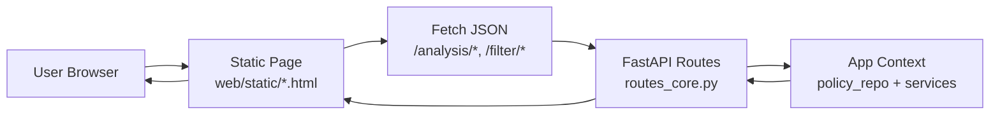
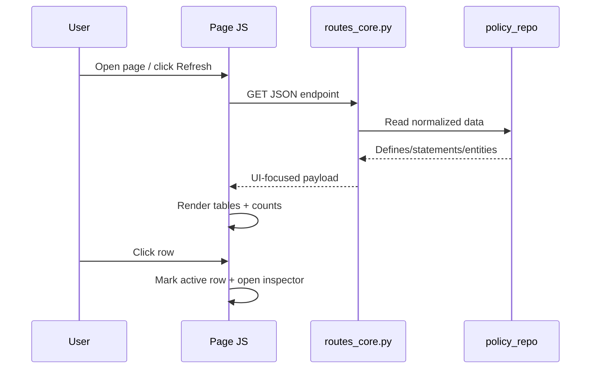

##########################################################################
# CONTEXT_web_ui.md
#
# Project-Specific Context: Web UI Architecture, Data Flow, and Detail Panes
##########################################################################

## Purpose

This document captures the current **web UI architecture and interaction flow**
for OCI Policy Analysis, with emphasis on:

- How the static web pages are composed and wired to API routes.
- How analysis data is loaded and rendered in table-first workflows.
- How row selection drives **right-side detail inspectors** (slide-in panes).
- The current cross-tenancy page behavior and conventions.


## 1) Web UI Architecture (Static Pages + API)

The web UI is implemented as static HTML/CSS/JS pages in
`src/oci_policy_analysis/web/static/` and data APIs in
`src/oci_policy_analysis/web/api/routes_core.py`.



Design principles:

- Keep page logic local and explicit (per-page JS script blocks).
- Keep route payloads UI-friendly and stable.
- Prefer a **table + inspector** interaction pattern for dense records.


## 2) Common UI Construction Pattern

Most analysis pages follow this structure:

1. **Header card** with refresh/actions/status.
2. **Primary table(s)** for fast scanning and sorting/filtering.
3. **Row selection state** tracked in JS (stable key where possible).
4. **Detail inspector pane** that renders selected row metadata.

Inspector behavior standard:

- Hidden by default.
- Opens when a row is selected.
- Close button clears selection and hides pane.
- On desktop, inspector is a **fixed right-side slide-in panel**.


## 3) Data Loading and Display Flow



UI rendering notes:

- Keep table rows compact (scan-first).
- Move high-cardinality fields (OCID, parsed fields, metadata) into inspector.
- Preserve selection when possible across table refreshes.


## 4) Detail Pane Pattern

For consistency with `policy-analysis.html`, desktop inspector behavior should be:

- `position: fixed; top:0; right:0; bottom:0`
- width approximately `min(460px, 40vw)`
- slide with `transform: translateX(105%)` -> `translateX(0)`
- close via `X` button that clears selection and removes `.open`

This is now the expected standard for right-side details on web analysis pages.


## 4.1) Row Context Menu (Right-Click) Pattern

For table-driven analysis pages, support a custom right-click action menu when it
improves workflow speed (desktop parity with Tkinter context actions).

Recommended behavior:

- Bind `contextmenu` on result rows and call `event.preventDefault()`.
- Show a lightweight custom menu near pointer position.
- Enable/disable menu items based on row content availability.
  - Example: enable "Send condition to Condition Tester" only when `conditions`
    is non-empty.
- Hide the menu on:
  - outside click,
  - `Escape`,
  - scroll,
  - window resize.

UX conventions:

- Keep row primary click behavior unchanged (selection + inspector).
- Use right-click for **secondary actions** only.
- Prefer explicit action labels over icon-only context items.


## 4.2) Cross-Page Handoff Pattern (Inspector/Row -> Utility Page)

When a row action needs to open another page/tool with prefilled input, use a
small client-side handoff pattern.

Preferred mechanism:

- Use `sessionStorage` for payload handoff (safer for long/special-character
  text than query strings).
- Optional query parameter may still be used as source metadata
  (`?from=policy-analysis`) but not as the primary payload transport.

Implementation standard:

1. Source page stores payload:
   - `sessionStorage.setItem('<key>', payloadText)`
2. Source page navigates to target utility page.
3. Target page reads payload on load, pre-fills UI, and clears the key.
4. Target page optionally runs immediate post-load helper actions
   (for example, auto-generate variable inputs).

This pattern should be preferred for "send to utility" flows across static web
pages.


## 5) Cross-Tenancy Web Page (Current Behavior)

File: `src/oci_policy_analysis/web/static/cross-tenancy-analysis.html`

Endpoint: `GET /analysis/cross-tenancy`

### Payload sections

- `defines`
- `admit_statements_basic`
- `endorse_statements_basic`
- `unknown_statements_basic`
- `counts`

Admit/Endorse rows include:

- basic display fields (`policy_name`, `statement_text`, ...)
- `stable_key`
- `parsed_fields` (parser-derived extra keys for inspector display)

### Current page flow

1. **Defines section** (top):
   - left table with alias selection for filtering
   - right inline define detail panel
2. **Admit + Endorse tables** (main scan view):
   - compact columns: `Policy Name`, `Statement Text`
3. **Shared right-side inspector** for Admit/Endorse:
   - opens from either table row selection
   - includes primary metadata and a **Parsed Details** section


## 6) Parsed Fields in Inspector

Cross-tenancy admit/endorse inspector now supports two logical blocks:

1. Primary fields (`policy_name`, `policy_ocid`, `statement_text`,
   `creation_time`, `parsed`, `stable_key`)
2. `- Parsed Details -` separator, then sorted parser-derived fields from
   `parsed_fields`

This keeps table display simple while still exposing parser output for deeper
inspection and future parser/validator iteration.


## 7) Implementation Guidance for New Web Pages

- Reuse the same **table + fixed right inspector** interaction model.
- Keep API payloads intentionally shaped for UI (avoid pushing formatting work
  into page JS where possible).
- Include stable row identifiers for selection persistence.
- Put verbose/diagnostic fields in the inspector instead of widening tables.
- Where parser output exists, provide an explicit parsed-details section.
- Where row-level secondary actions are needed, use the standard right-click
  context menu pattern from section 4.1.
- For cross-page utility workflows, use the handoff pattern from section 4.2.


## 7.1) Concrete Reference: Policy Analysis -> Condition Tester

Reference files:

- Source page: `src/oci_policy_analysis/web/static/policy-analysis.html`
- Target page: `src/oci_policy_analysis/web/static/condition-tester.html`

Current standardized interaction:

1. User right-clicks a policy row in Policy Analysis.
2. Context menu action "Send condition to Condition Tester" appears when row
   has non-empty `conditions`.
3. Source page stores condition text in
   `sessionStorage['ociConditionTesterClause']` and navigates to
   `/condition-tester.html`.
4. Condition Tester preloads clause input from session storage, clears the key,
   and runs variable generation.

Use this as the baseline implementation for future "send selected row data to
another tool page" features.


## 8) OCI Tenancy Explorer UI Style Reference (from `src/sample/index.html`)

This section captures reusable UI conventions observed in
`src/sample/index.html` so future pages can use named patterns instead of
ad-hoc styling.

### 8.1 Design Tokens and Visual Language

Primary semantic tokens used throughout the sample page:

- `--oci-red`, `--oci-red-deep`, `--oci-red-soft`: brand/action emphasis.
- `--oci-ink`: primary text color.
- `--oci-steel`: secondary text color.
- `--oci-line`, `--oci-line-strong`: borders/dividers.
- `--oci-panel`, `--oci-panel-alt`: surface backgrounds.
- `--oci-bg`: page background.

Practical rule:

- Use red tokens for primary actions, active state, and high-attention accents.
- Keep body surfaces neutral (`--oci-panel`) and reserve gradients for focused
  highlight regions (tabs, score bars, active chips where needed).

### 8.2 Typography Roles (Named Usage)

Use these named roles when designing content hierarchy:

- **Page Title**: large, high-contrast heading (example: `h1`/`h2` with
  `text-2xl` to `text-3xl`, `font-black`, tighter letter spacing).
- **Section Label**: small uppercase kicker above content blocks
  (`text-[10px]`, `font-black`, `uppercase`, `tracking-widest`, muted color).
- **Card Title**: section heading inside cards (`text-xl`, `font-black`).
- **Body Copy**: explanatory text (`text-[11px]`/`text-sm`, relaxed line-height).
- **Meta/Caption**: status and helper text (`text-[10px]` or `text-[9px]`,
  uppercase tracking for operational metadata).

### 8.3 Layout and Container Patterns

Reusable layout patterns:

- **Page Shell**: centered max-width app container with consistent paddings
  (`max-w-[1920px] mx-auto px-4 py-4`).
- **Top Masthead Card**: rounded header with top border accent and soft shadow.
- **Content Card**: `bg-white`, `rounded-2xl`, `border`, `shadow-sm`, padded.
- **Workspace Split**: filter/sidebar + results/table + optional right inspector.
- **Inspector Panel**: fixed-right, high-z panel on desktop;
  full-width/stacked behavior on smaller screens.

### 8.4 Navigation and Selection Components

Named reusable components:

- **Portal Tab** (`.portal-tab`, `.portal-tab-active`): top-level view switch.
- **Subtab** (`.opportunity-subtab`, `.opportunity-subtab-active`):
  section-level switch inside one view.
- **Filter Pill / Chip** (`.opportunity-filter-pill`, `.regional-chip` + active
  variants): quick multi-filter entry points.
- **Info Button + Popover** (`.section-info-button`, `.section-info-popover`):
  inline help for metric cards or labels.

### 8.5 Actions, Inputs, and Link Styling

Use these action patterns consistently:

- **Primary Action Button**: red background, white text, rounded corners, hover
  deepens red (e.g., refresh/run/open).
- **Secondary Button**: white background, neutral border/text, subtle hover fill.
- **Destructive/critical tone**: use only for error/alert semantics, not for
  regular navigation.

Input conventions from sample:

- Rounded controls (`rounded-xl`) with neutral border.
- Focus state uses red border + soft ring (`rgba(199,70,52,0.12)`).
- Search inputs and selects share visual baseline for alignment.

Link conventions:

- **Utility link-button** style for JSON/doc links (`.json-source-link`):
  button-like border and uppercase metadata typography.
- For external references in content cards, keep links visually consistent with
  secondary button treatment.

### 8.6 Data Display Patterns

Primary data-display building blocks:

- **Stat Card Ribbon**: key numeric KPIs with short labels (top-of-view).
- **Filter Summary Bar**: one-line statement describing filtered scope.
- **Data Table**: sticky header, compact rows, hover highlight, sortable columns.
- **Status Badge/Tag**: semantic classes for operational state
  (`.status-*`, `.refresh-status-*`, `.opportunity-check-*`).
- **OCID Chip** (`.ocid-chip`): compact, copy-friendly identifier display.

Row/table interaction conventions:

- Keep rows scan-friendly and move verbose diagnostics to the inspector.
- Use copy affordances (`.copy-icon-btn`) for OCIDs and key metadata values.

### 8.7 Overlays and Feedback Patterns

Modal and feedback conventions:

- **Modal Overlay** (`.modal-overlay`) with blur/dim treatment.
- **Modal Container**: rounded, bordered card with distinct header and body.
- **Live Activity**: spinner (`.refresh-spinner`), progress bar, and status chips.
- **Log Surface** (`.refresh-log`): monospace, dark background, warning/error
  color accents for troubleshooting readability.

### 8.8 Quick Mapping for Future Page Authors

When creating a new page, map elements to named roles before coding:

1. Page Title + subtitle/meta label.
2. Header action row (primary + secondary buttons).
3. Summary stat cards (if metrics exist).
4. Filter/search strip.
5. Main table/grid.
6. Right inspector panel (desktop fixed-right).
7. Optional modal(s) for workflow or detail drilldown.

This keeps new pages visually aligned with OCI Tenancy Explorer conventions and
prevents one-off class decisions.

### 8.9 Hover-Driven Context Help Area (TK-style Pattern for Web)

Yes — this is a strong fit for the web pages and can mirror the TK context-help
experience.

Recommended web pattern:

- Add a persistent **Context Help card** in the right rail (or below filters on
  narrower layouts).
- Any interactive widget can declare help text via attributes like:
  - `data-help-title="Quick Search"`
  - `data-help-body="Search by policy name, OCID, or statement text..."`
- Use delegated events (`mouseover`, `focusin`) to update the shared help card.
- On `mouseout`/`focusout`, restore default page guidance.

Minimal interaction model:

1. Page loads with a default “How to use this page” message.
2. Hover/focus on control -> help panel updates with role-specific guidance.
3. Leaving control -> help panel reverts to default.

Implementation notes:

- Keep one central helper in page JS (e.g., `setContextHelp(title, body)`).
- Prefer `focusin/focusout` in addition to hover for keyboard accessibility.
- Do not overload tooltips; use the help card for richer guidance.
- This pattern pairs well with existing `.section-info-button`/popover usage:
  popover for point details, help card for persistent workflow guidance.

### 8.10 Title Bar Modernization Experiment (Tenancy Explorer-inspired)

Yes — we can experiment with a title bar closer to Tenancy Explorer while
keeping policy-analysis functionality unchanged.

Proposed title-bar characteristics:

- Card-style masthead with subtle border, radius, and shadow.
- Left cluster: icon badge + page title + small uppercase subtitle.
- Right cluster: primary action(s) then secondary action(s).
- Optional top accent border using `--oci-red`.

Suggested structure to standardize across pages:

1. **Header shell** (`rounded-2xl`, bordered, shadowed panel).
2. **Identity block** (icon + title + descriptor text).
3. **Action block** (refresh/export/help, consistent button hierarchy).
4. **Status/meta line** (last refresh timestamp, data source, warning count).

Safe rollout strategy:

- Start with one page (recommended: `cross-tenancy-analysis.html`) as a visual
  pilot.
- Keep existing JS hooks/IDs; change only presentation classes first.
- Validate table/inspector layout still aligns at desktop and smaller widths.
- If successful, promote the masthead pattern to a shared reference snippet in
  this context doc.


## 9) Standard Shared Web Styles (`app.css`)

All new static web pages should start from the shared stylesheet at
`src/oci_policy_analysis/web/static/app.css`. Avoid page-local `<style>` blocks
and inline `style=` attributes for standard layout/presentation. Add reusable
classes to `app.css` when a pattern is expected to appear on more than one page.

Reference templates:

- `src/oci_policy_analysis/web/static/template-single-column.html`
- `src/oci_policy_analysis/web/static/template-two-column.html`
- `src/oci_policy_analysis/web/static/template-three-column.html`
- `src/oci_policy_analysis/web/static/template-workflow-workbench.html`

These templates intentionally show the class names in visible content so page
authors can copy the structure without inventing one-off styles.

### 9.1 Standard Page Skeleton

Every new page should use the standard masthead + context-help opening pattern:

```html
<link rel="stylesheet" href="/app.css" />

<div class="top-row">
  <header class="app-masthead" data-help-title="Page Name" data-help-body="What this page does.">
    <div class="masthead-brand">
      <span class="masthead-badge">OCI</span>
      <div>
        <h1>Page Name</h1>
        <p>Uppercase page subtitle or workflow descriptor</p>
      </div>
    </div>
    <div class="masthead-meta">Optional status/meta</div>
  </header>

  <div class="context-help-card" id="contextHelpCard">
    <p class="context-help-kicker">Context Help</p>
    <h3 id="contextHelpTitle" class="context-help-title">How To Use This Page</h3>
    <p id="contextHelpBody" class="context-help-body">Default page guidance.</p>
  </div>
</div>
```

Required masthead/context-help classes:

- `.top-row`
- `.app-masthead`
- `.masthead-brand`
- `.masthead-badge`
- `.masthead-meta` when right-side metadata/actions are needed
- `.context-help-card`
- `.context-help-kicker`
- `.context-help-title`
- `.context-help-body`

### 9.2 Standard Layout Choices

Use one of these page-level layouts below the masthead:

- `.layout-single`: one primary vertical content stream.
- `.layout-two-column`: primary work area plus right rail.
- `.layout-main`: home-page-compatible alias for the two-column layout.
- `.side-stack`: stacked right-rail cards/widgets.

Single-column page shell:

```html
<main class="layout-single">
  <section class="card compact-card">...</section>
</main>
```

Two-column page shell:

```html
<main class="layout-two-column">
  <section class="card compact-card">...</section>
  <aside class="side-stack">...</aside>
</main>
```

### 9.2.1 Reusable Row Utilities (1/2/3/4 Columns + Span)

For row-level layout composition inside any page (independent of the page shell),
use the generic row classes in `app.css`:

- `.layout-row`: base row container (`display:grid; gap:1rem`)
- `.layout-row-1`: one-column row
- `.layout-row-2`: two-column row
- `.layout-row-3`: three-column row
- `.layout-row-4`: four-column row
- `.layout-col-span-2`: span two columns
- `.layout-col-span-3`: span three columns
- `.layout-col-span-4`: span four columns

Example (1/3 + 2/3 split):

```html
<div class="layout-row layout-row-3">
  <section class="card">Left card (1/3)</section>
  <section class="card layout-col-span-2">Right card (2/3)</section>
</div>
```

Behavior on smaller screens:

- `.layout-row-2`, `.layout-row-3`, and `.layout-row-4` collapse to one column at mobile/tablet breakpoints.
- `.layout-col-span-2`, `.layout-col-span-3`, and `.layout-col-span-4` reset to auto span in the collapsed layout.

Use this row utility pattern instead of adding new page-specific grid classes
whenever possible.

### 9.3 Standard Content, Forms, and Actions

Preferred shared classes:

- Cards: `.card`, `.compact-card`, `.card-title`.
- Card links/navigation: `.card-link-row`, `.card a`, `.card a.secondary`.
- Action rows: `.panel-actions`.
- Forms: `.form-grid`, `.form-grid-spacious`, `.inline-field`, `.options-row`,
  `.checkbox-label`, `.ops-button`.
- Section text: `.section-heading`, `.section-kicker`, `.helper-text`,
  `.status-meta`.
- Compact controls: `.select-compact`, `.no-margin-label`, `.mt-compact`.
- Separators: `.section-separator`.

### 9.4 Standard Feedback and Progress

Use these classes for status/progress displays:

- `.status`, `.status.success`, `.status.error` for text feedback.
- `.status-badge` plus `.refresh-status-running`, `.refresh-status-success`,
  `.refresh-status-error`, or `.refresh-status-partial` for badges.
- `.progress-widget`, `.progress-widget-title`, `.progress-widget-head`,
  `.progress-widget-detail`, `.progress-widget-percent`,
  `.progress-widget-track`, `.progress-widget-fill` for progress cards.
- `.refresh-log`, `.refresh-log-line`, `.refresh-log-warning`,
  `.refresh-log-error` for log output surfaces.

### 9.4.2 Mini Event Log Pattern (Reusable)

For workflow-oriented pages, include a compact, always-visible **Mini Event Log**
to provide immediate user feedback for key operations.

Purpose:

- Show a lightweight operational trace without opening browser dev tools.
- Confirm action outcomes in user language.
- Improve confidence during multi-step workflows.

Recommended placement:

- In the right rail (`.side-stack`) or near workflow action controls.
- Inside a standard card container, with a compact log surface.

Behavior standard:

- Append-only timestamped entries.
- Auto-scroll to newest entry.
- Keep messages concise and action-focused.

Required event coverage:

- Action start (optional when operation is near-instant).
- Action result **success**.
- Action result **failure**.
- Action result **no-op** (for intentionally skipped operations, e.g. non-live dataset reload attempts).

Implementation guidance:

- Use a shared helper function (for example `log(message)`) that appends:
  `"[HH:MM:SS] <message>"`.
- Prefer clear user-facing text over raw exception traces.
- Keep stack traces and deep diagnostics in server/app logs, not mini-log lines.
- Reuse this pattern across pages that execute refresh/reload/check workflows.

### 9.4.1 Reusable Client-Side Table Filter Pattern (Large Result Sets)

For tables with high row counts (for example 500-2000 rows), use a lightweight
client-side text filter before introducing server-side filtering.

Standard UX:

- Add a search input directly above the target table.
- Apply case-insensitive substring matching across configured display columns.
- Re-render the table with only matching rows.
- Show a helper line in the format: `Showing X of Y`.
- Keep filtering independent of sorting (filter-only is acceptable when sort is
  unavailable or intentionally disabled).

Recommended markup pattern:

```html
<div class="inline-field">
  <label for="riskPolicyFilter" class="no-margin-label">Filter rows</label>
  <input
    id="riskPolicyFilter"
    type="search"
    placeholder="Type to filter rows"
    data-help-title="Risk Policy Filter"
    data-help-body="Filters rows by text across visible columns."
  />
</div>
<p id="riskPolicyFilterCount" class="helper-text">Showing 0 of 0</p>
```

Recommended JavaScript pattern:

```js
function filterRowsByText(rows, columns, query) {
  const normalized = String(query || '').trim().toLowerCase();
  if (!normalized) return rows || [];
  return (rows || []).filter((row) =>
    columns.some((col) => String(row?.[col] ?? '').toLowerCase().includes(normalized))
  );
}

function updateFilterCount(nodeId, shown, total) {
  const node = document.getElementById(nodeId);
  if (node) node.textContent = `Showing ${shown} of ${total}`;
}
```

Implementation guidance:

- Keep original row arrays in memory and derive filtered arrays on input events.
- Reuse existing table-render helpers so row-click inspectors continue to work.
- If filtering becomes expensive at higher row counts, debounce key input
  (e.g., 100-150ms) rather than changing UX semantics.
- Apply this pattern consistently across pages with table-first workflows.

### 9.5 Context Help Rules

Interactive controls should declare help text with attributes:

```html
<button
  data-help-title="Run Analysis"
  data-help-body="Runs the current filters and refreshes the result table."
>
  Run
</button>
```

Use one central page helper to update `#contextHelpTitle` and
`#contextHelpBody` on hover and keyboard focus. Prefer `mouseenter`/`mouseleave`
plus `focusin`/`focusout` so the pattern remains keyboard-accessible.

### 9.6 Style Hygiene Rules

- Do not add page-local `<style>` blocks for standard components.
- Do not add inline `style=` for spacing, layout, typography, or colors that can
  be expressed as a named class in `app.css`.
- Keep IDs stable for JavaScript/API hooks, but use classes for presentation.
- If a page truly needs unique behavior, prefer a narrowly named class in
  `app.css` and document the pattern here if it may be reused.

### 9.7 Template Guidance (How to Pick)

- Use `template-single-column.html` for vertically stacked workflows.
- Use `template-two-column.html` for main-work-area + side-rail pages.
- Use `template-three-column.html` when you need row-level 3-column composition,
  especially 1/3 + 2/3 patterns (using `.layout-col-span-2`).
- Use `template-workflow-workbench.html` for SPA-style guided workflows with
  ordered steps, persistent summary/status right rail, and optional inspector
  variants (right fly-in and bottom fly-in).

All templates demonstrate:

- shared `app.css` class usage,
- context-help data attributes (`data-help-title`, `data-help-body`),
- and table/card structures that avoid page-local style duplication.


## 10) Lightweight Web Session Access Gate (Runtime Key)

The web UI now supports a lightweight runtime session gate intended as a
low-friction access control layer for local/server-hosted web usage.

Scope and intent:

- This is **not** full IAM/OIDC user identity authentication.
- It is a process-local access gate that requires a startup key before using
  web pages.
- The key rotates automatically on server restart.

### 10.1 Runtime Key Lifecycle

Backend runtime key behavior is implemented in:

- `src/oci_policy_analysis/web/auth.py`

On process startup:

1. A UUID key is generated.
2. Key fingerprint (SHA-256) is generated for runtime/version binding.
3. Startup key is emitted to logs at **CRITICAL**:
   - `WEB_UI_RUNTIME_ACCESS_KEY=<uuid>`

Operational expectation:

- Operator retrieves the key from startup logs and shares with intended web
  users.
- Any restart rotates the key and invalidates prior authenticated sessions.

### 10.2 Session and Route Integration

Session middleware is enabled in:

- `src/oci_policy_analysis/web/main.py`

Using Starlette `SessionMiddleware`, browser session state is persisted in a
session cookie.

Auth API routes are implemented in:

- `src/oci_policy_analysis/web/api/routes_core.py`

Endpoints:

- `GET /auth/status`
  - Returns `{ authenticated: bool }` for current browser session.
- `POST /auth/login`
  - Request body: `{ "key": "<runtime key>" }`
  - On success: sets session fields
    - `authenticated = true`
    - `auth_key_fp = <current runtime fingerprint>`
  - On failure: clears session and returns invalid message.
- `POST /auth/logout`
  - Clears session and returns unauthenticated state.

Session validity rule:

- Session is considered authenticated only when both conditions are true:
  - `authenticated` flag is set
  - session fingerprint equals current runtime fingerprint

This ensures session invalidation when the server restarts and a new runtime key
is generated.

### 10.3 Frontend Gate Component

Shared frontend gate is implemented in:

- `src/oci_policy_analysis/web/static/auth-gate.js`

Behavior:

1. Runs on page load.
2. Calls `GET /auth/status`.
3. If unauthenticated, renders a blocking modal overlay.
4. Submits entered key to `POST /auth/login`.
5. Removes overlay only after successful authentication.

Shared styles are provided in:

- `src/oci_policy_analysis/web/static/app.css`

Relevant classes:

- `.modal-overlay`
- `.animate-fade`
- `.auth-modal-card`
- `.auth-modal-actions`
- `.auth-modal-error`

### 10.4 Page Integration Standard

For all non-template static pages, include:

```html
<script src="/auth-gate.js"></script>
```

Placement:

- Include near the end of `<body>` so page DOM is available.
- Existing page scripts may run before/after; auth gate still enforces access by
  showing a blocking modal until authenticated.

Current integration:

- Auth gate script is wired into all current non-template pages under
  `src/oci_policy_analysis/web/static/*.html`.

### 10.5 Security and Usage Notes

- Treat this as a practical, lightweight gate for controlled environments.
- Do not expose startup logs publicly, as they contain the active runtime key.
- For stronger security requirements, implement full user authn/authz (OIDC,
  reverse-proxy auth, etc.) in front of this app.


## References

- Web routes: `src/oci_policy_analysis/web/api/routes_core.py`
- Cross-tenancy page: `src/oci_policy_analysis/web/static/cross-tenancy-analysis.html`
- Policy analysis page (inspector pattern reference):
  `src/oci_policy_analysis/web/static/policy-analysis.html`
- Condition tester page (cross-page handoff target reference):
  `src/oci_policy_analysis/web/static/condition-tester.html`
