# Policy Consolidation Workbench: Architecture, Data Flow & Overlay Models

_Last updated: Mar 2026_

---

## Overview

**Policy consolidation** streamlines Oracle Cloud Infrastructure (OCI) IAM policies by merging or reducing statements to maximize manageability, minimize redundancy, and meet compliance/audit goals. The "Consolidation Workbench" provides advanced, interactive workflows for batch, auditable consolidation of OCI policies and statements via a robust UI and API, leveraging a persistent, overlay-based session model and a set of pluggable strategies.

_This document describes:_
- UI and data/state flow of the **Consolidation Workbench** (`src/oci_policy_analysis/ui/consolidation_workbench_tab.py`).
- **Consolidation strategies**: Statement Density (Pack Policies), Move to Root Compartment, and Move Closer to Target Compartment (see Strategies section). Each strategy's implementation, plan shapes, limits, and rollback.
- Overlay model architecture for protection, candidate selection, plan/run proposals, and auditing/persistence (see `src/oci_policy_analysis/common/models_consolidation.py`, `CacheManager`).
- Persisted overlay/session JSON for tenancy-specific, future-proof state and robust compliance reporting.
- Key shared helpers and reasoning from `logic/consolidation_helpers.py`.

---

## Workbench UI/UX: Subtab-Driven Flow

Implemented in `ConsolidationWorkbenchTab`, the workbench offers a **three-stage, interactive workflow**:

### 1. Policy/Statement Protection

- Advanced browser with filtering/search to identify policies/statements.
- Users mark statements or policies as "protected"—these are always **excluded** from consolidation.
- Selections are saved instantly to the tenancy overlay/session.
- Protection auto-excludes from downstream steps/tabs; robust against data drift (i.e., missing/internal_ID validation on reload).
- Always-visible table shows/editable protected set.

### 2. Candidate Selection & Strategy

- Unprotected statements presented for selection as candidates, with search/filter by text/compartment.
- System/locked exclusions: Policy named **"Tenant Admin Policy"** and all its statements are omitted from consolidation and proposal pools. "System: X" in the UI shows these counts.
- Select statements as consolidation candidates (additive, can be revised).
- Strategy choice: **Three built-in strategies are available (see below)**. Strategy parameters (compartment/limit checks) are auto-validated; UI/engine blocks invalid actions.

### 3. Consolidation Proposal & Batch Run

- Chosen strategy is applied to selected statements; engine generates a structured, stepwise plan.
- The plan includes explicit `add`, `modify`, or `delete` actions, full before/after state, rollback logic, and required details for UI/CLI/script execution and compliance.
- Plans and history are uniquely identified, timestamped, and persisted; all proposal/run records support reload, audit, and consistent replay.
- "Run history" UI allows browsing/summary of all prior/batched proposals.
- "Proposed script output" gives actionable steps.

---

## Consolidation Strategies (Implemented)

Strategies are pluggable (see `logic/consolidation_strategies/`; base in `base.py`). Each implements the `Strategy` protocol, with a unique `strategy_id`, `display_name`, and `.build_plan(...)` API. **As of Mar 2026, four strategies are available:**

### 1. Statement Density (Pack Policies)

- **Goal:** Pack all selected statements into a **single existing** policy, updating or deleting source policies accordingly.
- **Target policy:** Chosen as the one already containing most candidates and residing in the least common ancestor (LCA) compartment compatible with all statements (no statement may move "down").
- **Location rewrite:** When moving statements between compartments, the “in compartment X” clause is rewritten (using helpers, e.g. `rewrite_statement_location_for_target()`) so effective scope is preserved. See helpers below.
- **Plan shape:** 
  - **1** `modify` step (add all new statements, set marker tag).
  - `modify` or `delete` steps for each affected source policy (remove moved statements/delete empty).
- **Rollback:** Rollback steps enable restoration of both target/source policies, using original statement sets.
- **Helpers involved:** 
  - `required_policy_compartment_for_candidates` for computing LCA.
  - `rewritten_location_for_target` for precise path rewriting.

**Sequence Flow:**
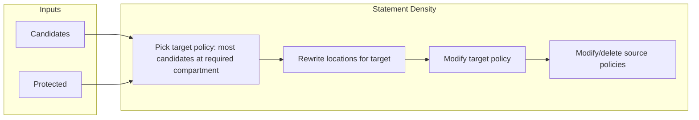
**Plan Steps:**
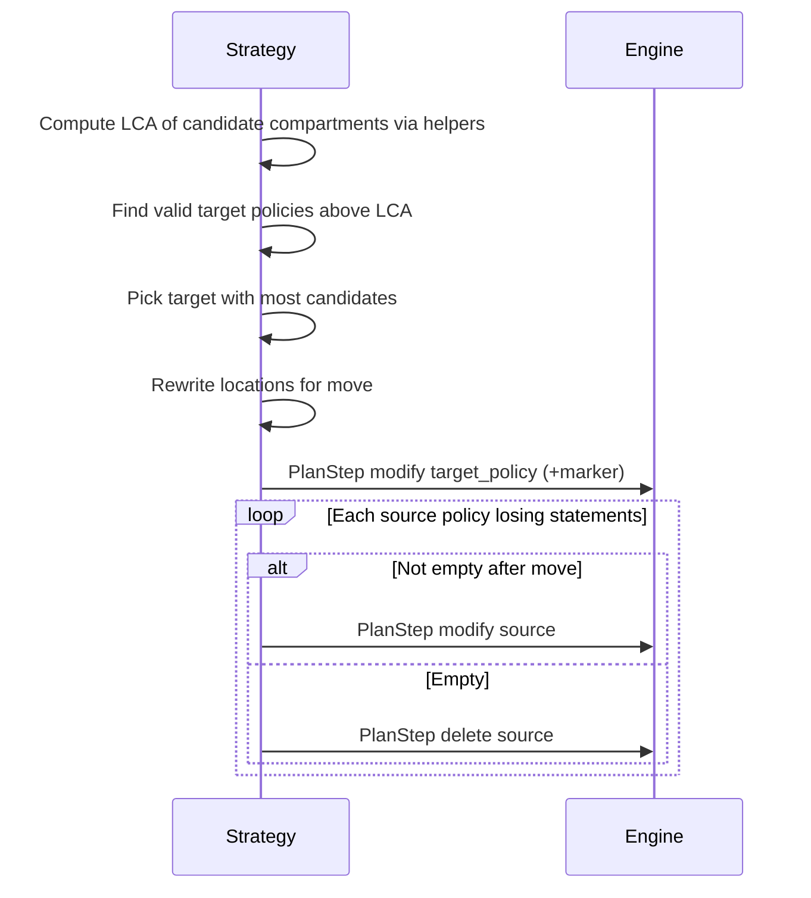

---

### 2. Move to Root Compartment

- **Goal:** Create a new policy at the **root/tenancy compartment**, adding all selected statements.
- **Limit:** **No more than 50 statements** per target policy (OCI constraint); UI/engine blocks excess.
- **Location rewrite:** Effective paths for all statements are recalculated and rewritten for root context (using helpers).
- **Plan shape:** 
  - **1** `add` step for the new policy (includes `compartment_ocid`, `create_policy_name`, description, and marker tag).
  - `modify` or `delete` steps for each original policy as appropriate.
- **Rollback:** Undo/restore via markers and before/after snapshot states.
- **Helpers involved:** 
  - `rewritten_location_for_target` and path normalization for statements.

**Sequence Flow:**
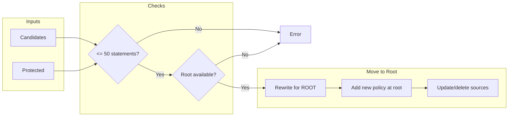
**Plan Steps:**
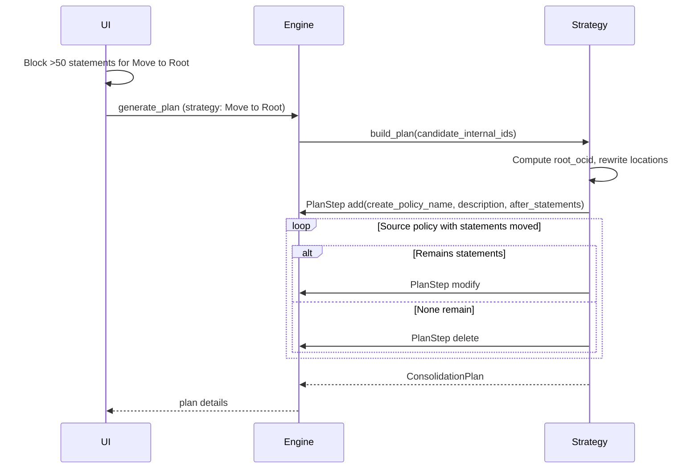

---

### 3. Move Closer to Target Compartment

- **Goal:** For selected statements—especially those in ROOT—move each as close as possible to its actual target compartment, following OCI's policy hierarchy rules.
- **Process:** 
  - **(1) Group:** Statements grouped by effective paths; for each group, compute the deepest valid compartment (using helpers, e.g. LCA logic).
  - **(2) Rewriting:** Locations are rewritten relative to new compartment host (`rewritten_location_for_target()`).
  - **(3) Existing/New:** If policy in that compartment exists, it is modified; otherwise, new policy created. OCI per-policy limits enforced.
  - **(4) Cleanup:** Empty source policies deleted; those with remaining statements updated.
- **Helpers involved:** 
  - lca_path, compartment_ancestors_including_self, and rewritten_location_for_target—all defined in `consolidation_helpers.py`.
- **Plan shape:** Multiple `add`, `modify`, and `delete` plan steps; all changes carefully tracked for rollback and audit.
- **Why:** Minimizes policy sprawl in ROOT, increases compartment alignment, and reflects administrative intent.

**Sequence Flow:**
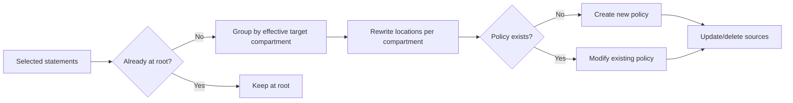
**Plan Steps:**
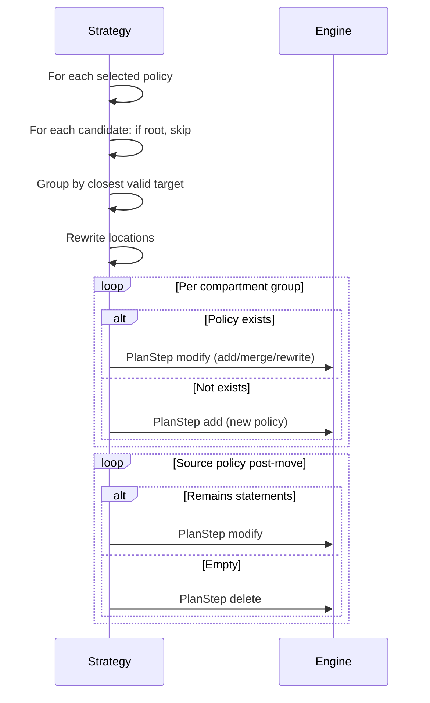
---

### 4. Move Into Target Compartment

- **Goal:** For each selected statement, move it directly into a policy located in its precise (lowest) effective target compartment (not the LCA of a group).
- **Process:**
  - **(1) For each statement:** Determine the target compartment from its `effective_path`.
  - **(2) Group by target compartment and policy name:** If multiple statements share a compartment and name, they consolidate together.
  - **(3) Rewrite statement 'location' using `rewritten_location_for_target()` relative to the destination compartment.
  - **(4) Modify existing policy if present, create new if not.
  - **(5) Remove statements from their origin policies; modify or delete source as appropriate.
- **Helpers involved:**
  - `find_compartment_by_hierarchy_path`, `normalize_compartment_path_segments`, `rewritten_location_for_target`, `internal_id_to_statement` (all from `consolidation_helpers.py`).
- **Plan shape:** Multiple `add` or `modify` steps—one per compartment+policy name as needed; source `modify` or `delete` cleanup steps.
- **Why:** Ensures every statement ends up exactly in its correct OCI compartment, 1:1 with its scope; avoids over-consolidation or accidental resource exposure outside intended administrative domain.

**Sequence Flow:**
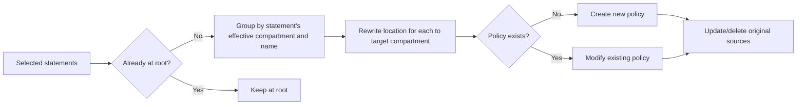
**Plan Steps:**
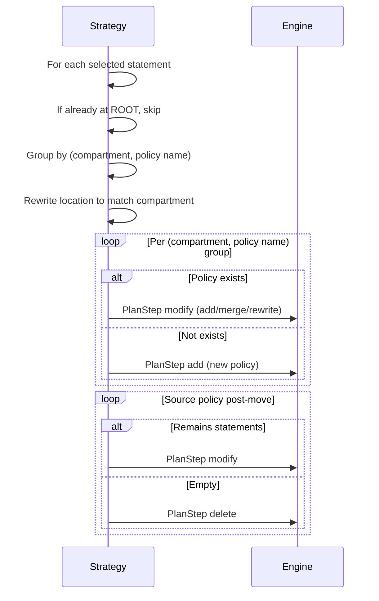
---

## Overlay Model: Persistence & Session Architecture

_All workbench state is recorded in a **per-tenancy overlay session file** (`consolidation_{tenancy_ocid}.json`), providing robust, extensible, and auditable history across runs:_

### Consolidation Overlay Models

Defined in `common/models_consolidation.py`, with helpers in `consolidation_helpers.py`. Key structures:

**1. ProtectedStatementSet**
- Tracks all protected statement references (`internal_id`, plus policy/name/text metadata).
- Includes `orphaned_internal_ids` for protected statements missing in current data.

**2. CandidateSelectionSet**
- List of current candidate statements eligible for consolidation.

**3. Consolidation Plan & Run Records**
- Each plan is a set of `PlanStep`s, persisted with effort/run ID, creation timestamp, and full context (inputs, candidate list, strategy, status, etc.).

**4. PlanStep**
- Each plan step has:
  - `action` (`add`, `modify`, `delete`)
  - before/after statements
  - before/after tags
  - policy/context identifiers
  - for `add`: compartment/details for creation
  - rollback/execution helpers

**5. ConsolidationSession**
- Complete snapshot of overlays mapped to their tenancy, including version, plan, audit/log data, and compliance state.

**Example models:**
```python
# models_consolidation.py (see file for full details)
class ConsolidationPlan(TypedDict): ...
class PlanStep(TypedDict): ...
class ProtectedStatementSet(TypedDict): ...
class CandidateSelectionSet(TypedDict): ...
class ConsolidationSession(TypedDict): ...
```

**Overlay Usage Example:**
```python
session = load_consolidation_session_json("consolidation_OCIDXXX.json")
session['protected_set']['protected'].append({...})
```

---

## Shared Helpers, Utilities & Policy Reasoning

All consolidation logic (engine and strategies) relies on standardized, well-tested helpers (`consolidation_helpers.py`):

- **Compartment/Hierarchy Calculation:**  
  - `compartment_ancestors_including_self()`: Ensures all ancestors up to ROOT are correctly traversed.
  - `lca_compartment_ocids()`: Robustly computes the least common ancestor (LCA) of compartments for a candidate set—enforces OCI rules for policy location.
- **Statement/Policy Location Rewriting:**
  - `normalize_compartment_path_segments()`: Splits compartment paths robustly.
  - `rewritten_location_for_target()`: Recomputes the `location` clause for each statement when moving it between compartments; ensures logical access is unchanged regardless of physical move. Handles all path/corner cases.
- **Indexing/Fast Lookup:** 
  - `internal_id_to_statement()`: Fast map of statement IDs to their dicts.
  - `policy_statement_texts()`: Extracts all statement texts for fast comparison.
- **Overlay/Batch Logic:**
  - All overlay file IO and tenancy/session handling are performed through `CacheManager`, always via the overlay. Live data is strictly input-only.
- **Auditability:**
  - Rollback, result/plan tagging, and action tracking are supported throughout by overlay helpers and robust model schema.

**_Practical Effect_**: All plan/step reasoning flows through these helpers, ensuring correct scoping, compartment handling, statement movement, and persistent/undo operation.

---

## Key End-to-End Data Flow (as implemented)

- All candidate, protected, and plan sets are **validated at load** against current OCI data (missing/internal_id drift is auto-flagged).
- All changes (protect, candidate, plan) immediately persist to overlay.
- Every action is captured in run history; previous plans can be reloaded.
- UI, helpers, and engine always reference overlays; live OCI data acts solely as a feed for parsing and drift resolution.

---

## Main UI/Engine Sequence Diagrams

Below are updated main sequence diagrams for the consolidation workbench. _Note: Actor and label names have been made code-accurate. Helpers are now directly referenced in plan and proposal steps. All helper/overlay interaction is reflected in the plan generation and audit paths._

> **Viewers: All diagrams render with Mermaid.js. Use View in VSCode/Markdown preview or an online Mermaid renderer for visual diagrams.**

### 1. Tab Instantiation

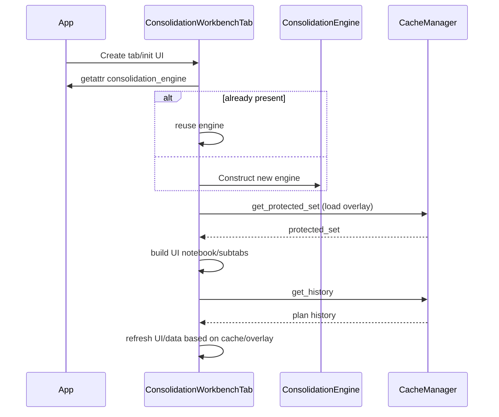

### 2. Tenancy (Cache Load)

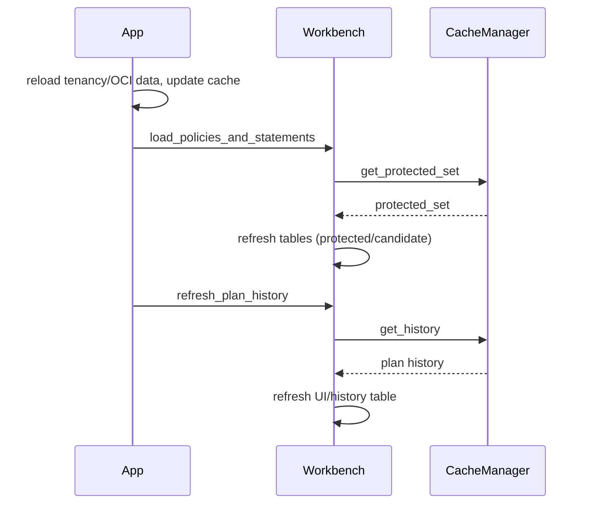

### 3. Protecting Statements

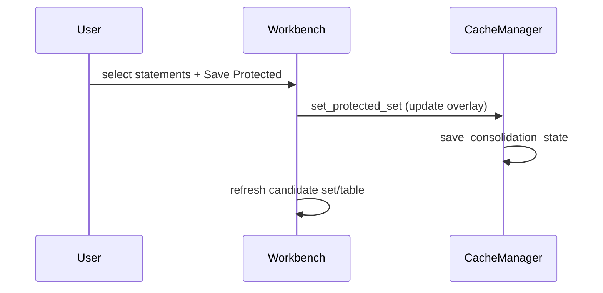

### 4. Creating a Proposal Plan

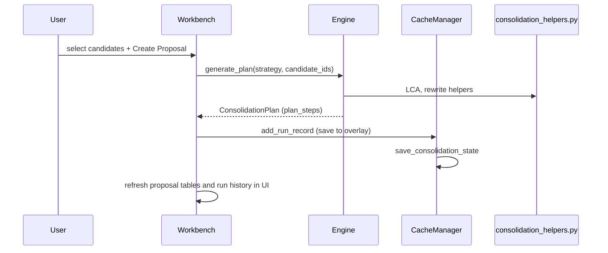

---

## Extension and Development Guidance

- **Add new strategies:** Create new module inheriting `Strategy` protocol in `logic/consolidation_strategies/`, register in engine, and update UI lists.
- **Extend overlays or plan steps:** Update models in `models_consolidation.py` and relevant helpers (see above).
- **Upgrade auditing/tools:** Overlay and helper model supports log extension; overlays are JSON for automation and compliance.

---

## References

- **UI & Overlay:**  
  - `src/oci_policy_analysis/ui/consolidation_workbench_tab.py`
  - `src/oci_policy_analysis/common/models.py`

- **Consolidation Engine & Strategies:**  
  - `src/oci_policy_analysis/logic/consolidation_engine.py`
  - `src/oci_policy_analysis/logic/consolidation_strategies/`
      - `statement_density.py`
      - `move_to_root.py`
      - `move_closer_to_target.py`
  - `src/oci_policy_analysis/logic/consolidation_helpers.py`

- **Models, Overlay, Cache:**  
  - `src/oci_policy_analysis/common/models_consolidation.py`
  - `src/oci_policy_analysis/common/caching.py` (CacheManager)

---

**This document is canonical—sync codebase changes here as helpers/strategies evolve.**