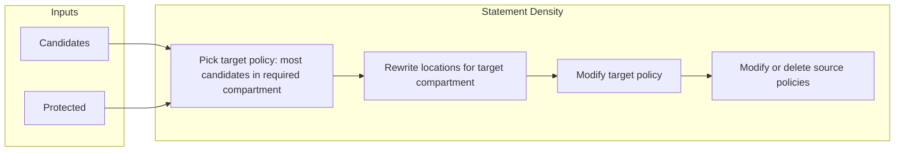
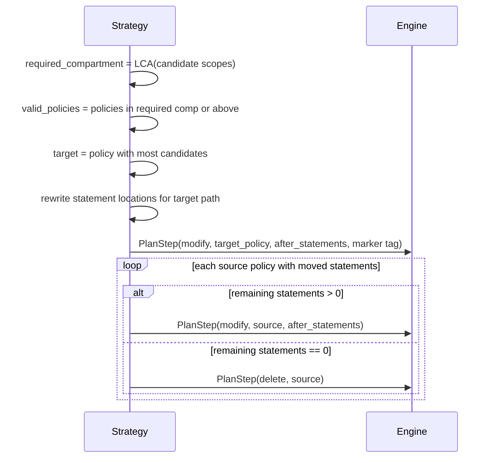
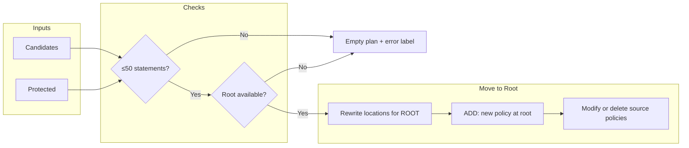
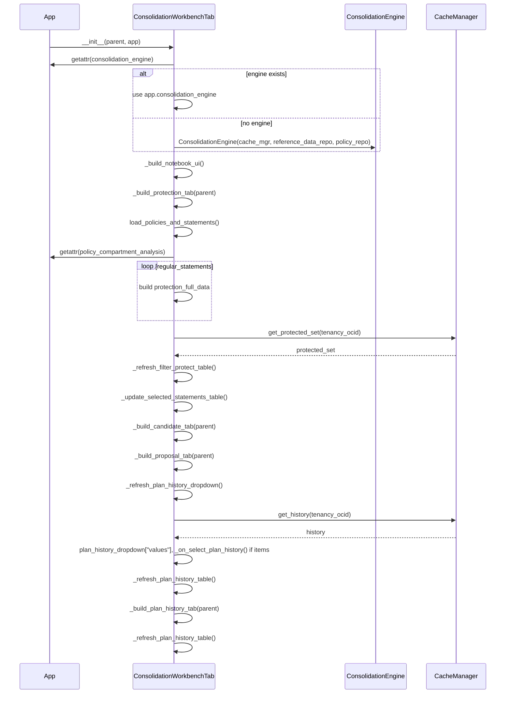

# Policy Consolidation Workbench: Architecture, UI Flow & Overlay Models

_Last updated: Feb 2026_

---

## Overview

Policy consolidation is the process of refactoring, merging, or reducing Oracle Cloud Infrastructure (OCI) IAM policy statements to improve manageability, compliance, and reduce redundancy. The "Consolidation Workbench" provides advanced, interactive controls for batch-driven, auditable consolidation of OCI policies and statements, supporting both end-users (through an interactive UI) and programmatic/automated workflows.

This document describes:
- UI structure and data/state flow of the **Consolidation Workbench** (see `src/oci_policy_analysis/ui/consolidation_workbench_tab.py`)
- The **two implemented consolidation strategies**: Statement Density (Pack Policies) and Move to Root Compartment, with plan shapes, limits, and rollback
- The overlay model architecture for protection, candidate selection, plan/run proposals, and auditing/persistence (see `src/oci_policy_analysis/common/models_consolidation.py` and overlay in `CacheManager`)
- Persisted overlay/session JSON for per-tenancy, future extensibility, and robust compliance state

---

## Workbench UI/UX: Subtab-Driven Flow

Implemented in `ConsolidationWorkbenchTab` (`src/oci_policy_analysis/ui/consolidation_workbench_tab.py`), the workbench provides a three-stage, interactive approach:

### 1. Policy/Statement Protection

- Browser with advanced filtering/search.
- Users can mark specific statements or entire policies as "protected"—these are **excluded** from consolidation consideration.
- All selections are immediately saved to the canonical overlay/session file for the current corpus/tenancy.
- "Protected" entries auto-exclude from candidate pool in following tabs; missing/internal_ID validation on reload.
- Always-visible table for current protected set (live, editable).

### 2. Candidate Selection & Strategy

- Presents unprotected statements for candidate selection; supports search/filter by name/text/compartment.
- Choose consolidation strategy (pluggable; two implemented):
    - **Statement Density (Pack Policies)** — Packs selected statements into a single existing policy (the one with most candidates in the required compartment or above), then updates or deletes source policies.
    - **Move to Root Compartment** — Creates a new policy at the root compartment with all selected statements (location rewritten); then updates or deletes each source policy. **Max 50 statements** (OCI limit); the UI shows an error and does not generate a plan if more than 50 are selected.
- Select one or more statements as consolidation candidates.
- Candidate selections are cumulative and can be revisited before generating a proposal.

### 3. Consolidation Proposal / Batch

- Runs chosen consolidation strategy on the selected candidate set.
- Generates an explicit, staged plan: each step specifies proposed action (add, modify, delete, merge), before/after state, and details.
- Plan/run records are uniquely identified, timestamped, and persisted with per-effort strategy and input for history, reload, compliance trace.
- Provides dropdown to review/run history; view details/scripts from all previous consolidation proposals.
- Displays "proposed script output" for manual/automated execution (e.g., OCI CLI, UI-based steps).

---

## Consolidation Strategies (Implemented)

The engine uses pluggable strategies (see `src/oci_policy_analysis/logic/consolidation_strategies/`). Each strategy implements the `Strategy` protocol (`strategy_id`, `display_name`, `build_plan(...)`). The following two strategies are built-in and available in the UI.

### Strategy 1: Statement Density (Pack Policies)

- **Goal:** Pack all selected candidate statements into a **single existing** policy, then update or delete the source policies that lost statements.
- **Target policy choice:** The policy that already contains the most candidates and lives in the **required compartment** (or an ancestor). The required compartment is the least common ancestor of all candidate statement scopes—a policy cannot live below a statement’s scope (e.g. tenancy-scoped statements must be in root).
- **Location rewrite:** When a statement is moved to a policy in a different compartment, its “in compartment X” clause is rewritten using effective path so the logical scope is unchanged (see `consolidation_helpers.rewrite_statement_location_for_target`).
- **Plan shape:** One **modify** step (target policy: add moved statements, set marker tag) plus zero or more **modify** or **delete** steps (each source policy: remove moved statements; delete if the policy would have zero statements).
- **Rollback:** Engine renders rollback commands to restore target and source policies (re-create deleted policies with original statements).



**Plan steps (Mermaid):**



---

### Strategy 2: Move to Root Compartment

- **Goal:** Create a **new** policy at the **root compartment** (tenancy) with all selected statements; then update or delete each source policy that had statements moved.
- **Limit:** OCI allows at most **50 statements per policy**. If more than 50 candidates are selected, the **UI shows an error** and does not call the engine; the strategy also returns an empty plan with an explanatory label if invoked with >50 candidates.
- **Location rewrite:** Same effective-path rewrite as above; statements are rewritten so that when the policy lives at root, the “in compartment X” location string yields the same effective scope.
- **Plan shape:** One **add** step (create new policy at root: `compartment_ocid`, `create_policy_name`, `create_policy_description`, `after_statements`, marker tag) plus zero or more **modify** or **delete** steps for source policies.
- **NOTE in plan:** The plan includes a note that the user **may change the Policy Name and Description** as desired; a suitable default is provided (e.g. `Consolidated-Root-<plan_id>` and a short description).
- **Rollback:** Engine renders rollback so the created policy can be deleted (find by marker tag in root compartment) and source policies can be restored or re-created.



**Plan steps (Mermaid):**

```mermaid
sequenceDiagram
    participant UI
    participant Engine
    participant Strategy
    UI->>UI: if strategy==Move to Root and candidates>50 → show error, return
    UI->>Engine: generate_plan(candidates, strategy="Move to Root Compartment")
    Engine->>Strategy: build_plan(repo, candidate_internal_ids, ...)
    Strategy->>Strategy: root_ocid = tenancy_ocid; rewrite each statement for ROOT
    Strategy->>Engine: PlanStep(add, compartment_ocid=root, create_policy_name, create_policy_description, after_statements, NOTE)
    loop each source policy with moved statements
        alt remaining statements > 0
            Strategy->>Engine: PlanStep(modify, source, after_statements)
        else remaining statements == 0
            Strategy->>Engine: PlanStep(delete, source)
        end
    end
    Strategy-->>Engine: ConsolidationPlan
    Engine-->>UI: plan (script + rollback)
```

---

## Overlay Model: Persistence & Session Architecture

All workbench state is persisted in a **per-tenancy overlay session file** (`consolidation_{corpus_id}.json`)—this is managed by the `CacheManager` and referenced throughout the UI, following a robust, future-extensible schema:

### Consolidation Overlay Models

Defined primarily in `src/oci_policy_analysis/common/models.py`, these encapsulate all user and plan state _separate_ from OCI live/parsed policy data (but linkable by internal IDs/OCIDs):

#### 1. **ProtectedStatementSet**

- Tracks statements marked protected (excluded from consolidation).
- Fields:
    - `corpus_id`: Tenancy or project scope (typically tenancy OCID).
    - `protected`: List of `ProtectedStatementReference` (internal_id, policy_ocid, policy_name, statement_text, ...).
    - `orphaned_internal_ids` (optional): IDs protected but no longer present after reload (flagged for reconciliation).

#### 2. **CandidateSelectionSet**

- Captures all currently selected _candidate_ statements for consolidation.
- Fields:
    - `corpus_id`
    - `candidates`: List of candidate references (internal_id, policy_ocid, etc.).

#### 3. **Consolidation Plan and Proposal/Run Records**

- Each consolidation action (proposal/run) is saved as a structured dict in plan/run history:
    - `consolidation_effort_id`: Unique (hash of tenancy, timestamp, candidate set).
    - `created_at`: ISO timestamp.
    - `candidate_statements`: List of internal_ids included in this proposal.
    - `strategy`: String describing chosen consolidation method (e.g. strategy_id or display name).
    - `step_status`: Dict keyed by step/proposal phase (with per-step status, progress, timestamp).
    - `results`: List of plan steps (action **add** | **modify** | **delete**, policy info, before/after statements and tags, see `PlanStep` in `models_consolidation.py`).

#### 4. **Consolidation Plan Step (Plan/Batch Table Row)**

- Each step in a plan specifies (see `PlanStep` in `models_consolidation.py`):
    - **Action:** `add` (create new policy), `modify` (update statements/tags), or `delete` (remove policy).
    - **Policy OCID**, before/after statements, before/after tags, plan_tags (marker for execution check).
    - For **add** steps: `compartment_ocid`, `create_policy_name`, `create_policy_description` (user may change; default provided).
    - Optional: `location_change_notes`, `rollback_command`, execution status.

#### 5. **Session Context/Overlay**

- All overlays and plan history are bundled per-corpus/tenancy in a single JSON session file.
- Fields:
    - `corpus_id`, `dataset_version` (optional snapshot/version label)
    - Overlays: `protected_set`, `candidate_set`, `plan`, `audit_log`, `execution_results`
- Canonical data is always loaded via the `CacheManager`, using overlay models as source of truth.

---

## Function flow: sequence diagrams

The following Mermaid sequence diagrams trace the main function calls for the Consolidation Workbench: tab instantiation, tenancy load, protecting statements and writing to cache, creating a plan, execution/reload/check progress, and showing history with conflicts. Participants are **App** (main), **Workbench** (`ConsolidationWorkbenchTab`), **Engine** (`ConsolidationEngine`), and **Cache** (`CacheManager`). The policy repo is used by Workbench and Engine but omitted for clarity.

### 1. Tab instantiation

When the Consolidation Workbench tab is created (or when the user first opens it), the notebook and all four subtabs are built. The Protection tab triggers an initial load of policies/statements and restores the protected set from cache; the Proposal tab loads plan history into its dropdown.



### 2. Tenancy (or cache/compliance) loaded

After a tenancy is loaded from OCI, cache, or compliance, the main app calls the workbench to refresh data and plan history. Protected set is validated (missing IDs removed); both Protection and Candidate subtabs are refreshed; plan dropdown and Plan History table are repopulated.

```mermaid
sequenceDiagram
    participant App
    participant Workbench as ConsolidationWorkbenchTab
    participant Cache as CacheManager

    App->>App: _post_load_update_ui()
    App->>Workbench: load_policies_and_statements()
    Workbench->>App: getattr(policy_compartment_analysis)
    Workbench->>Workbench: protection_full_data from repo
    Workbench->>Cache: get_protected_set(tenancy_ocid)
    Cache-->>Workbench: protected_set
    Workbench->>Workbench: _refresh_filter_protect_table()
    Workbench->>Workbench: _update_selected_statements_table()

    App->>Workbench: reload_and_validate_protection_set()
    Workbench->>App: getattr(policy_compartment_analysis), regular_statements
    Workbench->>Workbench: current_ids, missing_ids; remove from protected_statement_ids if missing
    Workbench->>Workbench: _refresh_filter_protect_table()
    Workbench->>Workbench: _update_selected_statements_table()
    Workbench->>Workbench: _update_protected_display()
    Workbench->>Workbench: _load_candidate_statements()

    App->>Workbench: refresh_plan_history_for_corpus()
    Workbench->>Workbench: _refresh_plan_history_dropdown()
    Workbench->>Cache: get_history(tenancy_ocid)
    Cache-->>Workbench: history
    Workbench->>Workbench: plan_history_id_lookup, dropdown values
    Workbench->>Workbench: _refresh_plan_history_table()
```

### 3. Protecting statements and writing to cache

User selects rows in the Protection tab (checkboxes or Select All) and clicks "Save Protected". Selection is persisted in memory; on Save, the protected set is written to the canonical consolidation state file and the Candidate tab is refreshed.

```mermaid
sequenceDiagram
    participant User
    participant Workbench as ConsolidationWorkbenchTab
    participant Cache as CacheManager

    User->>Workbench: check/uncheck rows or Select All
    Workbench->>Workbench: _on_protect_check_changed(checked_rows) or _on_protect_select_all(visible_ids, check_state)
    Workbench->>Workbench: protect_table_selected_ids add/remove
    Workbench->>Workbench: _refresh_filter_protect_table() [if select all]
    Workbench->>Workbench: _update_selected_statements_table()

    User->>Workbench: click "Save Protected"
    Workbench->>Workbench: _on_mark_as_protected(selected_rows)
    Workbench->>Workbench: protected_statement_ids = selected_ids; build protected_list (ProtectedStatementReference)
    Workbench->>Workbench: _get_corpus_id() via app/repo
    Workbench->>Cache: set_protected_set(tenancy_ocid, protected_set)
    Cache->>Cache: get_or_create_consolidation_state(); state['protected_set'] = protected_set; save_consolidation_state()
    Workbench->>Workbench: _update_protected_display()
    Workbench->>Workbench: _load_candidate_statements()
    Workbench->>Workbench: _update_selected_statements_table()
```

### 4. Creating a plan

User selects candidates in the Candidate tab and triggers "Create Consolidation Proposal" or generates from the Proposal tab. If the strategy is "Move to Root Compartment" and more than 50 candidates are selected, the UI shows an error and does not call the engine. Otherwise the engine builds the plan via the selected strategy; the run record is saved to history and the dropdown/Plan History tab are refreshed.

```mermaid
sequenceDiagram
    participant User
    participant Workbench as ConsolidationWorkbenchTab
    participant Engine as ConsolidationEngine
    participant Cache as CacheManager

    User->>Workbench: select candidates, click "Create Consolidation Proposal" or Generate
    Workbench->>Workbench: _on_create_consolidation_proposal(selected_rows) or _on_generate_proposal()
    Workbench->>Workbench: candidate_statement_ids = candidate_table_selected_ids
    Workbench->>Workbench: _on_generate_proposal()
    Workbench->>Engine: get_strategy_display_names()
    Engine-->>Workbench: [strategy names]
    alt strategy == "Move to Root Compartment" and candidates > 50
        Workbench->>Workbench: messagebox.showerror("Too Many Statements"); return
    else proceed
        Workbench->>Engine: generate_plan(candidate_internal_ids, protected_internal_ids, strategy_display_name, params)
        Engine->>Engine: strategy.build_plan(repo, corpus_id, ...)
        Engine-->>Workbench: ConsolidationPlan

        Workbench->>Workbench: _build_proposal_rows(plan, progress=None)
        Workbench->>Workbench: proposal_table.update_data(rows)
        Workbench->>Workbench: _set_script_content_from_plan(plan)
        Workbench->>Workbench: _get_corpus_id()
        Workbench->>Cache: add_run_record(corpus_id, run_record)
        Cache->>Cache: get_or_create_consolidation_state(); state['history'].append(run_record); save_consolidation_state()
        Workbench->>Workbench: _refresh_plan_history_dropdown()
        Workbench->>Cache: get_history(tenancy_ocid)
        Workbench->>Workbench: _refresh_plan_history_table()
    end
```

### 5. Execution and Reload and Check Progress

Execution of steps is done outside the app (OCI Console or CLI). "Reload and Check Progress" is only allowed when data is from OCI. Main app reloads policies/compartments and updates cache; then the workbench re-evaluates the selected plan’s progress (tags/policy presence) and optionally marks the plan completed and refreshes history.

```mermaid
sequenceDiagram
    participant User
    participant Workbench as ConsolidationWorkbenchTab
    participant App
    participant Engine as ConsolidationEngine
    participant Cache as CacheManager

    User->>Workbench: click "Reload and Check Progress"
    Workbench->>Workbench: _on_reload_and_check_progress()
    Workbench->>Workbench: plan_history_var.get(), plan_history_id_lookup[sel] -> run, plan
    Workbench->>App: reload_policies_and_compartments_and_update_cache()
    App->>App: repo.reload_compartment_policy_data(); CacheManager().update_policy_section(repo)
    App->>App: _post_load_update_ui()
    App->>Workbench: load_policies_and_statements(); reload_and_validate_protection_set(); refresh_plan_history_for_corpus()
    App-->>Workbench: return

    Workbench->>Engine: check_plan_progress(plan)
    Engine->>Engine: for each step: policy presence / marker tag -> executed
    Engine-->>Workbench: progress (step_id -> {executed, notes, ...})

    alt all steps executed
        Workbench->>Cache: update_run_record(corpus_id, effort_id, {status: "completed", step_status: {..., progress}, completed_at})
        Workbench->>Workbench: _refresh_plan_history_dropdown(); _refresh_plan_history_table()
    end
    Workbench->>Workbench: _build_proposal_rows(plan, progress)
    Workbench->>Workbench: proposal_table.update_data(data); plan_status_label [Executed: n/m]
```

### 6. Showing history with conflicts (Plan History tab)

When the user opens the Plan History subtab or refreshes it, the table is filled from cache. For each non-completed plan, the engine checks tag conflicts (policies tagged by another plan). Selecting a row updates the detail pane with summary, conflicts, and OCI Audit placeholder.

```mermaid
sequenceDiagram
    participant User
    participant Workbench as ConsolidationWorkbenchTab
    participant Cache as CacheManager
    participant Engine as ConsolidationEngine

    User->>Workbench: open Plan History tab or click Refresh
    Workbench->>Workbench: _refresh_plan_history_table()
    Workbench->>Workbench: _get_corpus_id()
    Workbench->>Cache: get_history(corpus_id)
    Cache-->>Workbench: history
    loop for each run in sorted_hist
        Workbench->>Workbench: plan, step_status.progress, executed count, status
        alt non-completed and plan has steps
            Workbench->>Engine: get_plan_tag_conflicts(plan)
            Engine->>Engine: for each step: policy freeform_tags[marker] -> prefix != plan_id?
            Engine-->>Workbench: conflicts list
            Workbench->>Workbench: Validity = "Conflicted (n)" or "OK"
        end
        Workbench->>Workbench: rows.append({Effort ID, Created, Strategy, Status, Steps, Validity, ...})
    end
    Workbench->>Workbench: plan_history_table.update_data(rows)

    User->>Workbench: select a row in Plan History table
    Workbench->>Workbench: _on_plan_history_row_selected(selected_rows)
    Workbench->>Workbench: _plan_history_selected_rows = selected_rows; view_plan_btn state
    Workbench->>Workbench: _update_plan_history_detail_pane()
    Workbench->>Cache: get_history(corpus_id)
    Workbench->>Workbench: find run by consolidation_effort_id
    Workbench->>Workbench: detail: Plan summary (Effort ID, Created, Strategy, Status, Steps)
    Workbench->>Engine: get_plan_tag_conflicts(plan)
    Engine-->>Workbench: conflicts
    Workbench->>Workbench: detail: Conflicts (policy_ocid, current_tag_value, conflicting_plan_id)
    Workbench->>Workbench: detail: "OCI Audit Data (selected policy) — (Not implemented yet.)"
    Workbench->>Workbench: plan_history_detail_text.insert(detail)
```

---

## End-to-End Data/UX Flow (as implemented)

- State for protection, candidates, and plan is _always_ loaded/validated against current parsed/live OCI data, and missing entries are auto-flagged for reconciliation.
- All changes (protection/candidate/plan) in the UI immediately persist to overlay.
- Past plan/proposals can be reloaded, examined, or re-applied, supporting both batch/manual and automated workflows.
- Every action (protect, candidate select, generate proposal) triggers overlay update; run history is auto-maintained.
- UI and API helpers always reference overlays for "source of truth"—live OCI data is input only (never source of overlay fields).

---

## Models for Consolidation

Canonical plan and step types are defined in `src/oci_policy_analysis/common/models_consolidation.py`. Overlay/session structures (protected set, candidate set, run history) are used by `CacheManager` and the workbench UI.

### **ProtectedStatementSet / CandidateSelectionSet**

Defined in `models_consolidation.py` (or referenced from overlay schema). Protected set tracks statements excluded from consolidation; candidate set tracks selected candidates. See overlay section above for field summaries.

### **Consolidation Plan and PlanStep** (`models_consolidation.py`)

```python
class ConsolidationPlan(TypedDict):
    plan_id: str
    corpus_id: str
    plan_label: str
    created_at: str
    plan_steps: list[PlanStep]
    execution_log: NotRequired[list[str]]
    plan_tags: NotRequired[dict[str, str]]  # e.g. strategy_id, marker_tag_key

class PlanStep(TypedDict):
    step_id: str
    action: Literal['add', 'modify', 'delete']
    policy_ocid: str                    # empty for action='add'
    before_statements: list[str]
    after_statements: list[str]
    before_tags: dict[str, str]
    after_tags: dict[str, str]
    plan_tags: NotRequired[dict[str, str]]   # marker_tag_key, marker_tag_value
    executed: NotRequired[bool]
    execution_status: NotRequired[Literal['PENDING', 'COMPLETE', 'ROLLED_BACK', 'DRIFTED']]
    rollback_command: NotRequired[str]
    location_change_notes: NotRequired[list[str]]
    # For action='add' (create new policy at root or elsewhere):
    compartment_ocid: NotRequired[str]
    create_policy_name: NotRequired[str]
    create_policy_description: NotRequired[str]
```
- Each run/proposal is a plan; each plan contains zero or more steps. **add** = create new policy (e.g. Move to Root); **modify** = update statements/tags; **delete** = remove policy.
- Run records in overlay history store plan + step_status/results for UI and progress check.

### **Auditing/Execution Results**
- Audit trails and result logs (historic, per-step, user/time/action, for compliance/rollback).

### **Session (Overlay Root)**
```python
class ConsolidationSession(TypedDict):
    corpus_id: str
    dataset_version: NotRequired[str]
    protected_set: ProtectedStatementSet
    candidate_set: CandidateSelectionSet
    plan: ConsolidationPlan
    audit_log: list[dict]
    execution_results: list[dict]
```
- Complete snapshot for all interactive/workbench state for a corpus/tenancy.

---

### Example: Overlay Overlay Usage

```python
# Load session from overlay
from src.oci_policy_analysis.common.models import ConsolidationSession
session = load_consolidation_session_json("consolidation_OCID123.json")

# Mark statement protected
session['protected_set']['protected'].append({
    "internal_id": "abc123",
    "policy_ocid": "...",
    "policy_name": "...",
    "statement_text": "...",
})
# Validate/protect against drift:
if protected['internal_id'] not in live_ids: session['protected_set'].setdefault('orphaned_internal_ids', []).append(protected['internal_id'])
```

---

## Why This Architecture?

- **Future-proof/Extensible:** New strategies, external scripts, or compliance tooling always plug into the same overlay/session model.
- **Persistent & Auditable:** Overlay file contains full run/proposal/audit history, protected set, and stepwise status.
- **Compliance:** All actions, plan decisions, and audit records are stable, portable, and recoverable across OCI state reload or tool changes.
- **Decoupling:** Sessions never mutate live data—overlays are self-contained, robust for multi-user or team environments.

---

## Extension/Development Guidance

- **To add new strategies:** Implement the `Strategy` protocol in `src/oci_policy_analysis/logic/consolidation_strategies/base.py` (e.g. in a new module under `consolidation_strategies/`), register with `ConsolidationEngine` via constructor or `register_strategy()`, and ensure the UI strategy dropdown is populated from `engine.get_strategy_display_names()`. See `statement_density.py` and `move_to_root.py` for examples.
- **To extend overlays or session models:** Extend the overlay/session models in `models_consolidation.py`; UI and `CacheManager` already support JSON versioning.
- **To integrate new audit/compliance controls:** Extend `audit_log` and run records; overlay format forwards compatible.
- **To support automation and external review:** All overlays are JSON-serializable, documented, and can be loaded/modified by external tools.

---

## References

- **UI and Overlay Implementation:**  
  - `src/oci_policy_analysis/ui/consolidation_workbench_tab.py`
  - `src/oci_policy_analysis/common/models.py`

- **Consolidation Engine and Strategies:**  
  - `src/oci_policy_analysis/logic/consolidation_engine.py` — plan generation, render (CLI/UI/rollback), progress check
  - `src/oci_policy_analysis/logic/consolidation_strategies/` — pluggable strategies:
    - `statement_density.py` — Statement Density (Pack Policies)
    - `move_to_root.py` — Move to Root Compartment (max 50 statements)
  - `src/oci_policy_analysis/logic/consolidation_helpers.py` — shared helpers (location rewrite, tag maps, etc.)

- **Plan and Step Types:**  
  - `src/oci_policy_analysis/common/models_consolidation.py` — `ConsolidationPlan`, `PlanStep`, `ProtectedStatementSet`, `CandidateSelectionSet`

- **Overlay Helper APIs and Caching:**  
  - `src/oci_policy_analysis/common/caching.py` (see: `CacheManager`)
  - Overlay is stored as: `consolidation_{corpus_id}.json`

---