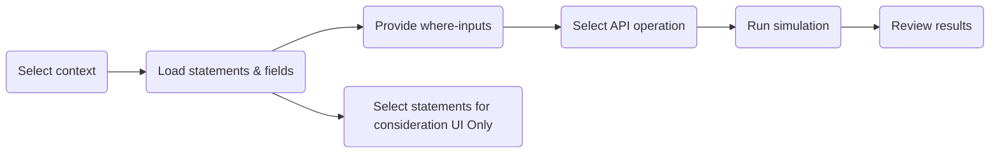

# Project-Specific Context: Simulation Engine

This document defines the architecture, data models, and canonical flow for the OCI Policy Simulation Engine, as consumed both via UI and Model Context Protocol (MCP) APIs.

---

## 1. Overview

The PolicySimulationEngine serves as the single source of truth for all permission simulation business logic. It enables the app to simulate allow/deny outcomes for OCI API operations, supporting conditional evaluation via “where” clauses. This engine powers both interactive user flows (Simulation UI Tab) and programmatic automation (via MCP server/tools).

- **Engine location:** `src/oci_policy_analysis/logic/simulation_engine.py`
- **Driven by:**
  - **UI:** `src/oci_policy_analysis/ui/simulation_tab.py`
  - **MCP:** `src/oci_policy_analysis/mcp_server.py`
- **Data Schemas:** `src/oci_policy_analysis/common/models.py`
- **Demo usage:** `docs/source/simulation_engine_usage_examples.py`

---

## 2. Key Data Models for Simulation (MCP/JSON)

All simulation-related requests and responses use schema-typed dictionaries from `common/models.py`:

- **Preparation:**  
  - `SimulationPrepareRequest`  
  - `SimulationPrepareResponse`

- **Single Simulation Run:**  
  - `SimulationScenario`  
  - `SimulationResult`

- **Batch Simulation:**  
  - `SimulationBatchRequest`  
  - `SimulationBatchResponse`

- **Policy/User/Group Filters:**  
  - `PolicySearch`, `PolicyFilterResponse`  
  - `UserSearch`, `UserSearchResponse`  
  - `GroupSearch`, `GroupSearchResponse`  
  - `DynamicGroupSearch`, `DynamicGroupSearchResponse`

Model fields are strictly enforced. Example:  
- To specify a principal for simulation, use a string for `"any-user"`/`"service"` or a two-element list `[domain, name]` for users/groups/dyn-groups.
- "Where" variables are always a mapping from `str` to `str`.

---

## 3. Simulation Stages & Canonical Flow

Whether simulation is initiated from the UI or via MCP, the process is broken into stages:

1. **Select Context:**  
   - Compartment path  
   - Principal type & value (domain/name, or string for "any-user"/"service")

2. **Load Policy Statements & Required Where-Fields:**  
   - Call:  
     - UI: via simulation engine API  
     - MCP: via `prepare_simulation` tool  
   - Output:  
     - Principal Key (calculated example "principal_key": "user:Default/anita")
     - List of applicable policy statements  
     - List of required where-clause input variables
   - Engine API:  
     - The canonical call is `get_applicable_statements(principal_key, effective_path)`. The engine internally maps the `principal_key` (which encodes both the principal type and identity) to the proper PolicySearch filter (`exact_users`, `exact_groups`, `exact_dynamic_groups`, or `subject`), ensuring correct filtering for all principal types.

3. **Gather Where-Input Values:**  
   - UI: Auto-generates dynamic input fields for variables  
   - MCP: Client must provide a mapping of variable inputs as JSON

4. **Select/Specify API Operation:**  
   - Operation name, e.g. `oci:ListBuckets`
   - UI: Geared toward a single simulation with visual results
   - MCP: ability to run a batch with several simulations, for example:
     - LaunchInstance(Compute) and LaunchInstance(VCN) may require different compartments and different API Operations, same principal.
     - Some Object Storage Operations will be split into a Group Principal API operation call and a Service Principal call

5. **Simulate & Retrieve Result:**  
   - Call simulation engine with all context/inputs
     - Effective Path (compartment)
     - Principal key (format above)
     - Where clause values (as JSON dict)
     - Optional list of statements to consider.
       - For UI, the internal IDs of the statements will be collected and passed
       - For MCP, this will not be included.  Implies using all statements from the effective path and principal key
     - Whether to provide trace output (if True, include a per-statement trace and final permission set)
   - Output:
     - Allow/Deny result
     - Set of granted permissions
     - Optional: decision trace (per-statement allow/deny, conditions)

6. **Review/Present Results:**  
   - UI: Results & trace are displayed/printable in the results panel or exported as JSON  
   - MCP: Results returned as structured JSON per canonical model
     - For MCP, there is a limit on returned JSON, so we should be brief with the response but provide enough detail for the AI consumer to provide a detailed analysis.

**All simulation stages are orchestrated outside the engine.** The engine itself is stateless and enforces all logic and normalization.  

---

## 4. Implementation: UI Tab vs. MCP Tool

| Stage                      | UI Tab (simulation_tab.py)                           | MCP Server (mcp_server.py)                          | Simulation Engine           |
|----------------------------|------------------------------------------------------|-----------------------------------------------------|-----------------------------|
| 1. Select context          | User selects via dropdowns                           | Receives context in SimulationPrepareRequest         | Receives canonical input    |
| 2. Load statements/fields  | Invokes engine API, displays preview                 | prepare_simulation tool returns required fields      | Same single entrypoint      |
| 3. Gather where-inputs     | Dynamic Tkinter fields, user-entered                 | Provided as part of API payload                     | Receives as mapping         |
| 4. Select API operation    | Dropdown, validated                                 | API parameter in SimulationScenario                  | Uniform                      |
| 5. Simulate                | Calls engine’s simulate_and_record                  | SimulationScenario or SimulationBatchRequest tool    | Only business logic layer   |
| 6. Present results         | Displays & exports UI results, prettifies trace     | Returns JSON output in SimulationResult form         | Dict output, always schema  |

- **NO business logic is duplicated or implemented in the UI or MCP server.**  
- UI and MCP are strictly callers, responsible for driving stages and displaying/returning output.
- Any changes to simulation or scenario semantics must be made only in the engine.

---

## 5. Data Models for Each Simulation Call

**Preparation Stage Example:**  
```python
# SimulationPrepareRequest Example
{
  "compartment_path": "ROOT/Finance",
  "principal_type": "user", # Must be one of Literals "service", "user", "group", "dynamic-group", "any-user", "any-group"
  "principal": ["Default", "anita"] # Optional - don't pass if type is any-user or any-group
}

# SimulationPrepareResponse Example
{
  "required_where_fields": ["user.department", "request.time"],
  "principal_key": "user:Default/anita" # Let the engien calculate this internally
}
```

**Simulation Stage Example:**  
```python
# SimulationScenario Example
{
  "compartment_path": "ROOT/Finance",
  "principal_key": "user:Default/anita"
  "api_operation": "oci:ListBuckets",
  "where_context": {"user.department": "Finance", "request.time": "2026-01-22T09:00:00Z"},
  "checked_statements": ["12345","23456"] # Optional - if omitted, use all statements from filter. If included, get the statements and only use the ones passed in.
}

# SimulationResult Key Fields
{
  "result": "YES" or "NO",
  "api_call_allowed": true,
  "final_permission_set": [...] // if trace enabled,
  "missing_permissions": [...],
  "failure_reason": "",
  "trace_statements": [...]   // if trace enabled
}
```

All model definitions in `common/models.py` must be strictly followed by both UI and MCP server.  

---

## 6. Simulation Stage Flow Comparison (Flowchart)


- *UI path*: A-B-G-C-D-E via direct user input and dynamic widgets.
- *MCP path*: A-B-C-D-E driven by JSON tool calls.

---

## 7. Deduplication Policy

- Simulation, policy mapping, and condition evaluation logic MUST exist only in the simulation engine.
- Code in `simulation_tab.py` or `mcp_server.py` may never reimplement the logic of any simulation stage—only drive input/output orchestration.
- Any shared workflow improvements (staging, normalization, batch mode, etc.) should begin in the engine.

All future contributions must comply with this policy.

---

## 8. Limitations, Known Issues, and Roadmap

- **Current Limitations:**
  - UI and MCP paths must be kept manually in sync if engine APIs are refactored.
  - Existing engine focused on policy simulation for a single principal-context-operation set at a time; future multi-context or batch extensions are designed but not fully exercised in UI.
  - Some edge case error handling (e.g., improperly-formatted input in MCP) may be less user-friendly than in UI.
  - Ensure TypedDict models in `common/models.py` stay in alignment with future simulation improvements.

- **Future Goals:**
  - Full “batch” simulation flows in both UI and MCP
  - Unified scenario harness for end-to-end and regression tests across both drive paths
  - Improved visual/JSON diff for large sets of simulation traces
  - OpenAPI spec generation for MCP endpoints

---

## 9. References

- [`simulation_engine.py`](../../../src/oci_policy_analysis/logic/simulation_engine.py)
- [`simulation_tab.py`](../../../src/oci_policy_analysis/ui/simulation_tab.py)
- [`mcp_server.py`](../../../src/oci_policy_analysis/mcp_server.py)
- [`common/models.py`](../../../src/oci_policy_analysis/common/models.py)
- [Simulation usage examples](../../../docs/source/simulation_engine_usage_examples.py)
