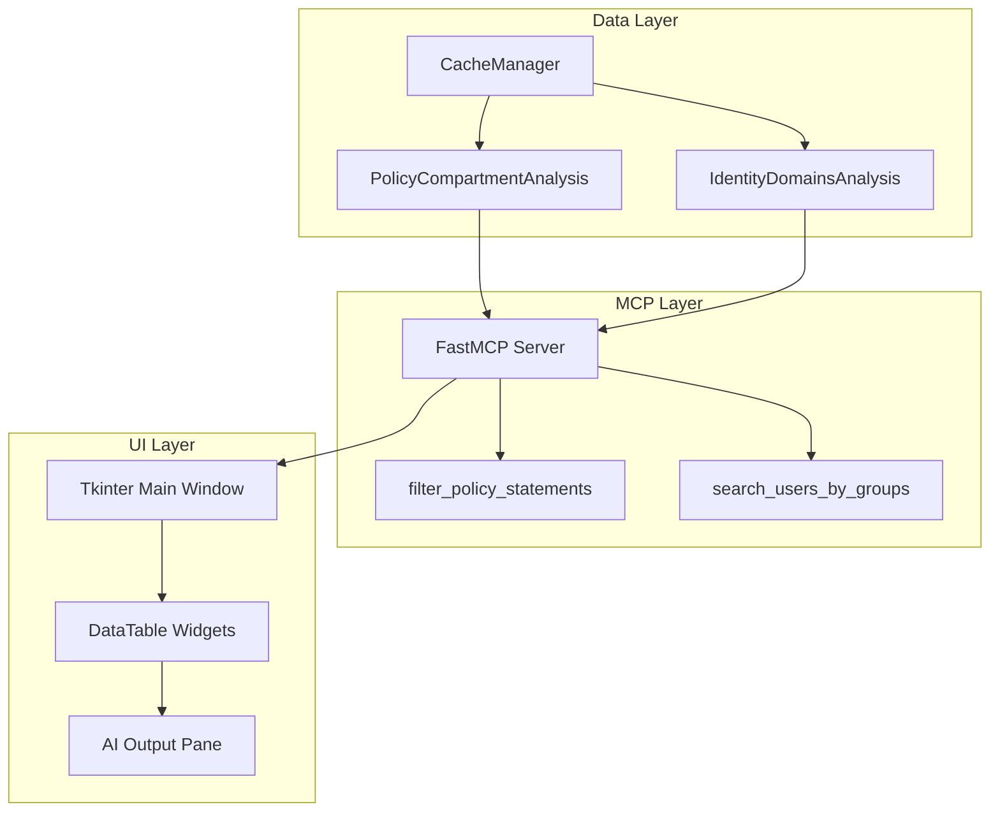

# Architecture

## Layers

Data Layer
Caches and normalizes tenancy data (policies, users, groups, dynamic groups); exposes efficient queries.

MCP Layer
FastMCP server exposing typed tools/resources (e.g., filter_policy_statements, search_users_by_groups) for AI clients.

UI Layer
Tkinter app with tabs, resizable panes, and an AI output area; integrates tightly with analysis and MCP results.
