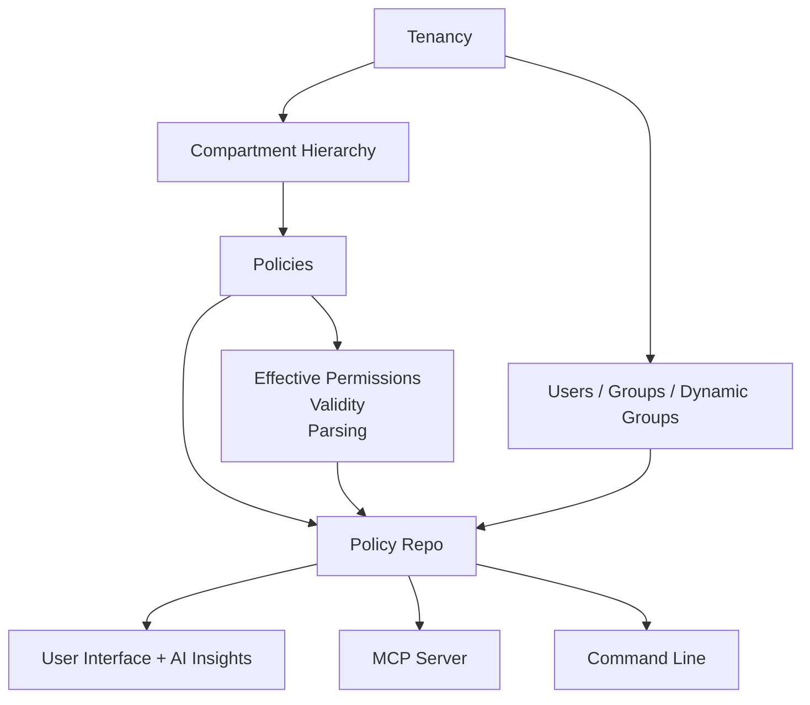

# Architecture

The OCI Policy Analysis tool has the following overall architecture:

Each tier works together to form a clean separation between presentation, data repository, and associated tools and helpers.  3rd party projects, such as DeepDiff are used for comparisons, which FastMCP is used to expose MCP to clients.  All access to OCI is via the OCI official Python SDK and the supported tenancy configurations.

## Data Model

The data model starts out as an empty JSON object, and then is populated via OCI SDK (API Calls) to build a picture 
of the IAM environment for the tenancy, as well as all of the policy statements.  This is required, because the the evaluation
of OCI Policy statements required knowledge of compartments, groups, dynamic groups, and many other runtime settings in order to
"allow" or "deny" the caller from the resource.

Here is a representation of the data:

### Policy Parsing

As part of parsing each policy statement, more data is generated about each statement, and is stored in the resulting JSON 
structure for use by the UI and MCP layers of the tool.   Any new fields which are derived during parsing represent new 
data for use with analysis.  Examples of this:

**Effective Path** - Consider that each policy statement is part of a policy that lives in a compartment, maybe root, and maybe further down the compartment tree.  When statements in that compartment refer to a
location, that location must be within (below) the current compartment.   Thus, the "Effective Path" helps us understand at which level this policy statement is applicable.  

**Valid** - Policy statements can become invalid for a variety of reasons, so it makes sense to check and store this information.  An example of an ivalid policy statement is when a location was referred to as "compartment id ocid1.xx.yy.zzz", and then the compartment is later deleted.  

**Invalid Reasons** - If a policy statement is determined (post-parsing) to be invalid, the reason(s) are made available to the data model for display and analysis.

**Policy Overlap** - Using OCI Resource -> Permissions mapping data, the program attempts to infer which policy statements overlap with each statement, and make that available for display.  For example, if 2 statements cover the same underlying permission, it is considered an overlap.

## Layers

**Data Layer**
Loads, caches, parses and normalizes tenancy data, including:
- policy statements, users, groups, dynamic groups
- exposes efficient queries using JSON

**Intelligence**
After loading policy and identity data, additional intelligence is created from the entire data set as a whole.  For example, recommendations, cleanup operations, and security risks that should be resolved.

**MCP Layer**
FastMCP server exposing typed tools/resources (e.g., filter_policy_statements, search_users_by_groups) for AI clients.

UI Layer
Tkinter app with tabs, resizable panes, and an AI output area; integrates tightly with analysis and MCP results.

---

## AI Context

The **AI Context** system provides a set of standard and project-specific context files that guide how code is developed, documented, and maintained within the OCI Policy Analysis project. These context files are updated as the code changes (or immediately before), ensuring that architectural standards, conventions, and best practices always remain aligned with the source code.

The files below are intended to be referenced both by human contributors and by the AI agent(s). When generating, modifying, or reviewing code, always consult these files. 

- **Generic** files (in `generic/`) define universal patterns and standards for any OCI/Python application.
- **Project-specific** files (in `project/`) define policies, conventions, and history unique to this repository.
- **If project and generic guidance conflict, project-specific guidance takes precedence.**
- Keep both sets up to date; escalate issues/uncertainties to maintainers.

### Index of Context Files

**Generic context:**
- [GENERIC_README.md](../context/generic/GENERIC_README.md)
- [GENERIC_UI_GUIDELINES.md](../context/generic/GENERIC_UI_GUIDELINES.md)
- [GENERIC_CODING_STANDARDS.md](../context/generic/GENERIC_CODING_STANDARDS.md)

**Project-specific context:**
- [CONTEXT_cli.md](../context/project/CONTEXT_cli.md)
- [CONTEXT_config.md](../context/project/CONTEXT_config.md)
- [CONTEXT_cross_tenancy.md](../context/project/CONTEXT_cross_tenancy.md)
- [CONTEXT_data_repo.md](../context/project/CONTEXT_data_repo.md)
- [CONTEXT_docs.md](../context/project/CONTEXT_docs.md)
- [CONTEXT_historical_analysis.md](../context/project/CONTEXT_historical_analysis.md)
- [CONTEXT_intelligence_strategies.md](../context/project/CONTEXT_intelligence_strategies.md)
- [CONTEXT_logging.md](../context/project/CONTEXT_logging.md)
- [CONTEXT_logic.md](../context/project/CONTEXT_logic.md)
- [CONTEXT_mcp_server_and_tab.md](../context/project/CONTEXT_mcp_server_and_tab.md)
- [CONTEXT_policies_tab.md](../context/project/CONTEXT_policies_tab.md)
- [CONTEXT_policy_browser_tab.md](../context/project/CONTEXT_policy_browser_tab.md)
- [CONTEXT_policy_changeset.md](../context/project/CONTEXT_policy_changeset.md)
- [CONTEXT_policy_intelligence_and_recommendations.md](../context/project/CONTEXT_policy_intelligence_and_recommendations.md)
- [CONTEXT_settings_tab.md](../context/project/CONTEXT_settings_tab.md)
- [CONTEXT_simulation_engine.md](../context/project/CONTEXT_simulation_engine.md)
- [CONTEXT_tests.md](../context/project/CONTEXT_tests.md)
- [CONTEXT_ui.md](../context/project/CONTEXT_ui.md)

For detailed structure and instructions, see [CONTEXT_INDEX.md](../context/CONTEXT_INDEX.md)
