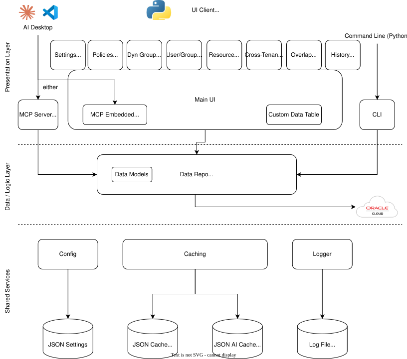
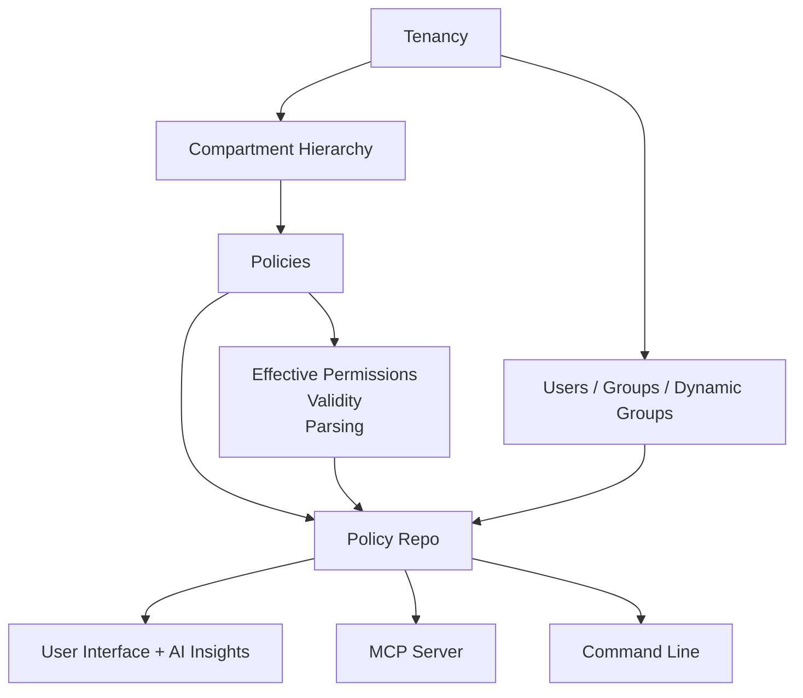
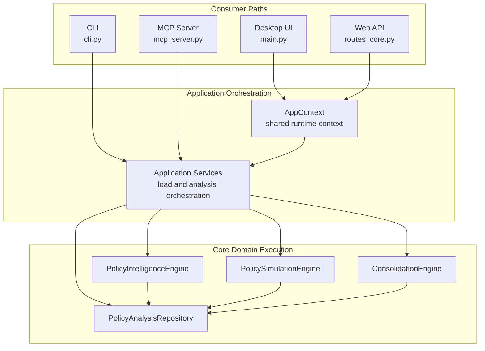
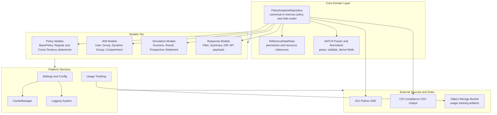
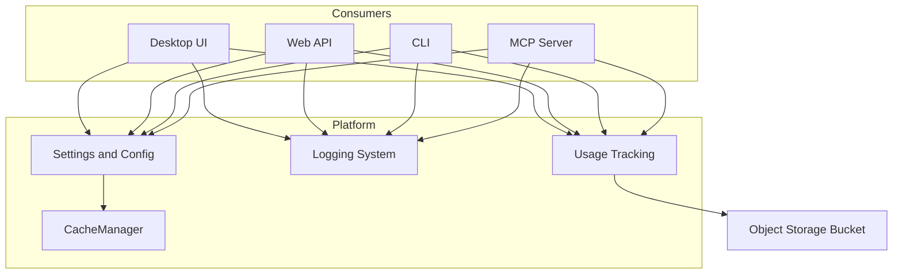

# Architecture

The OCI Policy Analysis tool has the following overall architecture:

Each tier works together to form a clean separation between presentation, data repository, and associated tools and helpers. Third-party projects, such as DeepDiff, are used for comparisons, and FastMCP is used to expose MCP to clients. All access to OCI is via the OCI official Python SDK and the supported tenancy configurations.

## Data Model

The data model starts as an empty JSON object and is then populated by API calls via the OCI SDK, describing compartments, IAM identities, and policies. The data model captures structure, effective permissions, parsed/derived fields (like effective path or validity), and more.

## Layers

**Data Layer**  
Loads, caches, parses, and normalizes tenancy data including policies, users, groups, and dynamic groups. Provides efficient queries on the in-memory model.

**Intelligence Layer**  
Derives additional analytics and insights, such as policy recommendations, cleanup tasks, security risks, and overlap/consolidation suggestions.

**MCP Layer**  
Runs an embedded MCP server using FastMCP to expose the current policy state and analytics as tools/resources to compatible clients.

**UI Layer**  
Implements all user-visible tabs, resizable panes, and integrates with the full policy/data model and analytics overlays. 

---

## Policy Parsing

OCI policies are parsed using a dedicated **ANTLR-based parser**, which incorporates a comprehensive grammar covering the full breadth of OCI Policy Syntax. The parser translates written policy statements into well-structured parse trees, enabling detailed, robust extraction of policy components, conditions, and rules.

Once a policy statement is parsed, a series of derived fields are computed and added to the internal data model:
- **Effective Path**: Determines which compartments a statement is in scope for, based on the policy's compartment location and referenced locations within statements.
- **Validity & Invalid Reasons**: Calculates if a policy statement is internally consistent and matches live OCI structures (e.g., references to deleted compartments or malformed subjects).
- **Parsed Conditions and Statement Breakdown**: Conditionals (WHERE clauses), operators, and subjects are normalized and attached to the data model for fine-grained filtering and analysis.
- **Policy Overlap**: Leveraging resource-to-permission data, the system computes which statements overlap in their effective permissions, enabling conflict/duplication analysis.
- **Canonical Models**: All parsed data is mapped to strict TypedDict-based schemas, powering consistent filtering, UI rendering, and MCP responses.

The ANTLR grammar and parser implementation ensure that all features and edge cases in the evolving OCI policy language are handled with a high degree of accuracy. Maintainers can see the [logic context](https://github.com/agregory999/oci-policy-analysis/blob/main/context/project/CONTEXT_logic.md) and [policies-tab context](https://github.com/agregory999/oci-policy-analysis/blob/main/context/project/CONTEXT_policies_tab.md) for deeper implementation details.

---

## Caching

The application persistently caches full tenancy analyses (IAM, policies, derived fields, overlays) as versioned JSON files. Caching serves to:
- Accelerate reloads (especially when analyzing large tenancies or when OCI credentials are not immediately available)
- Support offline/remote diagnostics or hand-offs
- Provide input for diff/historical comparison functionality

The cache format reflects the canonical data model and overlays as computed at data load time. All filtering, policy intelligence, and tab workflows can operate seamlessly over in-memory or cached data; the data repository manages de-duplication and versioning.

Cache management includes import, export, snapshotting, refreshing, and selection of caches—all directly exposed via the Settings Tab. Maintainers can see the [data repository context](https://github.com/agregory999/oci-policy-analysis/blob/main/context/project/CONTEXT_data_repo.md) and [settings context](https://github.com/agregory999/oci-policy-analysis/blob/main/context/project/CONTEXT_settings_tab.md) for more details.

---

## Settings

A robust and extensible settings system governs configuration for all areas of the application. Settings management covers:
- Tenancy/OCI configuration (profile, session token, compartment selection, recursion, MCP server config)
- Desktop-only preview controls, including [Optional AI Assist](optional_ai_assist.md)
- UI preferences (font size, tab visibility, context help, advanced tab enablement)
- Cache import/export, refresh, and selection
- Application-wide toggles for maintenance/debug features

Settings are saved and loaded automatically to persistent storage, enabling reproducibility between sessions. The settings system ensures all tabs receive relevant configuration updates dynamically, leveraging a propagation mechanism orchestrated by the main UI controller.

See the [settings maintainer context](https://github.com/agregory999/oci-policy-analysis/blob/main/context/project/CONTEXT_settings_tab.md) for the full field-by-field design.

---

## Logging

Logging is centrally managed by a flexible, unified system supporting global and per-component log levels, controlled both at startup and dynamically via the Console Tab UI.
Key characteristics:
- Log messages from all components go both to the shell and to a persistently-rotated application logfile.
- In-app Console Tab shows INFO+ logs for all components, while the shell and log file can include DEBUG-level output per logger.
- Log level selection is fully dynamic, can target individual loggers, and is instantly persisted for the next session.
- Special modes (like CLI `--verbose`) override all levels and pin logging for troubleshooting.
- ConsoleTab UI cannot enable global DEBUG logging, only component-level.

See the [logging maintainer context](https://github.com/agregory999/oci-policy-analysis/blob/main/context/project/CONTEXT_logging.md) for architecture diagrams, detailed workflows, and UI patterns.

---

## Maintainer context

The detailed feature and subsystem corpus is maintained separately from the
published documentation. Start at the [maintainer context index](https://github.com/agregory999/oci-policy-analysis/blob/main/context/README.md).

---

## Core Runtime Architecture (4 Consumer Paths)

The codebase exposes a shared core through four primary consumer paths:
- **Desktop UI** (`main.py` / Tkinter tabs)
- **CLI** (`cli.py`)
- **Web API** (`web/api/routes_core.py` via FastAPI dependencies)
- **MCP Server** (`mcp_server.py` via FastMCP)

Each path ultimately converges on shared repository and engine components, with OCI SDK and supporting platform services beneath the core domain.

### Runtime Flow (Consumers to Engines)

### Logical Layering (Domain, Models, Platform, External)

### Cross-Cutting Operations (Settings, Logging, Usage)

