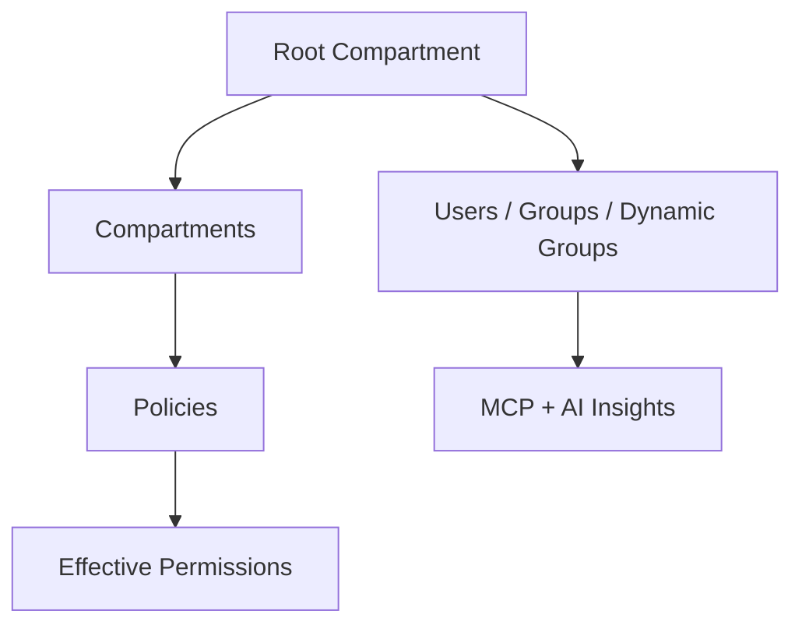

# Architecture

The OCI Policy Analysis tool has the following overall architecture:

Each tier works together to form a clean separation between presentation, data repository, and associated tools and helpers.  3rd party projects, such as DeepDiff are used for comparisons, which FastMCP is used to expose MCP to clients.  All access to OCI is via the OCI official Python SDK and the supported tenancy configurations.

## Data Model

The data model starts out as an empty JSON object, and then is populated via OCI SDK (API Calls) to build a picture 
of the IAM environment for the tenancy, as well as all of the policy statements.  This is required, because the the evaluation
of OCI Policy statements required knowledge of compartments, groups, dynamic groups, and many other runtime settings in order to
"allow" or "deny" the caller from the resource.

Here is a representation of the data:

### Policy Parsing

As part of parsing each policy statement, more data is generated about each statement, and is stored in the resulting JSON 
structure for use by the UI and MCP layers of the tool.   Any new fields which are derived during parsing represent new 
data for use with analysis.  Examples of this:

**Effective Path** - Consider that each policy statement is part of a policy that lives in a compartment, maybe root, and maybe further down the compartment tree.  When statements in that compartment refer to a
location, that location must be within (below) the current compartment.   Thus, the "Effective Path" helps us understand at which level this policy statement is applicable.  

**Valid** - Policy statements can become invalid for a variety of reasons, so it makes sense to check and store this information.  An example of an ivalid policy statement is when a location was referred to as "compartment id ocid1.xx.yy.zzz", and then the compartment is later deleted.  

## Layers

**Data Layer**
Loads, caches, parses and normalizes tenancy data, including:
- policy statements, users, groups, dynamic groups); exposes efficient queries.

**MCP Layer**
FastMCP server exposing typed tools/resources (e.g., filter_policy_statements, search_users_by_groups) for AI clients.

UI Layer
Tkinter app with tabs, resizable panes, and an AI output area; integrates tightly with analysis and MCP results.
