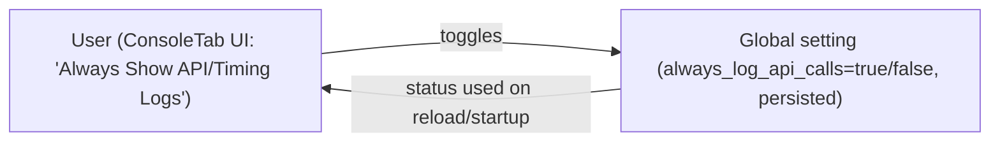
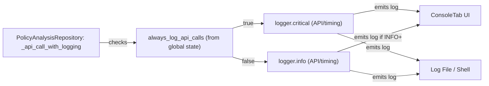

# Project-Specific Context: Logging Configuration

## Overview

OCI Policy Analysis uses a unified, flexible logging subsystem designed for transparency, robustness, and central control. Logging configuration—including global and per-component log levels—is managed centrally at application startup, and dynamically adjustable during runtime through the user interface.

---

## Centralized Logging Initialization

- **Primary control flow:**  
  1. *User logging preferences* (global and per-component levels) are read from `~/.oci-policy-analysis/settings.json` at application startup, via `load_settings()`.
  2. In `main.py`, immediately after loading settings, the log levels are applied programmatically:
      - `set_log_level` sets the root logger (global minimum).
      - `set_component_level` is called for each named logger/component to override the global level as needed.
  3. After this setup, all modules, tabs, and UI components are instantiated. All log emission from this point forward will honor the configured thresholds.

- **No log level or handler is set in tab or UI constructors.**
  - ConsoleTab and all tabs only reflect logging state; they do not modify it at initialization.

---

## Shell vs. ConsoleTab vs. File Logging

- **Shell/STDERR:**  
  - All log messages (including DEBUG, per logger) go to the shell/terminal according to logger/handler configuration.

- **ConsoleTab (In-app UI):**
  - Only shows logs at INFO or higher for all loggers by default.
  - DEBUG messages *do not* appear in ConsoleTab; this is enforced both by the handler and UI logic.
  - ConsoleTab allows inspecting and changing global and per-component log levels at runtime.

- **Rotating File Handler:**  
  - All logs (matching the configured levels) are persisted to an on-disk rotating file (at `~/.oci-policy-analysis/logs/app.log`), retaining historical log context across sessions.

---

## Forcing DEBUG Logging with `--verbose`

- If you launch the application with the `--verbose` command-line argument, the logging system **overrides all global and component-level settings and sets every logger to DEBUG**.
  - This applies to the root logger, *and* all component loggers.
- This mode is intended for troubleshooting or development—provides maximum log verbosity to both the shell and the log file.
- **ConsoleTab behavior in `--verbose` mode:**
  - A red banner is shown at the top of the ConsoleTab:  
    “Verbose mode (--verbose) is active. Only INFO+ logs appear below, but DEBUG output is available in the shell and app.log file. No logging configuration changes are allowed during this session. To modify logging, restart without --verbose.”
  - The global log-level dropdown and the "Show loggers" checkbox are disabled, and logging cannot be changed interactively.  
  - Even when all loggers are DEBUG, ConsoleTab continues to filter and shows only logs at INFO and above.
  - DEBUG output remains visible *only* in the shell or log file.
- When `--verbose` is not used, standard global and per-component log levels from settings are enforced.

---

## Timing and API Logging (Critical Operations and UI Integration)

In addition to standard log level configuration, the system supports explicit logging for **API calls** and **timing of critical operations**. This provides insight into slow or failing OCI interactions, and is controlled both programmatically and via UI.

### How Timing and API Logging Works

- Certain API calls (especially operations with OCI or other external services) are wrapped with timing and success/failure logging via the repository's `_api_call_with_logging` function (see `src/oci_policy_analysis/logic/data_repo.py`).
- The log output always states:
  - **Which API was called**
  - **Whether it succeeded or failed**
  - **Elapsed time (in seconds)**
- By default, these logs are emitted at `INFO` level. However, users can raise them to `CRITICAL` to ensure they are never missed, regardless of the global/component log level.
- The log level to use for these calls is controlled by the setting `always_log_api_calls` in `settings.json` and surfaced in the UI via the ConsoleTab and base settings tab (log level controls).
  - If `always_log_api_calls` is true, API/timing logs are pushed to `CRITICAL`, so they always surface in ConsoleTab and log files.

#### **Example:**
  - At default (`INFO`), API timing and outcomes show up only if global/component levels include INFO.
  - If `always_log_api_calls=true` or the user chooses "Always Show API Logs" in the UI, these events show up **even if** global/component levels are WARNING or ERROR.

### Where Timing/API Logging Surfaces in the UI

- The ConsoleTab (Logs UI), at both global and per-component, always shows logs at INFO and higher, but API logging may appear at CRITICAL if forced by settings.
- Timing/API logs are highly visible for troubleshooting slow or failing operations, especially via the main Logs/Console tab.
- Users can set API/timing log options in:
  - **App Settings** (`settings.json`)
  - **UI ConsoleTab** log controls (per-component, under "Show Loggers" overrides)

### Implementation (data_repo.py)

- All data/identity/policy repo API calls are funneled through `_api_call_with_logging`.
  - This function checks the settings, updates the logger, notes start/end time, and emits the result (success or failure) at the designated level.
  - Example (simplified):
    ```python
    log_critical = self.settings.get('always_log_api_calls', False)
    level_func = logger.critical if log_critical else logger.info
    ...
    t0 = time.perf_counter()
    try:
        result = api_client.call()
        elapsed = time.perf_counter() - t0
        level_func(f"[API] Fetch completed in {elapsed:.2f}s")
    except Exception as e:
        logger.error(f"[API] Call failed after {elapsed:.2f}s: {e}")
    ```
- See below for a mermaid diagram showing the flow.

### **Diagrams: API/Timing Logging Control and Flow**

#### (1) Control Flow: API/Timing Log Level Toggle in the UI



- The user sets the API/Timing logging behavior from the ConsoleTab UI (not main settings).
- The choice is saved globally and reapplied at startup.

#### (2) Logging Flow: Emission and Display of API/Timing Logs



- When making API/timing calls, the repo checks if "always_log_api_calls" is set.
- If **true**, logs go out as CRITICAL (always surface in ConsoleTab and file/shell).
- If **false**, logs are INFO and are visible only if ConsoleTab/global/component level is INFO+.

---

## Log Level Selection in the UI

- **Global log level:**  
  - Can be set to INFO/WARNING/ERROR/CRITICAL (never DEBUG) via the ComboBox.
  - DEBUG is *intentionally* excluded as a global choice; it is only valid for fine-grained, per-component diagnostics.

- **Component log levels:**
  - Can individually be set to DEBUG or any standard log level.
  - If a logger’s level is set to DEBUG, DEBUG output appears **only in the shell/STDERR**, not the in-app ConsoleTab, regardless of component.

- **Persistence:**
  - Any user-driven change in log level (via ConsoleTab) is applied by calling `set_log_level`/`set_component_level`, and immediately persisted to `settings.json` via `save_settings`.

- **Startup behavior:**
  - On startup, ConsoleTab UI reads the current logger state to reflect the relevant ComboBox selections, but does not perform any further logging configuration itself.

---

## Best Practices and Limitations

- Always apply new logger levels by calling the appropriate helper (`set_log_level`/`set_component_level`).
- Avoid modifying logger setup outside `main.py` (except in response to explicit user interaction in the UI).
- Because the root and file handlers are set up by `common/logger.py`, low-level logs may still be emitted during early imports. Centralized initialization in `main.py` keeps this window as short as possible.
- Never allow the user to set global log level to DEBUG.
- Per-component DEBUG is for advanced troubleshooting; encourage users to reset to INFO/WARNING after diagnosing issues.

---

## Example: Setting a Component Logger to DEBUG

1. Open *Console Logging* tab in the UI.
2. Under the component list, select 'DEBUG' for the desired logger (e.g., `policy_intelligence`).
3. All DEBUG logs for this component will appear in the shell; the ConsoleTab will only show INFO+ for all loggers.
4. The new setting is automatically saved for next startup.

---

## References

- Logging configuration is defined in [`src/oci_policy_analysis/common/logger.py`](../../src/oci_policy_analysis/common/logger.py)
- Console logging UI logic is in [`src/oci_policy_analysis/ui/console_tab.py`](../../src/oci_policy_analysis/ui/console_tab.py)
- Settings load/save implementation is in [`src/oci_policy_analysis/common/config.py`](../../src/oci_policy_analysis/common/config.py)
- All logger setup at startup occurs in [`src/oci_policy_analysis/main.py`](../../src/oci_policy_analysis/main.py)