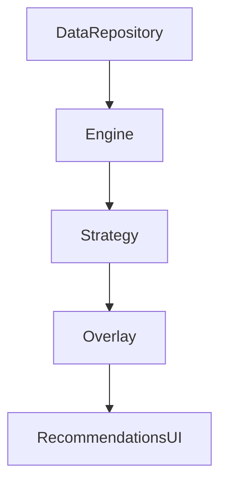
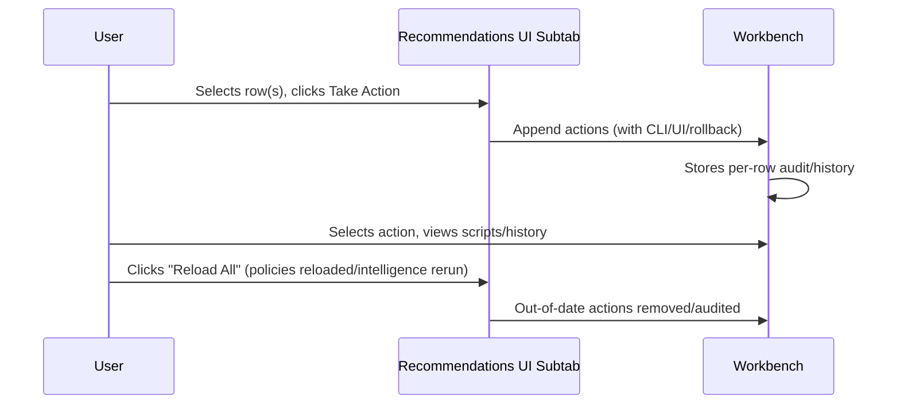

# Context: Policy Intelligence Engine and Recommendations UI Integration

This document describes the contract and architecture that underpins how the policy analytics/engine layer and the unified UI recommendations tab work in the OCI Policy Analysis project. It is the canonical reference for how backend analytics, the overlay model, and UI subtabs are wired together—and for extending intelligence with new strategies.

---

## 1. Architecture & Overview

- **PolicyIntelligenceEngine** ([`logic/policy_intelligence.py`](../../../src/oci_policy_analysis/logic/policy_intelligence.py)):  
  The engine orchestrates all post-load analysis by dispatching to a set of modular, pluggable **intelligence strategies**. Each strategy implements a simple protocol, and is registered (see `intelligence_strategies/__init__.py`) with an explicit run order. After execution, results are merged into a uniform **overlay** object using canonical models.
- **Intelligence Strategies** ([`logic/intelligence_strategies/`](../../../src/oci_policy_analysis/logic/intelligence_strategies/)):  
  These are single-responsibility, protocol-driven Python classes implementing specific analyses—such as risk scoring, overlap checks, or cleanup detection. Strategies are completely decoupled from the engine and UI. Adding a new strategy is a matter of subclassing and registering.
- **PolicyIntelligence Overlay Model** ([`common/models.py`](../../../src/oci_policy_analysis/common/models.py)):  
  All analytics output is attached to a single overlay dictionary (see `PolicyIntelligence` TypedDict). Keys include: `risk_scores`, `overlaps`, `consolidations`, `cleanup_items`, `recommendations`, etc., each matching their analytics category and documented canonical shape.
- **Recommendations UI Tab** ([`ui/policy_recommendations_tab.py`](../../../src/oci_policy_analysis/ui/policy_recommendations_tab.py)):  
  A multi-subtab UI notebook that simply **renders the overlay**. Each subtab selects/filters/presents a specific overlay key or overlay-internal section. The UI never recomputes analytics itself—it responds to overlay updates and (re)loads by re-pulling from the model.

---

### 1A. Architecture Diagram



<!--
Legend:
- DataRepository = PolicyAnalysisRepository (all loaded OCI/IAM state)
- Engine = PolicyIntelligenceEngine (registers strategies and runs analytics)
- Strategy = any pluggable/registered intelligence strategy
- Overlay = PolicyIntelligence overlay (aggregated analytics/results)
- RecommendationsUI = Tab and subtabs in the unified UI, displaying overlay data
-->

---

## 2. Strategy/Overlay/UI Mapping

The following table reflects the default strategies as registered in the canonical run order (`logic/intelligence_strategies/__init__.py`):

| Order | Strategy Class (File)                        | Overlay Key                     | UI Subtab(s)              | Description                                  |
|-------|---------------------------------------------|---------------------------------|---------------------------|----------------------------------------------|
| 1     | RiskScoreStrategy (`risk.py`)               | `risk_scores`                   | Risk Overview (subtabs)   | Computes potential risk for statements       |
| 2     | OverlapStrategy (`overlap.py`)              | `overlaps`                      | Overlap Analysis          | Finds conflicts, supersessions among policy  |
| 3     | ConsolidationSuggestionStrategy (`consolidation_suggestion.py`) | `consolidations`     | Policy Consolidation        | Suggests policies/statements to be merged    |
| 4     | InvalidStatementsCheck (`cleanup_invalid.py`)| `cleanup_items['invalid_statements']` | Cleanup/Fix     | Flags invalid statements for fix             |
| 5     | UnusedGroupsCheck (`cleanup_unused_groups.py`)| `cleanup_items['unused_groups']`  | Cleanup/Fix          | Detects groups with zero members             |
| 6     | UnusedDynamicGroupsCheck (`cleanup_unused_dynamic_groups.py`)| `cleanup_items['unused_dynamic_groups']` | Cleanup/Fix | Finds dynamic groups not referenced          |
| 7     | StatementsTooOpenCheck (`cleanup_statements_too_open.py`)| `cleanup_items['statements_too_open']` | Cleanup/Fix | Identifies ‘manage all-resources’ grants     |
| 8     | AnyuserNoWhereCheck (`cleanup_anyuser_no_where.py`) | `cleanup_items['anyuser_no_where']` | Cleanup/Fix    | Finds ‘any-user’ statements w/o a WHERE      |
| 9     | OverallRecommendationStrategy (`recommendations.py`)| `recommendations`      | Summary Table (top)         | Aggregates actionable recommendations        |

- Additional strategies may be registered by extending the protocol and updating the registration list (see below).

---

## 3. Overlay Contract (Data Model)

All analytics are merged into a single overlay. The canonical structure is:

```python
class PolicyIntelligence(TypedDict, total=False):
    overlaps: list[dict]
    recommendations: list[dict]
    risk_scores: list[dict]
    consolidations: list[dict]
    cleanup_items: NotRequired[dict]
```
- See [`common/models.py`](../../../src/oci_policy_analysis/common/models.py) for detailed data model definitions (e.g., `RegularPolicyStatement`, `PolicyOverlap`).  
- Each strategy writes its results into a corresponding overlay key or subkey (conventionally documented inline in the TypedDict or strategy comments).

---

## 4. UI Subtab Mapping and Data Sources

Each subtab in the unified recommendations UI directly reflects an overlay key or subkey as follows:

- **Summary Table** (top):  
  Renders the contents of `overlay['recommendations']` (aggregated by `OverallRecommendationStrategy` plus limits logic from compartment analysis).
- **Risk Overview (Statement/Policy)**:  
  Draws from `overlay['risk_scores']` and policy statement metadata.
- **Overlap Analysis**:  
  Renders `overlay['overlaps']`.
- **Policy Consolidation**:  
  Uses `overlay['consolidations']`.
- **Cleanup / Fix**:  
  Aggregates all lists inside `overlay['cleanup_items']`.
    - Ignore/hide and “Show Previously Ignored” features use a persistent set of ignored item keys (see UI for per-tenancy state).
    - “Take Action” wires to the Recommendation Workbench (see below).
- **Limits**:  
  Compartment/boundary analysis is shown directly from compartment metadata and statement counts, not overlay.
- **Recommendation Workbench**:  
  Accumulates per-action CLI/UI steps, rollback, and history, appended whenever a subtabs's “Take Action” is used.

---

## 5. Extensibility (Add/Change an Intelligence Strategy)

**A. To Add a New Strategy:**

1. **Implement the Protocol**  
   Create a new Python class in `logic/intelligence_strategies/`, implementing the `IntelligenceStrategy` protocol (see `base.py`). For example:
   ```python
   from dataclasses import dataclass
   from oci_policy_analysis.logic.intelligence_strategies.base import IntelligenceStrategy
   from oci_policy_analysis.logic.data_repo import PolicyAnalysisRepository

   @dataclass(frozen=True)
   class MyNewStrategy:
       strategy_id: str = "my_new_check"
       display_name: str = "Custom Check"
       category: str = "cleanup"  # Or risk, overlap, etc.
       def run(self, repo: PolicyAnalysisRepository, overlay: dict, params: dict | None = None) -> None:
           # Compute whatever analytics desired
           results = ... # list of dicts, TypedDict, etc.
           overlay.setdefault("cleanup_items", {})[self.strategy_id] = results
   ```
2. **Register the Strategy**  
   Add your class to the return list in `get_default_intelligence_strategies()` in `logic/intelligence_strategies/__init__.py`, placing it appropriately in run order.
3. **Update Docs and UI**  
   a. Document the overlay key output by your strategy here, under the relevant section/list.  
   b. Modify the appropriate UI subtab in `policy_recommendations_tab.py` to present the new overlay result (if needed).

**B. Overlay and Model Contracts**  
- All analytic and remediation data passed from strategy to overlay to UI should use explicit Python types or TypedDicts as defined in `common/models.py`. This ensures UI and strategy code remain compatible and maintainable.

---

## 6. Workbench and "Take Action" Integration

- Each “Take Action” operation in a subtab (Cleanup/Fix, and future Risk/Overlap/Consolidation extensions) creates action items in the **Recommendation Workbench**.
- Workbench action entries must include source, description, CLI and rollback instructions, and can accrue history/audit data over time.  
- See `policy_recommendations_tab.py` for workbench API details and per-action semantics; all actions are per-session and cleared on reload.  
- A diagram for workbench action flow:



---

## 7. Coupling and Boundaries

- **Engine/Strategy:**  All analytics are delegated to pluggable strategies using a protocol-defined contract, never hard-coded in the engine. Strategies know nothing of UI.
- **Overlay/UI:** The UI only renders overlay data; it never computes analytics itself, and triggers only overlay reload or recomputation through the engine.
- **Models:** All overlay structure and per-item analytics are explicitly type-checked using TypedDicts and docstrings in `common/models.py`.
- **Extensibility:** Adding a new analytic, check, or recommendation is entirely plug-and-play. If you extend the overlay or models, document all updates in this file and the linked sources above.

---

## 8. References & Cross-links

- **Engine:** [`src/oci_policy_analysis/logic/policy_intelligence.py`](../../../src/oci_policy_analysis/logic/policy_intelligence.py)
- **Strategies/Registry/Protocol:** [`src/oci_policy_analysis/logic/intelligence_strategies/`](../../../src/oci_policy_analysis/logic/intelligence_strategies/)
- **Overlay Data Models:** [`src/oci_policy_analysis/common/models.py`](../../../src/oci_policy_analysis/common/models.py)
- **Recommendations Tab UI:** [`src/oci_policy_analysis/ui/policy_recommendations_tab.py`](../../../src/oci_policy_analysis/ui/policy_recommendations_tab.py)
- **Consolidation Workbench (proposal/demo):** [`src/oci_policy_analysis/ui/consolidation_workbench_tab.py`](../../../src/oci_policy_analysis/ui/consolidation_workbench_tab.py)

---

**Summary:**  
This contract decouples the logic of analytics, extensibility, overlay modeling, and UI rendering—ensuring you can add, modify, or reason about any kind of policy intelligence or recommendation in a single place. Use this file as your reference for all future strategy or overlay-related updates.