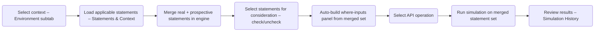

# Project-Specific Context: Simulation Engine

This document defines the architecture, data models, and canonical flow for the OCI Policy Simulation Engine, as consumed both via UI and Model Context Protocol (MCP) APIs.

---

## 1. Overview

The PolicySimulationEngine serves as the single source of truth for all permission simulation business logic. It enables the app to simulate allow/deny outcomes for OCI API operations, supporting conditional evaluation via “where” clauses. This engine powers both interactive user flows (Simulation UI Tab) and programmatic automation (via MCP server/tools).

- **Engine location:** `src/oci_policy_analysis/logic/simulation_engine.py`
- **Driven by:**
  - **UI:** `src/oci_policy_analysis/ui/simulation_tab.py`
  - **MCP:** `src/oci_policy_analysis/mcp_server.py`
- **Data Schemas:** `src/oci_policy_analysis/common/models.py`
- **Demo usage:** `docs/source/simulation_engine_usage_examples.py`

---

## 2. Key Data Models for Simulation (MCP/JSON)

All simulation-related requests and responses use schema-typed dictionaries from `common/models.py`:

- **Preparation:**  
  - `SimulationPrepareRequest`  
  - `SimulationPrepareResponse`

- **Single Simulation Run:**  
  - `SimulationScenario`  
  - `SimulationResult`

- **Batch Simulation:**  
  - `SimulationBatchRequest`  
  - `SimulationBatchResponse`

- **Policy/User/Group Filters:**  
  - `PolicySearch`, `PolicyFilterResponse`  
  - `UserSearch`, `UserSearchResponse`  
  - `GroupSearch`, `GroupSearchResponse`  
  - `DynamicGroupSearch`, `DynamicGroupSearchResponse`

Model fields are strictly enforced. Example:  
- To specify a principal for simulation, use a string for `"any-user"`/`"service"` or a two-element list `[domain, name]` for users/groups/dyn-groups.
- "Where" variables are always a mapping from `str` to `str`.

---

## 3. Simulation Stages & Canonical Flow

Whether simulation is initiated from the UI or via MCP, the process is broken into stages. The **engine flow** is the same; the **UI flow** is now structured into three logical subtabs.

### 3.1 Canonical Engine Stages (UI + MCP)

1. **Select Context:**  
   - Compartment path  
   - Principal type & value (domain/name, or string for "any-user"/"service")

2. **Load Policy Statements (Real + Prospective):**  
   - Call:  
     - UI: via simulation engine API  
     - MCP: via `prepare_simulation` tool  
   - Output:  
     - Principal Key (calculated example `"principal_key": "user:Default/anita"`)
     - **Merged list of applicable policy statements** for the given `principal_key` and `effective_path`, including:
       - Real tenancy statements from the policy repository.
       - Any **prospective (what‑if) statements** whose `compartment_path` is equal to or a parent of `effective_path`.
   - Engine API:  
     - Canonical call is `get_applicable_statements(principal_key, effective_path)` (or equivalent wrapper).  
       The engine internally maps the `principal_key` (which encodes both the principal type and identity) to the proper `PolicySearch` filter (`exact_users`, `exact_groups`, `exact_dynamic_groups`, or `subject`), ensuring correct filtering for all principal types and then **merges in prospective statements** (see section 10) before returning to UI/MCP.

3. **Gather Where-Input Values:**  
   - Engine exposes a *derived* view of required where‑variables based on the selected statements’ condition strings (**after real + prospective statements have been merged and filtered**).  
   - UI: Auto‑generates dynamic input fields for variables every time the set of *included* (checked) statements changes. The where‑context panel is **always present**, even if the user chooses not to fill any values (in which case the `where_context` is `{}`).
   - MCP: Client must provide a mapping of variable inputs as JSON (the engine does not require a separate “load fields” call; it simply consumes the mapping).

4. **Select/Specify API Operation:**  
   - Operation name, e.g. `oci:ListBuckets`.
   - UI: Single operation per run (though the engine supports batch scenarios).  
   - MCP: May run batches where each scenario has its own API operation.

5. **Simulate & Retrieve Result:**  
   - Call simulation engine with all context/inputs:
     - Effective Path (compartment)
     - Principal key (format above)
     - Where clause values (as JSON dict; may be empty `{}`)
     - Optional list of statements to consider.
       - For UI, the internal IDs of the *currently included* statements are collected and passed (these IDs may reference real **or prospective** statements; the engine treats them uniformly).
       - For MCP, this is typically omitted, which implies “use all applicable statements from the filter (real + prospective)”.
     - Whether to provide trace output (if `True`, include a per‑statement trace and final permission set).
   - Output:
     - Allow/Deny result
     - Set of granted permissions (reflecting the combined effect of real and prospective statements)
     - Optional: decision trace (per-statement allow/deny, conditions, including which statements were prospective).

6. **Review/Present Results:**  
   - UI: Results & trace are displayed in a dedicated **Simulation History** view and can be exported as JSON. Each run is named (e.g., `"oci:ListBuckets | user:Default/anita"`) and added to a history list.  
   - MCP: Results returned as structured JSON per canonical model.
     - For MCP, there is a limit on returned JSON, so responses are brief but contain enough detail for the AI consumer to build a rich explanation.

**All simulation stages are orchestrated outside the engine.** The engine itself is stateless and enforces all logic and normalization.  

---

## 4. Implementation: Three-Subtab UI vs. MCP Tool

The UI’s Simulation experience is now organized into **three subtabs** that together orchestrate the same canonical engine stages described above.

| Stage                      | UI Tab (simulation_tab.py) – Subtab                 | MCP Server (mcp_server.py)                          | Simulation Engine           |
|----------------------------|------------------------------------------------------|-----------------------------------------------------|-----------------------------|
| 1. Select context          | **Simulation Environment**: dropdowns for effective path and principal type/name; inline table for Prospective (what‑if) statements | Receives context in `SimulationPrepareRequest`      | Receives canonical input    |
| 2. Load statements         | **Statements and Context**: auto-loads applicable statements whenever environment changes; merges real + prospective statements | `prepare_simulation` tool filters policies and returns metadata | Same single entrypoint (`get_applicable_statements`/equivalent) |
| 3. Gather where-inputs     | **Statements and Context**: dynamic where‑inputs panel automatically rebuilt whenever included (checked) statements change; values preserved when possible | Provided as part of simulation payload              | Receives as mapping         |
| 4. Select API operation    | **Statements and Context**: API operation combobox + validation + optional notes | API parameter in `SimulationScenario`               | Uniform behaviour           |
| 5. Simulate                | **Statements and Context → Simulation History**: Run button calls `simulate_and_record`, then switches to History subtab | `SimulationScenario` or `SimulationBatchRequest` tool | Only business logic layer   |
| 6. Present results         | **Simulation History**: trace history dropdown, “Show trace details” toggle, JSON export | Returns JSON output in `SimulationResult` form       | Dict output, schema-driven  |

- **NO business logic is duplicated or implemented in the UI or MCP server.**  
- UI and MCP are strictly callers, responsible for driving stages and displaying/returning output.
- Any changes to simulation or scenario semantics must be made only in the engine.

---

## 5. Data Models for Each Simulation Call

**Preparation Stage Example:**  
```python
# SimulationPrepareRequest Example
{
  "compartment_path": "ROOT/Finance",
  "principal_type": "user", # Must be one of Literals "service", "user", "group", "dynamic-group", "any-user", "any-group"
  "principal": ["Default", "anita"] # Optional - don't pass if type is any-user or any-group
}

# SimulationPrepareResponse Example
{
  "required_where_fields": ["user.department", "request.time"],
  "principal_key": "user:Default/anita" # Let the engien calculate this internally
}
```

**Simulation Stage Example:**  
```python
# SimulationScenario Example
{
  "compartment_path": "ROOT/Finance",
  "principal_key": "user:Default/anita"
  "api_operation": "oci:ListBuckets",
  "where_context": {"user.department": "Finance", "request.time": "2026-01-22T09:00:00Z"},
  "checked_statements": ["12345","23456"] # Optional - if omitted, use all statements from filter. If included, get the statements and only use the ones passed in.
}

# SimulationResult Key Fields
{
  "result": "YES" or "NO",
  "api_call_allowed": true,
  "final_permission_set": [...] // if trace enabled,
  "missing_permissions": [...],
  "failure_reason": "",
  "trace_statements": [...]   // if trace enabled
}
```

All model definitions in `common/models.py` must be strictly followed by both UI and MCP server.  

---

## 6. Simulation Stage Flow Comparison (Flowchart)


- *UI path* (three subtabs):  
  - **Simulation Environment**: A  
  - **Statements and Context**: B → G → C → D → E  
  - **Simulation History**: F
- *MCP path*: A-B-C-D-E driven entirely by JSON tool calls.

---

## 7. Deduplication Policy

- Simulation, policy mapping, and condition evaluation logic MUST exist only in the simulation engine.
- Code in `simulation_tab.py` or `mcp_server.py` may never reimplement the logic of any simulation stage—only drive input/output orchestration.
- Any shared workflow improvements (staging, normalization, batch mode, etc.) should begin in the engine.

All future contributions must comply with this policy.

---

## 8. Limitations, Known Issues, and Roadmap

- **Current Limitations:**
  - UI and MCP paths must be kept manually in sync if engine APIs are refactored.
  - Existing engine focused on policy simulation for a single principal-context-operation set at a time; future multi-context or batch extensions are designed but not fully exercised in UI.
  - Some edge case error handling (e.g., improperly-formatted input in MCP) may be less user-friendly than in UI.
  - Ensure TypedDict models in `common/models.py` stay in alignment with future simulation improvements.

- **Future Goals:**
  - Full “batch” simulation flows in both UI and MCP
  - Unified scenario harness for end-to-end and regression tests across both drive paths
  - Improved visual/JSON diff for large sets of simulation traces
  - OpenAPI spec generation for MCP endpoints

---

## 10. Prospective (What-If) Policy Statements

The simulation engine also supports **prospective** policy statements: hypothetical or planned policies that do not exist in the live tenancy but should be evaluated as if they did. This enables “what-if” analysis for future changes.

- **Storage & Scope**
  - Stored per tenancy in settings under `simulation_prospective_statements_by_tenancy`.
  - Keyed by tenancy OCID, value is a list of lightweight statement dicts with at least:
    - `compartment_path` (hierarchy path where the statement would live)
    - `description` (user-friendly label, used by UI)
    - `statement_text` (full OCI IAM policy statement text)
  - The Simulation Tab’s “Manage Prospective Statements” dialog lets users create/edit/delete these rows for *any* compartment in the tenancy.

- **Engine Representation**
  - Internally, the engine normalizes these into full statement dicts and keeps them in:
    - `PolicySimulationEngine._prospective_statements: list[dict]`
  - Normalized fields include:
    - `internal_id` (unique, in a `prospective-*` namespace)
    - `compartment_path`
    - `policy_name` (derived from `description` when not provided)
    - `statement_text`
    - Optional `conditions`, `subject_type`, etc. once parsed.
    - `is_prospective = True` marker for UI/analysis.

- **Engine APIs**
  - `get_prospective_statements() -> list[dict]`
    - Returns the current in-memory list of normalized prospective statements.
  - `set_prospective_statements(statements: list[dict]) -> None`
    - Replaces the engine’s prospective statement set.
    - Caller passes lightweight dicts with `compartment_path`, `statement_text`, optional `description`.
    - Engine normalizes, sets `is_prospective=True`, and assigns unique `internal_id` values.

- **Applicability & Merging (Stage 2)**
  - Prospective statements are merged into the normal flow as part of **Stage 2 – Load Policy Statements** via `get_applicable_statements`:
    ```python
    def get_applicable_statements(self, principal_key: str, effective_path: str) -> list[dict]:
        # 1) Use policy_repo.filter_policy_statements for base (tenancy) statements.
        # 2) For each prospective statement, if its compartment_path is equal to
        #    or a parent of effective_path, include it.
        # 3) Return a merged list.
    ```
  - The same principal filtering semantics apply: callers pass a `principal_key` and `effective_path`, and any prospective statements that would be in scope for that path are included alongside real tenancy statements.
  - Downstream stages (where-field extraction, simulation, history) always operate on this **merged set**; they do not distinguish between real and prospective statements for business logic.

- **Simulation Semantics**
  - After merging, prospective statements are indistinguishable from real statements for:
    - where-clause extraction (`get_required_where_fields`)
    - selection-by-internal-id from the UI
    - evaluation in `simulate_and_record` (allow/deny logic, permissions, and trace output).
  - The Simulation Tab displays them with a `[Prospective]` prefix in the “Policy Path/Name” column but otherwise treats them identically.

- **UI Integration Notes**
  - The Simulation Tab includes a **“Manage Prospective Statements”** button in the Applicable Policy Statements table.
  - The dialog explains scope: users may define statements anywhere in the tenancy, but only those applicable to the currently selected compartment/principal will appear in the main table.
  - On save, the UI:
    - Calls `set_prospective_statements` with the new list.
    - Updates the per-tenancy settings entry `simulation_prospective_statements_by_tenancy[tenancy_ocid]` and persists via `config.save_settings`.
    - Reloads the Applicable Policy Statements table so new prospective entries appear.

As with all other simulation behavior, the **engine remains the single source of truth** for how prospective statements are normalized, merged, and evaluated. The UI is responsible only for collection and presentation of these inputs.

---

## 9. References

- [`simulation_engine.py`](../../../src/oci_policy_analysis/logic/simulation_engine.py)
- [`simulation_tab.py`](../../../src/oci_policy_analysis/ui/simulation_tab.py)
- [`mcp_server.py`](../../../src/oci_policy_analysis/mcp_server.py)
- [`common/models.py`](../../../src/oci_policy_analysis/common/models.py)
- [Simulation usage examples](../../../docs/source/simulation_engine_usage_examples.py)
