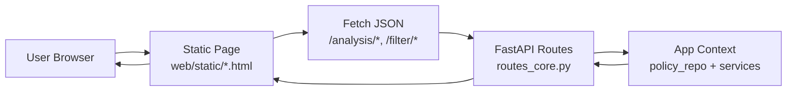
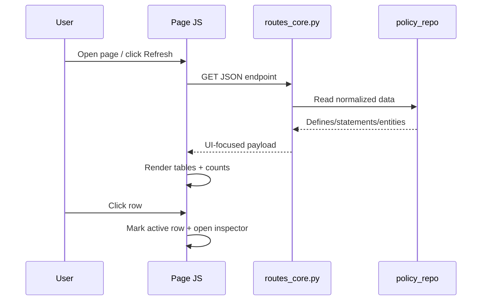

##########################################################################
# CONTEXT_web_ui.md
#
# Project-Specific Context: Web UI Architecture, Data Flow, and Detail Panes
##########################################################################

## Purpose

This document captures the current **web UI architecture and interaction flow**
for OCI Policy Analysis, with emphasis on:

- How the static web pages are composed and wired to API routes.
- How analysis data is loaded and rendered in table-first workflows.
- How row selection drives **right-side detail inspectors** (slide-in panes).
- The current cross-tenancy page behavior and conventions.

## 1) Web UI Architecture (Static Pages + API)

The web UI is implemented as static HTML/CSS/JS pages in
`src/oci_policy_analysis/web/static/` and data APIs in
`src/oci_policy_analysis/web/api/routes_core.py`.

Design principles:

- Keep page logic local and explicit (per-page JS script blocks).
- Keep route payloads UI-friendly and stable.
- Prefer a **table + inspector** interaction pattern for dense records.

## 2) Common UI Construction Pattern

Most analysis pages follow this structure:

1. **Header card** with refresh/actions/status.
2. **Primary table(s)** for fast scanning and sorting/filtering.
3. **Row selection state** tracked in JS (stable key where possible).
4. **Detail inspector pane** that renders selected row metadata.

Inspector behavior standard:

- Hidden by default.
- Opens when a row is selected.
- Close button clears selection and hides pane.
- On desktop, inspector is a **fixed right-side slide-in panel**.

## 3) Data Loading and Display Flow

UI rendering notes:

- Keep table rows compact (scan-first).
- Move high-cardinality fields (OCID, parsed fields, metadata) into inspector.
- Preserve selection when possible across table refreshes.

## 4) Detail Pane Pattern

For consistency with `policy-analysis.html`, desktop inspector behavior should be:

- `position: fixed; top:0; right:0; bottom:0`
- width approximately `min(460px, 40vw)`
- slide with `transform: translateX(105%)` -> `translateX(0)`
- close via `X` button that clears selection and removes `.open`

This is now the expected standard for right-side details on web analysis pages.

## 5) Cross-Tenancy Web Page (Current Behavior)

File: `src/oci_policy_analysis/web/static/cross-tenancy-analysis.html`

Endpoint: `GET /analysis/cross-tenancy`

### Payload sections

- `defines`
- `admit_statements_basic`
- `endorse_statements_basic`
- `unknown_statements_basic`
- `counts`

Admit/Endorse rows include:

- basic display fields (`policy_name`, `statement_text`, ...)
- `stable_key`
- `parsed_fields` (parser-derived extra keys for inspector display)

### Current page flow

1. **Defines section** (top):
   - left table with alias selection for filtering
   - right inline define detail panel
2. **Admit + Endorse tables** (main scan view):
   - compact columns: `Policy Name`, `Statement Text`
3. **Shared right-side inspector** for Admit/Endorse:
   - opens from either table row selection
   - includes primary metadata and a **Parsed Details** section

## 6) Parsed Fields in Inspector

Cross-tenancy admit/endorse inspector now supports two logical blocks:

1. Primary fields (`policy_name`, `policy_ocid`, `statement_text`,
   `creation_time`, `parsed`, `stable_key`)
2. `- Parsed Details -` separator, then sorted parser-derived fields from
   `parsed_fields`

This keeps table display simple while still exposing parser output for deeper
inspection and future parser/validator iteration.

## 7) Implementation Guidance for New Web Pages

- Reuse the same **table + fixed right inspector** interaction model.
- Keep API payloads intentionally shaped for UI (avoid pushing formatting work
  into page JS where possible).
- Include stable row identifiers for selection persistence.
- Put verbose/diagnostic fields in the inspector instead of widening tables.
- Where parser output exists, provide an explicit parsed-details section.

## 8) OCI Tenancy Explorer UI Style Reference (from `src/sample/index.html`)

This section captures reusable UI conventions observed in
`src/sample/index.html` so future pages can use named patterns instead of
ad-hoc styling.

### 8.1 Design Tokens and Visual Language

Primary semantic tokens used throughout the sample page:

- `--oci-red`, `--oci-red-deep`, `--oci-red-soft`: brand/action emphasis.
- `--oci-ink`: primary text color.
- `--oci-steel`: secondary text color.
- `--oci-line`, `--oci-line-strong`: borders/dividers.
- `--oci-panel`, `--oci-panel-alt`: surface backgrounds.
- `--oci-bg`: page background.

Practical rule:

- Use red tokens for primary actions, active state, and high-attention accents.
- Keep body surfaces neutral (`--oci-panel`) and reserve gradients for focused
  highlight regions (tabs, score bars, active chips where needed).

### 8.2 Typography Roles (Named Usage)

Use these named roles when designing content hierarchy:

- **Page Title**: large, high-contrast heading (example: `h1`/`h2` with
  `text-2xl` to `text-3xl`, `font-black`, tighter letter spacing).
- **Section Label**: small uppercase kicker above content blocks
  (`text-[10px]`, `font-black`, `uppercase`, `tracking-widest`, muted color).
- **Card Title**: section heading inside cards (`text-xl`, `font-black`).
- **Body Copy**: explanatory text (`text-[11px]`/`text-sm`, relaxed line-height).
- **Meta/Caption**: status and helper text (`text-[10px]` or `text-[9px]`,
  uppercase tracking for operational metadata).

### 8.3 Layout and Container Patterns

Reusable layout patterns:

- **Page Shell**: centered max-width app container with consistent paddings
  (`max-w-[1920px] mx-auto px-4 py-4`).
- **Top Masthead Card**: rounded header with top border accent and soft shadow.
- **Content Card**: `bg-white`, `rounded-2xl`, `border`, `shadow-sm`, padded.
- **Workspace Split**: filter/sidebar + results/table + optional right inspector.
- **Inspector Panel**: fixed-right, high-z panel on desktop;
  full-width/stacked behavior on smaller screens.

### 8.4 Navigation and Selection Components

Named reusable components:

- **Portal Tab** (`.portal-tab`, `.portal-tab-active`): top-level view switch.
- **Subtab** (`.opportunity-subtab`, `.opportunity-subtab-active`):
  section-level switch inside one view.
- **Filter Pill / Chip** (`.opportunity-filter-pill`, `.regional-chip` + active
  variants): quick multi-filter entry points.
- **Info Button + Popover** (`.section-info-button`, `.section-info-popover`):
  inline help for metric cards or labels.

### 8.5 Actions, Inputs, and Link Styling

Use these action patterns consistently:

- **Primary Action Button**: red background, white text, rounded corners, hover
  deepens red (e.g., refresh/run/open).
- **Secondary Button**: white background, neutral border/text, subtle hover fill.
- **Destructive/critical tone**: use only for error/alert semantics, not for
  regular navigation.

Input conventions from sample:

- Rounded controls (`rounded-xl`) with neutral border.
- Focus state uses red border + soft ring (`rgba(199,70,52,0.12)`).
- Search inputs and selects share visual baseline for alignment.

Link conventions:

- **Utility link-button** style for JSON/doc links (`.json-source-link`):
  button-like border and uppercase metadata typography.
- For external references in content cards, keep links visually consistent with
  secondary button treatment.

### 8.6 Data Display Patterns

Primary data-display building blocks:

- **Stat Card Ribbon**: key numeric KPIs with short labels (top-of-view).
- **Filter Summary Bar**: one-line statement describing filtered scope.
- **Data Table**: sticky header, compact rows, hover highlight, sortable columns.
- **Status Badge/Tag**: semantic classes for operational state
  (`.status-*`, `.refresh-status-*`, `.opportunity-check-*`).
- **OCID Chip** (`.ocid-chip`): compact, copy-friendly identifier display.

Row/table interaction conventions:

- Keep rows scan-friendly and move verbose diagnostics to the inspector.
- Use copy affordances (`.copy-icon-btn`) for OCIDs and key metadata values.

### 8.7 Overlays and Feedback Patterns

Modal and feedback conventions:

- **Modal Overlay** (`.modal-overlay`) with blur/dim treatment.
- **Modal Container**: rounded, bordered card with distinct header and body.
- **Live Activity**: spinner (`.refresh-spinner`), progress bar, and status chips.
- **Log Surface** (`.refresh-log`): monospace, dark background, warning/error
  color accents for troubleshooting readability.

### 8.8 Quick Mapping for Future Page Authors

When creating a new page, map elements to named roles before coding:

1. Page Title + subtitle/meta label.
2. Header action row (primary + secondary buttons).
3. Summary stat cards (if metrics exist).
4. Filter/search strip.
5. Main table/grid.
6. Right inspector panel (desktop fixed-right).
7. Optional modal(s) for workflow or detail drilldown.

This keeps new pages visually aligned with OCI Tenancy Explorer conventions and
prevents one-off class decisions.

### 8.9 Hover-Driven Context Help Area (TK-style Pattern for Web)

Yes — this is a strong fit for the web pages and can mirror the TK context-help
experience.

Recommended web pattern:

- Add a persistent **Context Help card** in the right rail (or below filters on
  narrower layouts).
- Any interactive widget can declare help text via attributes like:
  - `data-help-title="Quick Search"`
  - `data-help-body="Search by policy name, OCID, or statement text..."`
- Use delegated events (`mouseover`, `focusin`) to update the shared help card.
- On `mouseout`/`focusout`, restore default page guidance.

Minimal interaction model:

1. Page loads with a default “How to use this page” message.
2. Hover/focus on control -> help panel updates with role-specific guidance.
3. Leaving control -> help panel reverts to default.

Implementation notes:

- Keep one central helper in page JS (e.g., `setContextHelp(title, body)`).
- Prefer `focusin/focusout` in addition to hover for keyboard accessibility.
- Do not overload tooltips; use the help card for richer guidance.
- This pattern pairs well with existing `.section-info-button`/popover usage:
  popover for point details, help card for persistent workflow guidance.

### 8.10 Title Bar Modernization Experiment (Tenancy Explorer-inspired)

Yes — we can experiment with a title bar closer to Tenancy Explorer while
keeping policy-analysis functionality unchanged.

Proposed title-bar characteristics:

- Card-style masthead with subtle border, radius, and shadow.
- Left cluster: icon badge + page title + small uppercase subtitle.
- Right cluster: primary action(s) then secondary action(s).
- Optional top accent border using `--oci-red`.

Suggested structure to standardize across pages:

1. **Header shell** (`rounded-2xl`, bordered, shadowed panel).
2. **Identity block** (icon + title + descriptor text).
3. **Action block** (refresh/export/help, consistent button hierarchy).
4. **Status/meta line** (last refresh timestamp, data source, warning count).

Safe rollout strategy:

- Start with one page (recommended: `cross-tenancy-analysis.html`) as a visual
  pilot.
- Keep existing JS hooks/IDs; change only presentation classes first.
- Validate table/inspector layout still aligns at desktop and smaller widths.
- If successful, promote the masthead pattern to a shared reference snippet in
  this context doc.

## References

- Web routes: `src/oci_policy_analysis/web/api/routes_core.py`
- Cross-tenancy page: `src/oci_policy_analysis/web/static/cross-tenancy-analysis.html`
- Policy analysis page (inspector pattern reference):
  `src/oci_policy_analysis/web/static/policy-analysis.html`
