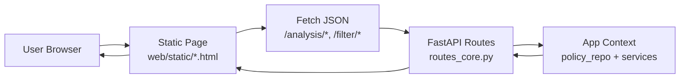
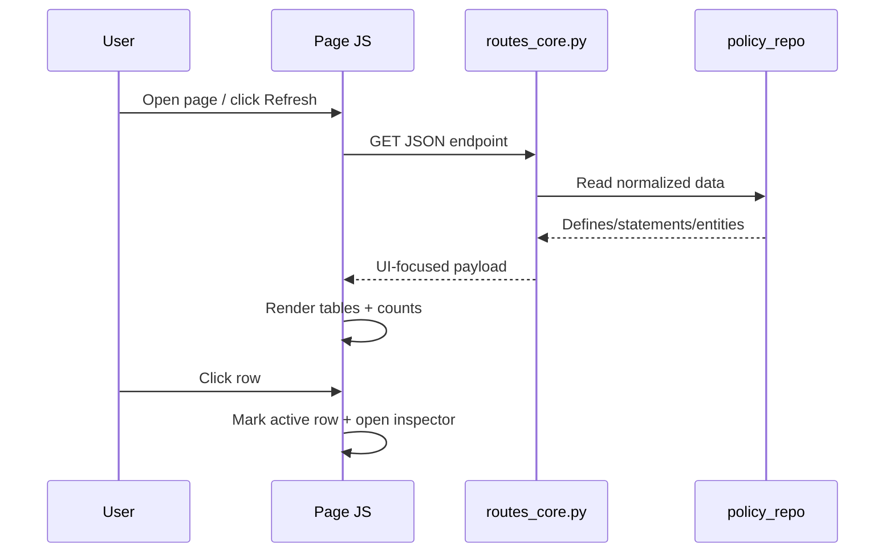

##########################################################################
# CONTEXT_web_ui.md
#
# Project-Specific Context: Web UI Architecture, Data Flow, and Detail Panes
##########################################################################

## Purpose

This document captures the current **web UI architecture and interaction flow**
for OCI Policy Analysis, with emphasis on:

- How the static web pages are composed and wired to API routes.
- How analysis data is loaded and rendered in table-first workflows.
- How row selection drives **right-side detail inspectors** (slide-in panes).
- The current cross-tenancy page behavior and conventions.

## 1) Web UI Architecture (Static Pages + API)

The web UI is implemented as static HTML/CSS/JS pages in
`src/oci_policy_analysis/web/static/` and data APIs in
`src/oci_policy_analysis/web/api/routes_core.py`.

Design principles:

- Keep page logic local and explicit (per-page JS script blocks).
- Keep route payloads UI-friendly and stable.
- Prefer a **table + inspector** interaction pattern for dense records.

## 2) Common UI Construction Pattern

Most analysis pages follow this structure:

1. **Header card** with refresh/actions/status.
2. **Primary table(s)** for fast scanning and sorting/filtering.
3. **Row selection state** tracked in JS (stable key where possible).
4. **Detail inspector pane** that renders selected row metadata.

Inspector behavior standard:

- Hidden by default.
- Opens when a row is selected.
- Close button clears selection and hides pane.
- On desktop, inspector is a **fixed right-side slide-in panel**.

## 3) Data Loading and Display Flow

UI rendering notes:

- Keep table rows compact (scan-first).
- Move high-cardinality fields (OCID, parsed fields, metadata) into inspector.
- Preserve selection when possible across table refreshes.

## 4) Detail Pane Pattern

For consistency with `policy-analysis.html`, desktop inspector behavior should be:

- `position: fixed; top:0; right:0; bottom:0`
- width approximately `min(460px, 40vw)`
- slide with `transform: translateX(105%)` -> `translateX(0)`
- close via `X` button that clears selection and removes `.open`

This is now the expected standard for right-side details on web analysis pages.

## 5) Cross-Tenancy Web Page (Current Behavior)

File: `src/oci_policy_analysis/web/static/cross-tenancy-analysis.html`

Endpoint: `GET /analysis/cross-tenancy`

### Payload sections

- `defines`
- `admit_statements_basic`
- `endorse_statements_basic`
- `unknown_statements_basic`
- `counts`

Admit/Endorse rows include:

- basic display fields (`policy_name`, `statement_text`, ...)
- `stable_key`
- `parsed_fields` (parser-derived extra keys for inspector display)

### Current page flow

1. **Defines section** (top):
   - left table with alias selection for filtering
   - right inline define detail panel
2. **Admit + Endorse tables** (main scan view):
   - compact columns: `Policy Name`, `Statement Text`
3. **Shared right-side inspector** for Admit/Endorse:
   - opens from either table row selection
   - includes primary metadata and a **Parsed Details** section

## 6) Parsed Fields in Inspector

Cross-tenancy admit/endorse inspector now supports two logical blocks:

1. Primary fields (`policy_name`, `policy_ocid`, `statement_text`,
   `creation_time`, `parsed`, `stable_key`)
2. `- Parsed Details -` separator, then sorted parser-derived fields from
   `parsed_fields`

This keeps table display simple while still exposing parser output for deeper
inspection and future parser/validator iteration.

## 7) Implementation Guidance for New Web Pages

- Reuse the same **table + fixed right inspector** interaction model.
- Keep API payloads intentionally shaped for UI (avoid pushing formatting work
  into page JS where possible).
- Include stable row identifiers for selection persistence.
- Put verbose/diagnostic fields in the inspector instead of widening tables.
- Where parser output exists, provide an explicit parsed-details section.

## References

- Web routes: `src/oci_policy_analysis/web/api/routes_core.py`
- Cross-tenancy page: `src/oci_policy_analysis/web/static/cross-tenancy-analysis.html`
- Policy analysis page (inspector pattern reference):
  `src/oci_policy_analysis/web/static/policy-analysis.html`
