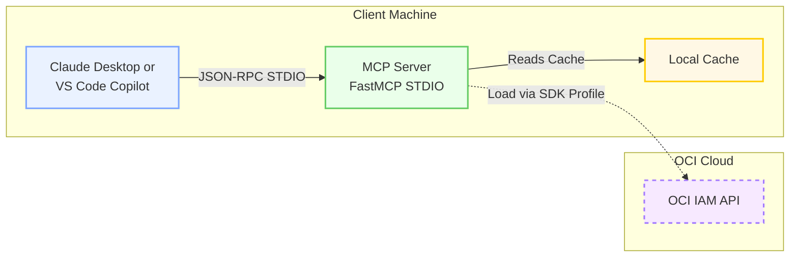
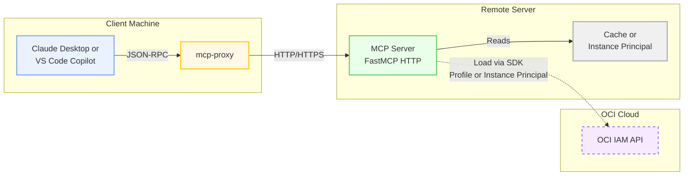
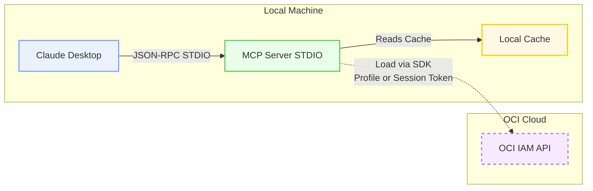
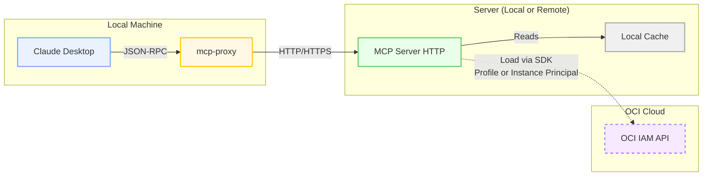
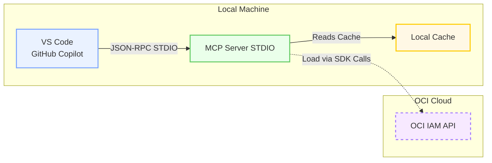
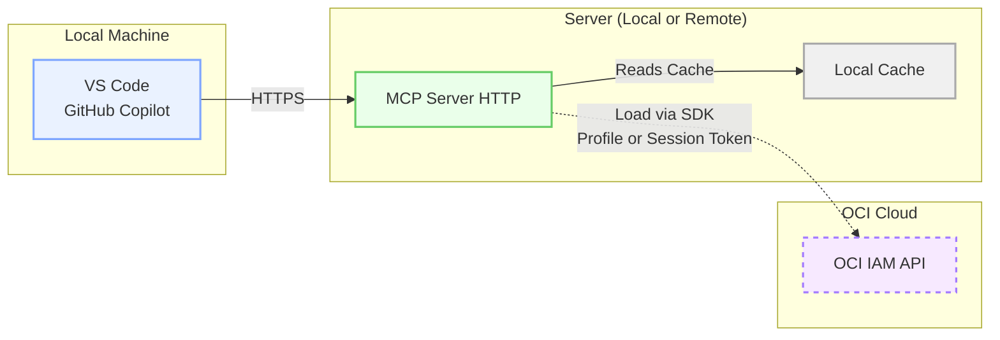
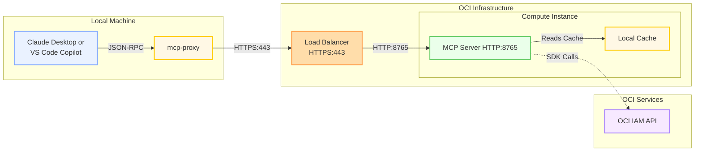

# MCP Server

This repository provides a **Model Context Protocol (MCP)** server exposing OCI IAM data (users, groups, dynamic groups, and policy analysis) as structured tools and resources consumable by **Claude**, **VS Code MCP**, or any MCP-compliant proxy client.

MCP Integration can be done in several ways, depending on the client or situation.  The following diagrams show how MCP can be used to expose OCI policy data.   [Python FastMCP](https://gofastmcp.com/getting-started/welcome) is used for each of these methods.

Here are the methods that OCI Policy Analysis supports for MCP:

1) Standalone MCP Server -- In this method, the MCP server loads live or cached tenancy IAM and Policy data, then uses FastMCP to stand up an MCP Server.  This works in 2 possible ways:

    - If using FastMCP and STDIO, it is expected to be called from a calling process.
    - If using Streamable HTTP, the server can be invoked via any MCP Client supporting HTTP.  More details below

2) Embedded MCP Server -- In this method, the OCI Policy Analysis UI is used.  From the UI, the data is loaded from a tenancy or cache.  Then the UI tab "Embedded MCP Server" controls an HTTP-based server which is invoked from desktop MCP tools.

In the case of the standalone MCP Server, command line options are available, which control where to load the data from.  For example, to load data from a specific OCI Profile or from a local cache.  Also, there is a a switch to control STDIO or Streamable HTTP

## MCP Architectures

Many popular MCP tools allow a sub-process to run, using the STDIO mechanism.  Others expect you to have an MCP Server running and they will connect.  Both architectures are shown here:

### MCP via STDIO:

MCP Clients start the subprocess for MCP, and it loads its data, runs as an embedded python process, and the client sends and receives over Standard IO.



### MCP as HTTP (Remote Server):

Desktop tools such as VSCode and Claude can consume MCP endpoints running locally or remotely on a secure port.



## Running MCP from OCI Policy Analysis

## Core-Only Install for MCP (No Web/Desktop Extras)

For standalone MCP usage where you only need core + MCP runtime (and not the
desktop UI or web server), install from source using the base package:

```bash
python -m pip install --upgrade pip
pip install -e .
```

Then run MCP directly:

```bash
python -m oci_policy_analysis.mcp_server --help
```

This keeps installation minimal while still enabling STDIO and streamable-HTTP
MCP modes documented below.

MCP Servers have 2 basic modes: STDIO and Streamable-HTTP.  STDIO mode is good for embedding in an AI Desktop client such as Claude, Oracle Code Assist, or VSCode.  More details on setups later on in the document.

Streamable HTTP is good for a server, where MCP is not local to the client, or in the OCI Policy Analysis Embedded MCP tab, the clients connect to the app over HTTP on the configured port.

In either case, the OCI Policy Analysis tool has a handful of options that can be applied.  See the usage for details:

```bash
usage: mcp_server.py [-h] (--profile PROFILE | --instance-principal | --resource-principal | --use-cache USE_CACHE | --session-token SESSION_TOKEN) [--recursive] [--dont-save-cache-after-load] [--transport {stdio,streamable-http}] [--port PORT] [--host HOST] [--compartment-domain-search-depth [1-6]]

options:
  -h, --help            show this help message and exit
  --profile PROFILE
  --instance-principal
  --resource-principal
  --use-cache USE_CACHE
                        provide the combined cache date to use
  --session-token SESSION_TOKEN
                        OCI session token for instance principal auth
  --recursive           Recursively load all compartments (default: True)
  --dont-save-cache-after-load
                        Dont save the combined cache after loading from OCI
  --transport {stdio,streamable-http}
  --port PORT
  --host HOST
  --compartment-domain-search-depth [1-6]
                        Depth for identity-domain compartment traversal (1=root only, 2=include direct children, max=6).
  ```

The options listed below cover the supported configurations.

(finding-the-available-caches)=
### Finding the Available Caches

If you want to use an existing cache from OCI Policy Analysis, for example, after having run the UI and loading data from any tenancy, you can use the command line first, to show the named caches available by tenancy and date of data load:

You can use the CLI to show caches for a given tenancy.  Ensure that the application is built locally first, and that the correct virtual environment is loaded:
```
agregory@agregory-mac ~ % python -m oci_policy_analysis.cli --get-caches andgre5678

2025-12-04 16:32:48,895 [INFO] [root] Root logger initialized (stdout + app.log).
2025-12-04 16:32:49,006 [INFO] [oci-policy-analysis.reference_data_repo] Loading reference data from directory: /Users/agregory/oci-policy-analysis/.venv/lib/python3.12/site-packages/oci_policy_analysis/logic/permissions
2025-12-04 16:32:49,008 [INFO] [oci-policy-analysis.reference_data_repo] Loaded 23 reference data files. Total resources: 303, families: 46
2025-12-04 16:32:49,339 [INFO] [oci-policy-analysis.reference_data_repo] Loading reference data from directory: /Users/agregory/oci-policy-analysis/.venv/lib/python3.12/site-packages/oci_policy_analysis/logic/permissions
2025-12-04 16:32:49,341 [INFO] [oci-policy-analysis.reference_data_repo] Loaded 23 reference data files. Total resources: 303, families: 46
<frozen runpy>:128: RuntimeWarning: 'oci_policy_analysis.cli' found in sys.modules after import of package 'oci_policy_analysis', but prior to execution of 'oci_policy_analysis.cli'; this may result in unpredictable behaviour
2025-12-04 16:32:49,341 [INFO] [oci-policy-analysis.cli] Logging to Console
2025-12-04 16:32:49,341 [INFO] [oci-policy-analysis.data_repo] Initialized PolicyAnalysisRepo
2025-12-04 16:32:49,342 [INFO] [oci-policy-analysis.caching] Initialized Caching at /Users/agregory/.oci-policy-analysis/cache
2025-12-04 16:32:49,342 [INFO] [oci-policy-analysis.caching] Entries found in cache_entries.json: 11
2025-12-04 16:32:49,342 [INFO] [oci-policy-analysis.cli] Available caches:
2025-12-04 16:32:49,342 [INFO] [oci-policy-analysis.cli] andgre5678_2025-12-03-23-56-50-UTC
2025-12-04 16:32:49,342 [INFO] [oci-policy-analysis.cli] andgre5678_2025-12-03-23-56-04-UTC
2025-12-04 16:32:49,342 [INFO] [oci-policy-analysis.cli] andgre5678_2025-12-03-23-53-40-UTC
2025-12-04 16:32:49,342 [INFO] [oci-policy-analysis.cli] andgre5678_2025-12-03-23-49-04-UTC
2025-12-04 16:32:49,342 [INFO] [oci-policy-analysis.cli] andgre5678_2025-12-03-14-15-24-UTC
2025-12-04 16:32:49,342 [INFO] [oci-policy-analysis.cli] andgre5678_2025-12-02-19-04-53-UTC
2025-12-04 16:32:49,342 [INFO] [oci-policy-analysis.cli] andgre5678_2025-11-26-16-43-15-UTC
2025-12-04 16:32:49,342 [INFO] [oci-policy-analysis.cli] andgre5678_2025-11-26-16-40-46-UTC
2025-12-04 16:32:49,342 [INFO] [oci-policy-analysis.cli] andgre5678_2025-11-26-15-19-59-UTC
2025-12-04 16:32:49,342 [INFO] [oci-policy-analysis.cli] andgre5678_2025-11-26-15-04-29-UTC
2025-12-04 16:32:49,342 [INFO] [oci-policy-analysis.cli] andgre5678_2025-11-26-saved
2025-12-04 16:32:49,342 [INFO] [oci-policy-analysis.cli] Exiting after listing caches as --get-caches was provided
``` 

With the cache name and date (for example, `andgre5678_2025-12-03-23-56-50-UTC`), you can set up MCP within the Claude or VSCode config file.

### MCP Option 1 - Locally with STDIO and Claude

In order to use Claude with MCP, you update a file called `claude_desktop_config.json` and simply restart Claude after changes.  To add the MCP server using STDIO mode, you likely want to start with a cached copy of the tenancy data, from a previous run from the UI or CLI, where the cache file exists.  See [above](#finding-the-available-caches) for more details on getting the cache name.

Claude Desktop and MCP over STDIO Architecture:



Following are 2 examples.

#### Flavor 1 - Cached Data
```json
{
  "mcpServers": {
    "oci-policy-local": {
      "command": "/Users/agregory/oci-policy-analysis/.venv/bin/python",
      "args": [
        "-m",
        "oci_policy_analysis.mcp_server",
        "--use-cache",
        "andgre5678_2025-12-03-23-56-50-UTC"
      ],
      "env": {
        "MCP_STDIO_MODE": "1"
      },
      "type": "stdio"
    }
  }
}
```
#### Flavor 2 - Load Data via SDK (Live)

**Hint** Your `YOUR-OCI-NAMED-PROFILE` may be `DEFAULT` if that is the only profile on your machine.
```json
{
  "mcpServers": {
    "oci-policy-local": {
      "command": "/Users/agregory/oci-policy-analysis/.venv/bin/python",
      "args": [
        "-m",
        "oci_policy_analysis.mcp_server",
        "--profile",
        "YOUR-OCI-NAMED-PROFILE"
      ],
      "env": {
        "MCP_STDIO_MODE": "1"
      },
      "type": "stdio"
    }
  }
}
```

**NOTE** If you want to load live tenancy data but NOT create a new cache each time, add in the `--dont-save-cache-after-load` flag on a new line in the configuration above.

When Claude starts it will automatically run the code from your locally built application, assuming you set up a virtual environment similar to the path above.

### MCP Option 2 - Streamable HTTP and Claude

In this model, Claude requires an installed [MCP Proxy](https://github.com/sparfenyuk/mcp-proxy) on your machine.  The MCP Server can be started as a standalone Python process or from the OCI Policy Analysis UI with the Embedded MCP tab.  Either way, it will be listening on host:port and then the MCP Proxy connects to it.



In this model, the MCP server is standalone.  It could be on your computer, using the MCP Server standalone server, or via the embedded MCP tab in the OCI Policy Analysis UI.  Either way, configure Claude like this:

```json
{
  "mcpServers": {
    "mcp-remote": {
      "command": "mcp-proxy",
      "args": [
        "http://url-or-ip:port/mcp"
      ]
    }
  }
}
```
When you start Claude, it will connect if your MCP is running at the given location.  Any time you restart the MCP server, simply close and reopen Claude to re-establish the connection.

### MCP Option 3 - VSCode Co-Pilot and STDIO (Local)

VSCode Configuration is similar to, but different from Claude.  The architecture for STDIO is very similar:



#### Flavor 1 - Cached Data

Use the command line to get the [name of the cache](#finding-the-available-caches) to use.  Then configure VSCode to add it to the startup command.

```json
    "mcp-local-stdio": {
        "type": "stdio",
        "command": "/Users/agregory/oci-policy-analysis/.venv/bin/python",
        "env": {
            "MCP_STDIO_MODE": "1"
        },
        "args": [
            "-m",
            "oci_policy_analysis.mcp_server.",
            "--use-cache",
            "tenancy_2025-10-29-16-52-22-UTC"
        ]
    }
```

VSCode logs and output should show communication with MCP.

#### Flavor 2 - Load via OCI SDK (Live Data)

Without the cache, it will connect to the tenancy and load the data.

```json
		"mcp-local-stdio-live": {
			"type": "stdio",
			"command": "/Users/agregory/oci-policy-analysis/.venv/bin/python",
			"env": {
				"MCP_STDIO_MODE": "1"
			},
			"args": [
        "-m"
				"oci_policy_analysis.mcp_server",
				"--profile",
				"POLICY-ANDGRE-5678"
			]
		}
```
If it starts, you will something like this in the VSCode Output:
```
2025-10-29 20:06:33.711 [warning] [server stderr] 2025-10-29 20:06:33,710 [INFO] [root] Root logger initialized (stdout + app.log).
2025-10-29 20:06:33.912 [warning] [server stderr] 2025-10-29 20:06:33,911 [INFO] [oci.circuit_breaker] Default Auth client Circuit breaker strategy enabled
2025-10-29 20:06:34.835 [info] Discovered 6 tools
```

### MCP Option 4 - VSCode Remote HTTP

VSCode will also connect to any running MCP server, and does not need the MCP Proxy that Claude requires.  Simply connect to the running MCP Server, either running Standalone or Embedded within the UI.



In this case, your MCP server is already running like above, on your PC or on a remote server, or in the OCI Policy Analysis tool in the embedded MCP tab.  The host and port are available and open for connections. 

Set up VSCode for a remote MCP Server:
```
    "mcp-policy-remote": {
        "url": "https://mcp-host:port/mcp",
        "type": "http"
    }
```

### MCP Option 5 - Remote OCI Deployment with Load Balancer



In this production deployment, the MCP server runs on an OCI compute instance with instance principal authentication, behind an OCI Load Balancer with TLS termination. This provides secure, scalable access to OCI IAM data without storing credentials.

For OCI Container Instance deployment (OCIR image + private subnet + instance principal default runtime), follow:

- [MCP Deployment on OCI Container Instance](setup_mcp_container_instance.md)

**Configuration for Claude:**
```json
{
  "mcpServers": {
    "mcp-remote": {
      "command": "mcp-proxy",
      "args": [
        "https://oci-policy-analysis-mcp.ocidemo.app/mcp"
      ]
    }
  }
}
```

**Configuration for VSCode:**
```json
{
  "servers": {
    "mcp-policy-remote": {
      "url": "https://oci-policy-analysis-mcp.ocidemo.app/mcp",
      "type": "http"
    }
  }
}
```

## Setup for MCP Locally or on a Server

Running locally allows you to build OCI Policy Analysis, connect to live or cached data, and avoid using the UI.  Similar to the CLI, you can run with a cached data set or load the tenancy.  For this way of running, STDIO doesn't make sense, as you are expecting a client to access via HTTP.  

Example 5 above talks about running on a server with a load balancer.  You can use the method described here to run OCI Policy Analysis on an OCI Virtual Machine with Instance Principal, and then expose using a Load Balancer.  Then desktop clients can connect MCP tools with stopping and starting the server.

### Load the tenancy via PROFILE
```bash
python  -m oci_policy_analysis.mcp_server --profile DEFAULT --transport streamable-http --host 0.0.0.0
```

### Load the tenancy via Instance Principal
```bash
python -m oci_policy_analysis.mcp_server --instance-principal --transport streamable-http --host 0.0.0.0
```

### Load the tenancy via Resource Principal
```bash
python -m oci_policy_analysis.mcp_server --resource-principal --transport streamable-http --host 0.0.0.0
```

### Using Cached Data
```bash
python -m oci_policy_analysis.mcp_server --use-cache andgre5678_2025-10-17-17-54-09-UTC --transport streamable-http --host 0.0.0.0
```

### Adding OCI Load Balancer
To run behind a Load Balancer on a server, see above first.  Following that, In your VCN's public subnet, run a standard Layer 7 Load Balancer, listening on port 443 (HTTPS) with health check and backend set with your private host and port (default 8765).  Once the LB is up, point Claude or VSCode (option 2 or 4 above) to the LB's public domain and port - below there is a cert running on the LB, so the https address and cert are valid.  But it points to the MCP server on the backend.

```bash
mcp-proxy add oci-policy-analysis --url https://oci-policy-analysis-mcp.ocidemo.app/mcp
```

## Secure Deployment on OCI (Outline Steps)

1. Deploy Compute Instance (OL9, Instance Principal)
2. Configure Dynamic Group and Policy:
   ```text
   Allow dynamic-group my-mcp-dg to read all-resources in tenancy
   ```
3. Launch service behind OCI Load Balancer (port 443 → 8000)
4. Add TLS (Let’s Encrypt or OCI Certificate)
5. Verify endpoint:
   ```bash
   curl -vk https://oci-policy-analysis-mcp.ocidemo.app/mcp
   ```

## OCI Container Instance Deployment

For a containerized standalone MCP deployment on OCI:

1. Build image using `Dockerfile.mcp`
2. Push image to OCIR
3. Deploy OCI Container Instance in private subnet
4. Run with defaults:
   - `MCP_AUTH_MODE=resource_principal`
   - `MCP_TRANSPORT=streamable-http`
   - `MCP_HOST=0.0.0.0`
   - `MCP_PORT=8765`
   - `MCP_LOG_LEVEL=INFO`
   - `MCP_SAVE_CACHE_AFTER_LOAD=false`
   - `MCP_COMPARTMENT_DOMAIN_SEARCH_DEPTH=1` (use `2` when identity domains are in child compartments)

Full procedure:

- [MCP Deployment on OCI Container Instance](setup_mcp_container_instance.md)

## Available MCP Tools

MCP clients such as **Claude** and **VS Code Copilot** understand the request and response types described below. Users interact with these clients by asking questions in natural language, and the client will interpret your query and translate it into requests to the appropriate MCP tools. The client will automatically choose the best tool, construct the request, and present the results in a readable format.

### How It Works
- **Ask in natural language:** You can ask questions like "Show me all users in the cloud-engineering domain" or "List policies that allow manage on databases."
- **Automatic tool selection:** The MCP client will select the right tool and build the request for you.
- **Structured responses:** Results are returned in structured formats (summaries, lists, breakdowns) and presented clearly.

### Example Natural Language Queries

| User Question | Tool Used | Example Request |
|--------------|-----------|-----------------|
| "Show all users in the tenancy" | `search_users` | `{}` |
| "Find all groups with 'admin' in the name" | `search_groups` | `{ "group_name": ["admin"] }` |
| "Which policies allow manage on databases?" | `filter_policy_statements` | `{ "verb": ["manage"], "resource": ["database"] }` |
| "List all users in group 'cloud-engineering-domain-users'" | `get_users_for_group` | `{ "group_name": "cloud-engineering-domain-users", "domain_name": "cloud-engineering-domain" }` |
| "Show cross-tenancy aliases" | `cross-tenancy-alias-list` | `None` |
| "Show me policies with use or manage that cover databases or instances" | `filter_policy_statements` | `{ "verb": ["use", "manage"], "resource": ["database", "instance-family"] }` |
| "Find all groups in the Default domain with 'viewer' or 'admin' in the name" | `search_groups` | `{ "domain_name": ["Default"], "group_name": ["viewer", "admin"] }` |
| "List users named Andrew or Mark in cloud-engineering-domain" | `search_users` | `{ "search": ["andrew", "mark"], "domain_name": ["cloud-engineering-domain"] }` |
| "Show policies for group 'cloud-engineering-domain-users' in root compartment" | `filter_policy_statements` | `{ "principals": [{"principal_type": "group", "domain_name": "cloud-engineering-domain", "name": "cloud-engineering-domain-users"}], "policy_compartment": ["ROOTONLY"] }` |
| "Show policies for the Default Administrators group principal" | `filter_policy_statements` | `{ "principals": [{"principal_type": "group", "domain_name": "Default", "name": "Administrators"}] }` |

---

The OCI Policy Analysis MCP Server exposes the following tools for querying OCI IAM data:

### reload_mcp_data
Reload all policy and identity data from OCI through the same application load service used by the main app.

**Features:**
- Live reloads the full OCI tenancy policy and identity data (requires running server with profile or instance principal, not just cache mode).
- Also saves a new combined cache after reload, unless `--dont-save-cache-after-load` is set.
- Useful for refreshing the data visible to MCP clients without restarting the server process.

**Input:** None

**Response:**
- `status`: "success" or "error"
- `message`: Result summary ("Data reloaded successfully")
- `total_policies`: Number of policies loaded after reload
- `data_as_of`: Timestamp for new data snapshot

**Example:**
```json
{
  "status": "success",
  "message": "Data reloaded successfully",
  "total_policies": 374,
  "data_as_of": "2025-12-04T15:45:21Z"
}
```

### filter_policy_statements
**Primary tool for policy analysis** - Filter OCI IAM policy statements with flexible criteria.

**Features:**
- OR logic within each field, AND logic across fields
- Returns summary for large result sets (>50 statements), full details for smaller sets
- Supports exact matching and fuzzy search

**Filter Options:**
- `verb`: ["inspect", "read", "use", "manage"]
- `resource`: Resource types (e.g., "instance-family", "database")
- `subject_type`: ["user", "group", "dynamic-group", "any-user"]
- `subject`: Token search across subject/principal domain, name, OCID, principal key, or display name
- `principals`: Structured principal selectors using `principal_type`, `principal_key`, `domain_name`, `name`, `ocid`, or `display_name`
- `principal_keys`: Canonical principal key matching, such as `group:Default/Administrators`
- `location`: Compartment paths where resources are accessed
- `policy_compartment`: Compartment where policy is defined (use "ROOTONLY" for root only)
- `policy_text`: Text search within statement
- `exact_groups`, `exact_users`, `exact_dynamic_groups`: Legacy precise identity matching, retained for compatibility
- `search_groups`, `search_users`, `search_dynamic_groups`: Fuzzy search with partial matches

**Examples:**
```json
// Get all manage permissions
{"verb": ["manage"]}

// Find policies for specific group principal
{"principals": [{"principal_type": "group", "domain_name": "Default", "name": "Administrators"}]}

// Find policies for a canonical principal key
{"principal_keys": ["group:Default/Administrators"]}

// Find policies for a structured principal selector
{"principals": [{"principal_type": "group", "domain_name": "Default", "name": "Administrators"}]}

// Find database-related permissions with manage or use
{"verb": ["manage", "use"], "resource": ["database"]}

// Search for users by name
{"search_users": {"search": ["andrew", "bob"]}}
```

**Response Types:**
- **Summary** (>50 results): Counts, breakdowns by policy/compartment/subject/verb, sample statements
- **Full** (≤50 results): Complete list of matching policy statements

---

### search_users
Search and retrieve OCI IAM users with optional filtering.

**Filter Options:**
- `search`: List of partial username/email strings (fuzzy match)
- `user_ocid`: List of full or partial user OCIDs
- `domain_name`: List of identity domain names

**Examples:**
```json
// Get all users
{}

// Search by username
{"search": ["andrew", "mark", "noah"]}

// Find users by OCID
{"user_ocid": ["ocid1.user.oc1..aaaaaa..."]}
```

**Response:**
- **Summary** (>50 users): Total count, domain breakdown, sample usernames
- **Full** (≤50 users): Complete user details with name, email, OCID, domain

---

### search_groups
Search and retrieve OCI IAM groups.

**Filter Options:**
- `group_name`: List of partial group names (fuzzy match)
- `group_ocid`: List of full or partial group OCIDs
- `domain_name`: List of identity domain names

**Examples:**
```json
// Get all groups
{}

// Search by name
{"group_name": ["admin", "developer"]}

// Find specific groups by OCID
{"group_ocid": ["ocid1.group.oc1..aaaaaa...", "ocid1.group.oc1..bbbbbb..."]}

// Filter by domain
{"domain_name": ["Default", "cloud-engineering-domain"]}
```

**Response:**
- **Summary** (>50 groups): Total count, domain breakdown, sample group names
- **Full** (≤50 groups): Complete group details with name, OCID, domain, description

---

### search_dynamic_groups
Search and retrieve OCI dynamic groups.

**Filter Options:**
- `dynamic_group_name`: List of partial dynamic group names (fuzzy match)
- `matching_rule`: List of partial matching rule strings
- `domain_name`: List of identity domain names

**Examples:**
```json
// Get all dynamic groups
{}

// Search by name
{"dynamic_group_name": ["compute", "function"]}

// Find by matching rule content
{"matching_rule": ["instance.compartment.id"]}
```

**Response:**
- **Summary** (>50 groups): Total count, domain breakdown, usage breakdown, samples
- **Full** (≤50 groups): Complete dynamic group details with rules and policy usage

---

### get_groups_for_user
Get all groups that a specific user belongs to (exact match only).

**Input:**
```json
{
  "user_name": "andrew.gregory@oracle.com",
  "domain_name": "cloud-engineering-domain"
}
```

**Response:** List of all groups the user is a member of.

---

### get_users_for_group
Get all users in a specific group (exact match only).

**Input:**
```json
{
  "group_name": "Administrators",
  "domain_name": "Default"
}
```

**Response:** List of all users who are members of the group.

---

### cross_tenancy_alias_list
List all cross-tenancy aliases defined in OCI policies.

**Input:** None

**Response:** List of all DEFINE statements with tenancy OCIDs and aliases.

---

### cross_tenancy_policies_by_alias
Filter cross-tenancy policy statements that reference a specific alias.

**Input:**
```json
{
  "alias": "partner-tenancy"
}
```

**Response:** List of policy statements using the specified cross-tenancy alias.

---

## 💡 Usage Tips

1. **Start broad, then filter**: Begin with empty filters `{}` to get summaries, then add specific criteria
2. **Combine filters**: Use multiple fields together (AND logic across fields, OR within fields)
3. **Use fuzzy search**: `search_users`, `search_groups` support partial string matching
4. **OCID filtering**: All `*_ocid` fields support partial OCID matching
5. **Check response type**: Large result sets return summaries - add filters to get full details
