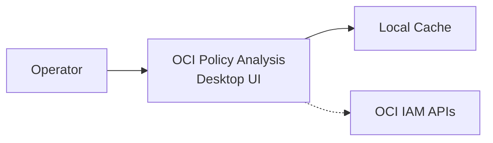
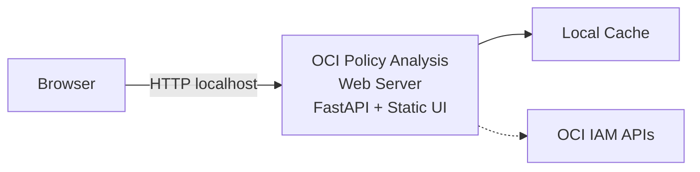
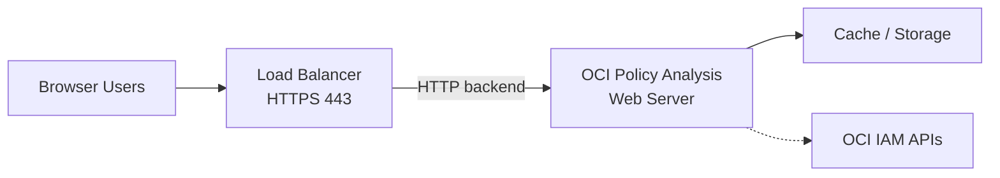

# Overview

**OCI Policy Analysis** is now a **multi-modal application** for Oracle Cloud Infrastructure (OCI) IAM analysis. You can run it as:

- a **Desktop UI** (Tkinter)
- a **Web UI** (FastAPI + static web client)
- a **CLI** for automation and offline workflows
- an **MCP Server** for AI tooling integrations (Claude, VS Code MCP, etc.)

The core goal across all modes is the same: analyze and explain OCI IAM policies, dynamic groups, principals, and effective access.

## Core Capabilities

- **Policy Analysis**: Parse/filter IAM policy statements by subject, verb, resource, compartment, and conditions.
- **Dynamic Group Analysis**: Review dynamic-group rules, usage, and related policy grants.
- **Principal-Centric Analysis**: Analyze access for users, groups, resource principals, and OKE workload identities.
- **Historical Comparison**: Compare policy snapshots over time.
- **Caching**: Save/load combined tenancy data for repeatable, offline, or remote workflows.
- **Export & Import**: Export analysis data to JSON/CSV and re-import as needed.
- **AI Insights**: Generate plain-language interpretation of policy statements.
- **Contextual Help**: In-app guidance based on page/section context.

## Advanced Capabilities

- **Condition Tester**: Evaluate hypothetical where-clause values.
- **Permissions Report**: Resolve effective OCI permissions by principal and compartment.
- **MCP Tooling**: Expose tenancy data as MCP tools/resources for AI assistants.
- **API Simulation**: Evaluate whether an OCI API call should be allowed under selected policies.
- **Recommendations Workbench**: Catalog and prioritize policy improvement suggestions.

The application supports **Instance Principal**, **OCI profile/config**, and **Session Token** authentication models.

## Feature Availability Matrix (by Startup Mode)

> This is a living matrix and can be updated as parity evolves.

| Capability | Desktop UI | Web UI | CLI | MCP |
|---|---|---|---|---|
| Load live tenancy data from OCI | ✅ | ✅ | ✅ | ✅ |
| Load/use local combined cache | ✅ | ✅ | ✅ | ✅ |
| Load/use CIS Compliance Data | ✅ | ✅ | ❌ | ❌ |
| Interactive UI | ✅ | ✅ | ❌ | ❌ |
| Rich Policy filtering/search | ✅ | ✅ | ⚠️ Limited | ✅ (tool calls) |
| Historical comparison | ✅ | ✅ | ❌ | ⚠️ Limited |
| Consolidation workflows/workbench | ✅ | ✅ | ❌ | ❌ |
| Prospective statements editor/workbench | ✅ | ✅ | ❌ | ⚠️ Via tools |
| Recommendations calculation/display and actionable guidance | ✅ | ✅ | ❌ Not exposed | ❌ Not exposed |
| Permissions report | ✅ | ✅ | ⚠️ Export only | ❌ Not exposed |
| API simulation | ✅ | ✅ | ❌ | ✅ (tool calls) |
| AI assistant integration | ✅ (embedded MCP tab) | ⚠️ Indirect | ⚠️ Indirect | ✅ Native purpose |
| Best fit: human exploratory analysis | ✅ Best | ✅ Good | ❌ | ❌ |
| Best fit: Admin Team Analysis | ✅ Best | ✅ Good | ⚠️ Limited | ⚠️ Tool-driven |
| Best fit: automation/scripting | ⚠️ | ⚠️ | ✅ Best | ✅ Best |

**Legend**
- ✅ Fully supported
- ⚠️ Partial/in progress
- ❌ Not intended for that mode

## Run Modes (Architecture-at-a-Glance)

The following simplified diagrams show common deployment/run patterns.

### 1) Desktop Mode (Local Tkinter)

### 2) Web Mode (Local)

### 3) Web Mode (Server + Load Balancer)

### 4) MCP Mode

MCP usage patterns (STDIO, HTTP, embedded vs standalone) are documented in detail on the dedicated [MCP Server](mcp.md) page.

The higher-level interactive workflow, including basic vs advanced filters, tag-based search, resource principals, and OKE workload identities, is organized in the [Usage](usage.md) guide. For the OKE-specific query pattern, see [OKE Workload Identity Querying](oke_workload_identity.md).
