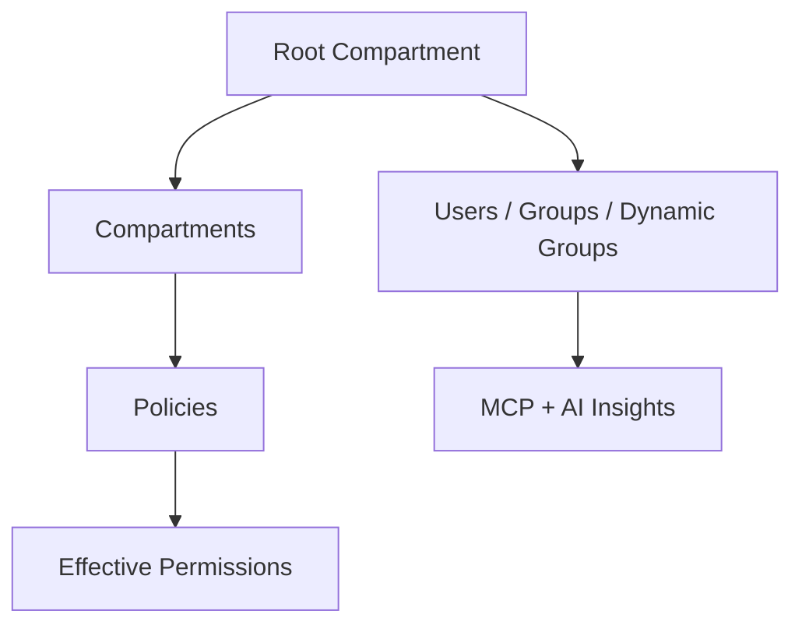

# Overview

**OCI Policy Analysis** helps explore and visualize OCI IAM policies.

```mermaid
graph TD
    A[Root Compartment] --> B[Compartments]
    B --> C[Policies]
    C --> D[Effective Permissions]
    A --> E[Users / Groups / Dynamic Groups]
    E --> F[MCP + AI Insights]
```
