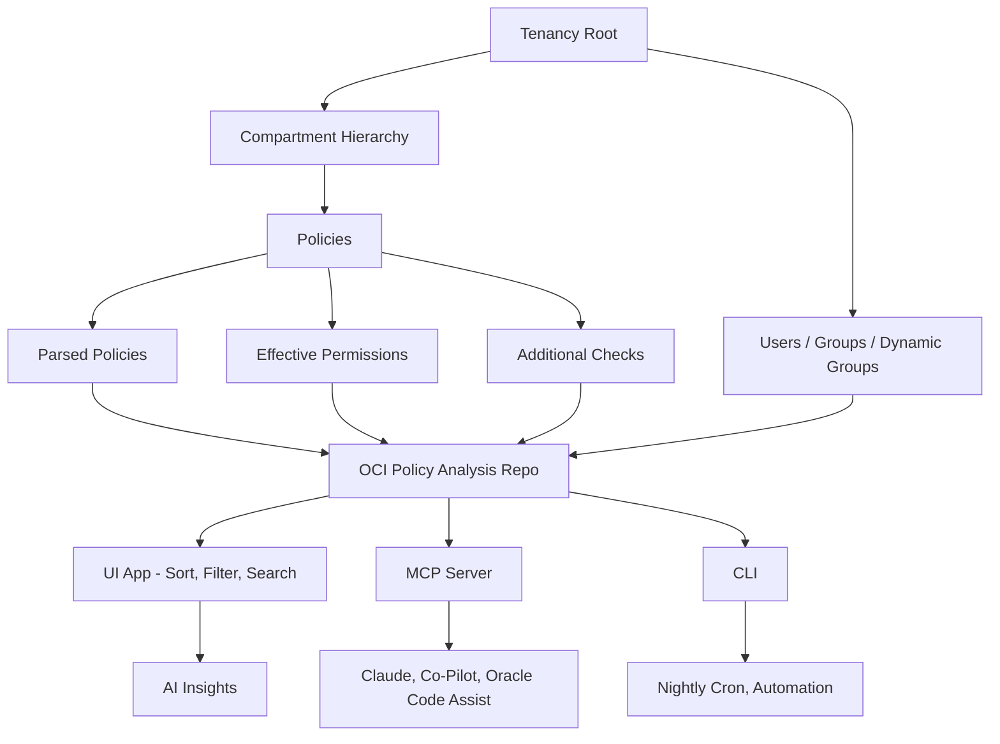

# Overview

**OCI Policy Analysis** helps explore and visualize OCI IAM policies.  Key features include:

- **Policy Analysis**: View and filter parsed IAM policy statements across compartments, with details like subject, verb, resource, and conditions.
- **Dynamic Group Analysis**: Display dynamic groups, their matching rules, and check for unused groups.
- **Resource Principal Analysis**: Display resource principals and search for relevant policy statements.
- **User Analysis**: Filter policy statements applicable to a user based on their group memberships.
- **Historical Comarison**: Compare policy sets from previous loads of data in order to find discrepancies over time.
- **Caching**: Save and load data to/from a local cache for faster access.
- **Export / Import**: Export filtered data to CSV or JSON for further analysis.  Good for offline usage or exchange of data from inaccessible tenancies.
- **Cross-Platform**: Runs on Windows and Linux with a user-friendly GUI.
- **GenAI Insights**: Takes advantage of AI to create insights that may help users understand a policy statement.
- **MCP Server Access**: Run the program as an MCP server, so that policy questions about your tenancy can come from desktop MCP tools such as Claude and VSCode.  Use your own data and have AI tools formulate responses

The application supports both Instance Principal authentication (for OCI compute instances) and OCI configuration file-based authentication (using named profiles).

